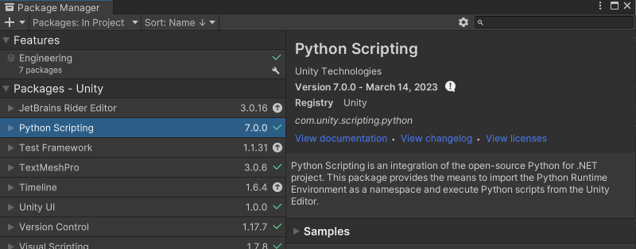

# Avata DID

Metaverse에서 사용하기 위한 Avata에 DID 적용


## Avata DID 상황에 따른 설계

### 처음 실행 시 (회원 가입)

1. 외부 지갑과의 연결 또는 내부 지갑 생성
2. 지갑 내 새로운 DID 생성 및 메타버스 내에서 사용할 아바타 생성
3. 아바타와 DID를 매핑하여 서버에 저장

→ 중간에 인증 과정이 필요한가? (기존 메타버스에서 범죄를 저지른 사람을 유추)

→ 로컬에 아바타 저장, 다른 곳에서도 사용 가능

→ 아바타의 범위? → 아바타 관련 표준이 있는가?

<aside>
💡 아바타 표준의 경우 현재 VRM, Ready Player Me, VRC가 있으며 대부분 Unity를 지원한다.  Unity의 경우 엔진 내에서 사용하기 위한 모델의 표준이 작성되어 있다. 또한 Metaverse에서 사용하기 위한 아바타 표준의 경우 Metaverse-standards forum에서 협의 진행 중이다.

</aside>

<aside>
💡 VRM의 경우 파일 포맷이며 VRM 확장자로 만들어진 모델은 VRM 기능을 지원하는 모든 프로그램에 자유롭게 사용할 수 있다.

</aside>

- 관련 링크)
    
    [VRM](https://vrm.dev/en/)
    
    [Ready Player Me](https://docs.readyplayer.me/ready-player-me/)
    
    [VRC](https://docs.vrchat.com/docs/rig-requirements)
    
    [Unity 메뉴얼](https://docs.unity3d.com/Manual/CreatingDCCAssets.html)
    
    [Metaverse-standards forum](https://metaverse-standards.org/)
    
- 그외 아바타 표준 관련 링크)
    
    [애니메이션 관련 표준 glTF](https://github.com/KhronosGroup/glTF)
    
    [Web3D](https://www.web3d.org/)
    

→ 인증 시 아바타를 사용한 인증은 가능한가? → 블록체인에 DID 저장 시 아바타 정보를 같이 저장하며 이후 해당 아바타를 사용해 로그인 → 아바타 하나에 종속적이며 아바타 분실 또는 복제 시 이에 대한 대처 방법이 필요 → 블록체인에 저장할 아바타 정보?

→ 유니티에서 연결할 지갑은? → 외부 지갑을 연결하기 위한 방법? 

- 유니티 지갑 관련 링크)
    
    [moralis - Unity App to a Web3 Wallet](https://moralis.io/how-to-connect-a-unity-app-to-a-web3-wallet/)
    
    [Unity-Solana Wallet](https://github.com/allartprotocol/unity-solana-wallet)
    

### 처음 실행 이후 사용 시 (로그인)

1. 내부 저장소를 읽어 지갑 확인 또는 DID와 공개 키로 로그인

### 메타버스 내부의 인증 상황

- 메타버스 내부에서 VC 발급 시
- 메타버스 내부에서 VP 사용 시
- 외부에서 발급한 VC를 메타버스 내부에서 사용 시
- 

### 아바타의 VC 발급 과정

1. 이전 활동을 통해 발급자와의 인증 완료
2. 아바타의 DID와 VC 발급자의 DID를 사용한 연결
3. DIDComm을 사용한 통신을 통해 VC 전달

### 아바타의 VP 제시 과정

1. 아바타의 서비스 사용 요청
2. 검증자의 VP 제출 요청 (이때 검증에 필요한 정보 전달)
3. VP 제출 요청 기반으로 VP 생성 후 전달
4. 검증자는 받은 VP를 검증
5. 검증 결과에 따라 서비스 제공 또는 거부

### 예시 상황1) 메타버스 집 출입

1. 사용자가 메타버스 내의 집을 구매
    1. 사용자가 직접 집을 만들 경우?
2. 집 제공자는 사용자에게 집의 주인이라는 증명서 제공
    1. NFT를 사용한 증명서 또는 DID를 사용한 VC
    2. 집의 잠금 장치가 사용자의 DID와 공개 키를 저장
3. 사용자는 증명서를 지갑에 저장
4. 집 출입을 위해 사용자가 집에 접근
5. 사용자가 본인의 DID를 제공하여 집 주인임을 인증
    1. 집의 잠금 장치가 사용자의 DID를 통해 신원 인증 진행
    2. 집의 잠금 장치에 사용자의 DID가 등록되어 가벼운 DID Auth를 통해 인증
6. 인증이 완료되면 사용자가 집에 출입

- 추가 출처
    
    [메타버스와 오픈소스](https://www.oss.kr/oss_guide/show/c203c6fb-c9cc-4e67-bb65-ea177244ecdd)
    
    [오픈 메타버스 논문](https://outlierventures.io/research/the-open-metaverse-os/)
    

# Unity에 DID 적용

## python wrapper 사용

### Unity에서 Python 사용

Unity에선 Python을 위한 기능을 제공하고 있으며 이는 패키지 매니저를 통해 다운받을 수 있다. [자세한 정보는 링크에 있다.](https://docs.unity3d.com/Packages/com.unity.scripting.python@7.0/manual/index.html)


먼저 Unity를 실행해 프로젝트를 생성한 뒤 창을 띄운다. 다음 ‘Window → Package Manager’를 클릭해 Package Manager 창을 띄운다. 다음 ‘+’를 클릭해 ‘Add pakage by name’을 클릭하여 ‘com.unity.scripting.python’을 입력해 추가한다. 

- Unity에서 제공하는 Python 사용을 위한 패키지는 아래와 같다.



패키지를 다운 받으면 Unity 창으로 돌아가 ‘Window → General → Python Consol’을 클릭한다. ‘Python Consol’을 클릭하면 ‘Python Script Editor’ 창이 뜨며 Python을 실행할 수 있다.

- 아래의 코드는 Python 버전을 출력하는 코드이며 아래에 코드를 작성한 뒤, Execute 버튼을 누르면 실행된다.


다음은 C# 스크립트에서 Python을 실행하는 방법이다. 먼저 테스트를 위한 스크립트를 작성한다. 

- Assets/_Script/PythonTest.cs

```csharp
using System;
using System.Collections;
using System.Collections.Generic;
using System.Diagnostics;
using UnityEditor.Scripting.Python;
using UnityEditor;
using UnityEngine;

public class PythonTest : MonoBehaviour
{
    // Start is called before the first frame update
    void Start()
    {
        
    }

    // Update is called once per frame
    void Update()
    {

        if (Input.GetKeyDown(KeyCode.W))
        {
            PrintHelloWorldFromPython();
        }

        if (Input.GetKeyDown(KeyCode.K))
        {
            IndyFromPython();
        }
    }

    static void PrintHelloWorldFromPython()
    {
        PythonRunner.RunString(@"
                import UnityEngine;
                UnityEngine.Debug.Log('hello world')
                ");
    }

    static void IndyFromPython()
    {
        UnityEngine.Debug.Log($"{Application.dataPath}");
        PythonRunner.RunFile($"{Application.dataPath}/_PythonScript/pythonTest.py");
    }
}
```

- 위 코드는 Python이 제대로 동작하는지 확인하기 위해 작성한 코드로 테스트 용이다.
- Update : 사용자가 W키 또는 K키를 누르면 Python 코드가 실행되도록 작성했다.
- PrintHelloWorldFromPython : C# 코드 내에서 Python 코드를 작성하는 방법으로 PythonRunner.RunString에 실행할 Python 코드를 작성해 실행시킨다.
- IndyFromPython : C# 코드 밖에서 작성한 Python 코드를 실행하는 방법으로 PythonRunner.RunFile에 실행할 Python 코드 파일 경로를 작성해 실행시킨다.

<aside>
💡 Application.dataPath는 Unity 프로젝트 내부의 Asset 파일 경로이다.

</aside>

- Assets/_PythonScript/pythonTest.py

```python
import UnityEngine

print("python.print")
UnityEngine.Debug.Log('Unity.Log')
```

- Unity Engine 패키지는 유니티에서 제공해주는 패키지로 이를 통해 Unity 내의 게임 오브젝트 정보나 기능을 Python을 통해 제어할 수 있다.
- 위 코드의 경우 둘 다 문자열을 출력하지만 Unity에서 출력을 원할 경우 UnityEngine의 Debug를 사용해야 출력을 할 수 있다.
- 출처
    
    [unity에서 python 사용](https://docs.unity3d.com/Packages/com.unity.scripting.python@2.0/manual/PythonScriptEditor.html)
    
    [Unity3D 유니티에서 파이썬파일 실행시키기(Run .py in Unity)|작성자 kanrhaehfdl1](https://blog.naver.com/PostView.nhn?blogId=kanrhaehfdl1&logNo=221675044575&parentCategoryNo=&categoryNo=10&viewDate=&isShowPopularPosts=true&from=search)
    
    [unity python script 6.0](https://docs.unity3d.com/Packages/com.unity.scripting.python@6.0/manual/installation.html)
    

### Unity에서 indy-sdk pyhton wrapper 사용

indy-sdk의 경우 wrappers 기능을 제공해 줌으로 다른 프로그래밍 언어를 사용해 libindy 기능을 사용할 수 있다. 이를 위해선 현재 운영체제에 맞는 libindy 라이브러리 파일을 받아 사용해야한다.

- 윈도우 libindy : https://repo.sovrin.org/windows/libindy/stable/1.16.0/libindy_1.16.0.zip

Python에서 libindy를 사용하기 위해선 python 패키지 매니저인 pip를 통해 [python 용 libindy 받아야 한다.](https://github.com/hyperledger/indy-sdk/tree/main/wrappers/python) python의 경우 패키지 관리를 위해 requirements.txt 파일을 만들어 패키지들을 정리하기도 한다.

- pip를 사용한 패키지 다운로드
```python
pip install python3-indy
```
- requirements.txt 파일을 사용

    - requirements.txt 파일에 필요한 패키지 작성 후 pip 실행

```python
python3_indy==2.1.1
```

```python
pip install -r requirements.txt
```

[Unity Python 문서](https://docs.unity3d.com/Packages/com.unity.scripting.python@7.0/manual/settings.html)에서는 Unity에서 사용하는 Python 패키지는 pip를 사용해 다운받을 수 있으며 'Library/PythonInstall/Lib/site-packages' 경로에서 확인 가능하다. 또한 'requirements.txt'을 사용한 다운을 할 경우 'ProjectSettings/requirements.txt' 경로에 파일을 놓아야하며 Unity를 시작할 때 적용된다.

아래는 indy-sdk 실행 테스트를 위해 작성하는 코드로 pool 연결이 필요없는 지갑 생성 코드만 작성한 부분이다.

- Assets\_PythonScript\pythonTest.py

```python
import sys, os
import asyncio
import json
import pprint
from pathlib import Path

from indy import pool, ledger, wallet, did, anoncreds
from indy.error import ErrorCode, IndyError

import UnityEngine

# libindy 경로에 맞춰 수정, 윈도우 기준
os.add_dll_directory("D:\libindy_1.16.0\lib")

pool_name = 'pool'
issuer_wallet_config = json.dumps({"id": "issuer_wallet"})
issuer_wallet_credentials = json.dumps({"key": "issuer_wallet_key"})
genesis_file_path = Path.home().joinpath("pool_transactions_genesis")

async def proof_negotiation():
    try:

        # 3.
        UnityEngine.Debug.Log('\n3. Creating Issuer wallet and opening it to get the handle.\n')
        try:
            await wallet.create_wallet(issuer_wallet_config, issuer_wallet_credentials)
        except IndyError as ex:
            if ex.error_code == ErrorCode.WalletAlreadyExistsError:
                pass

        issuer_wallet_handle = await wallet.open_wallet(issuer_wallet_config, issuer_wallet_credentials)

        # 4.
        UnityEngine.Debug.Log('\n4. Generating and storing steward DID and verkey\n')
        steward_seed = '000000000000000000000000Steward1'
        did_json = json.dumps({'seed': steward_seed})
        steward_did, steward_verkey = await did.create_and_store_my_did(issuer_wallet_handle, did_json)

        # 22.
        UnityEngine.Debug.Log('\n22. Closing both wallet_handles and pool\n')
        await wallet.close_wallet(issuer_wallet_handle)

        # 23.
        UnityEngine.Debug.Log('\n23. Deleting created wallet_handles\n')
        await wallet.delete_wallet(issuer_wallet_config, issuer_wallet_credentials)

    except IndyError as e:
        UnityEngine.Debug.Log('Error occurred: %s' % e)

def main():
    #os.add_dll_directory("D:\libindy_1.16.0\lib")
    UnityEngine.Debug.Log("START!!!")
    loop = asyncio.get_event_loop()
    loop.run_until_complete(proof_negotiation())
    loop.close()

py_ver = int(f"{sys.version_info.major}{sys.version_info.minor}")
if py_ver > 37 and sys.platform.startswith('win'):
    asyncio.set_event_loop_policy(asyncio.WindowsSelectorEventLoopPolicy())

main()
```

- 위 코드를 Unity가 아닌 환경에서 테스트할 경우 pip를 사용한 다운로드 및 libindy 파일 다운, python이 있는 환경에서 실행을 해 테스트할 수도 있다.

    ```bash
    # 파일 경로로 이동
    python pythonTest.py
    ```

## dotnet wrapper 사용(.NET)

.NET(dotnet)의 경우 Microsoft에서 만든 오픈 소스 개발자 플랫폼으로 다양한 유형의 어플리케이션 개발을 위한 기능을 제공해준다.

.NET의 경우 C#, F# 또는 Visual Basic 등의 언어를 지원한다. 

### NuGet을 사용한 패키지 다운

NuGet이란 .NET을 사용한 개발을 위해 다양한 패키지를 제공해준다. indy-sdk의 경우 dotnet wrapper를 제공하며 NuGet을 사용해 다운받을 수 있다. 

Unity의 경우 NuGet 사용을 위한 플러그인을 받아 사용해야한다. 플러그인의 경우 [해당 링크](https://github.com/GlitchEnzo/NuGetForUnity)의 플러그인을 사용한다. 

사용법의 경우 Window -> Package Manager를 켠 뒤 왼쪽 위의 '+' 버튼을 눌러 'Add package from git URL...'를 눌러 'https://github.com/GlitchEnzo/NuGetForUnity.git?path=/src/NuGetForUnity' 링크를 넣어 실행한다. 이를 통해 NuGetForUnity를 사용할 수 있다. 

NuGetForUnity 다운 이후 위 NuGet 창이 생기며 NuGet -> Manage NuGet Packages를 통해 패키지를 다운받을 수 있다.

패키지의 경우 Online -> Search에 필요한 패키지를 검색하여 다운 받을 수 있다. indy-sdk의 dotnet wrapper는 [해당 링크](https://github.com/hyperledger/indy-sdk/tree/main/wrappers/dotnet)에 정보가 있다. Search에 Hyperledger.Indy.Sdk를 검색하면 나오며 다운 받으면 패키지를 사용할 수 있다.

### indy-sdk dotnet wrapper 사용

위 방법을 통해 indy-sdk dotnet wrapper를 다운 받으면 패키지를 불러올 수 있으나 사용을 위해선 indy 외부 라이브러리가 있어야한다. 

- 윈도우 libindy : https://repo.sovrin.org/windows/libindy/stable/1.16.0/libindy_1.16.0.zip

위 링크를 통해 libindy를 다운 받고 압축을 풀어 나오는 폴더 중 'lib' 폴더에 있는 dll 파일들을 'Assets\Plugins' 폴더 내부에 붙여넣기하면 된다. Plugins 폴더의 경우 없으면 새로 만들어 사용한다.

앞선 과정을 통해 libindy를 사용할 수 있으며 이를 사용한 코드는 아래와 같다.

- Assets\Scripts\IndyTest.cs

```C#
using System.Collections;
using System.Collections.Generic;
using System.Runtime.InteropServices;
using UnityEngine;
using System;
using UnityEngine.UI;
using System.IO;

using Hyperledger.Indy.WalletApi;
using Hyperledger.Indy.DidApi;
using Hyperledger.Indy.PoolApi;

public class IndyTest : MonoBehaviour
{
    string wallet_config;
    string wallet_credentials = "{\"key\":\"wallet_key\"}";

    public Text text;

    int wallet = 0;

    string genesis_file_path = null;
    string test_url = "http://220.68.5.139:9000/genesis";

    // Start is called before the first frame update
    void Start()
    {
        /*
        wallet_config = "{\"id\":\"wallet\", \"storage_type\": {\"path\": \"" + Application.dataPath + 
        "/.indy_client/wallet\"}}";
        */
        wallet_config = "{\"id\":\"wallet_unity\"}";
        Debug.Log(wallet_config);

        genesis_file_path = Application.dataPath + "/genesis.txn";
        HttpClient httpClient = HttpClient.GetInstance();
        string genesis_file_ = httpClient.CreateGenesisFile(genesis_file_path);
        Debug.Log("genesis_file_: " + genesis_file_);
    }

        void Update()
    {

        if (Input.GetKeyDown(KeyCode.V))
        {
            Debug.Log("Wallet API Test Start");
            IndyWalletApiTestFun();
        }

        if (Input.GetKeyDown(KeyCode.B))
        {
            Debug.Log("Pool API Test Start");
            IndyPoolApiTestFun();
        }

        if (Input.GetKeyDown(KeyCode.Escape))
        {
            Debug.Log("Quit");
            Application.Quit();
        }
    }

    public void IndyWalletApiTestFun()
    {
        string wallet_name = "wallet";
        string wallet_config = "{\"id\":\"" + wallet_name + "\", \"storage_type\": {\"path\": \"" 
        + Application.dataPath + "/indy/wallet\"}}";
        string wallet_credentials = "{\"key\":\"wallet_key\"}";

        Wallet wallet_handle = null;
        CreateAndStoreMyDidResult did = null;
        string did_list = null;

        try
        {
            Debug.Log("Indy Create Wallet");
            Wallet.CreateWalletAsync(wallet_config, wallet_credentials).Wait();

            Debug.Log("Indy Open Wallet");
            wallet_handle = Wallet.OpenWalletAsync(wallet_config, wallet_credentials).Result;
            Debug.Log("Wallet Handle: " + wallet_handle.ToString());

            Debug.Log("Indy Create DID");
            string did_json = "{\"seed\":\"test0000000000000000000000000000\"}";
            did = Did.CreateAndStoreMyDidAsync(wallet_handle, did_json).Result;
            Debug.Log("DID: " + did);

            Debug.Log("Indy List DID");
            did_list = Did.ListMyDidsWithMetaAsync(wallet_handle).Result;
            Debug.Log("DID List: " + did_list);

            text.text = did_list;
        }
        catch (Exception e)
        {
            Debug.Log(e.ToString());
        }
        finally
        {
            Debug.Log("Indy Close Wallet");
            wallet_handle.CloseAsync().Wait();

            //Debug.Log("Indy Delete Wallet");
            //Wallet.DeleteWalletAsync(wallet_config, wallet_credentials).Wait();
        }
    }

    public void IndyPoolApiTestFun()
    {
        if(false == File.Exists(genesis_file_path))
        {
            Debug.Log("Genesis File is Null");
            return;
        }

        string pool_name = "pool";
        string pool_config = "{\"genesis_txn\":\"" + genesis_file_path + "\"}";
        Debug.Log("Pool Config: " + pool_config);

        Pool pool_handle = null;

        try
        {
            Debug.Log("Indy Create Pool Ledger Config");
            Pool.CreatePoolLedgerConfigAsync(pool_name, pool_config).Wait();

            Debug.Log("Indy Open Pool Ledger");
            pool_handle = Pool.OpenPoolLedgerAsync(pool_name, pool_config).Result;
            Debug.Log("Pool Handle: " + pool_handle.ToString());

            text.text = pool_handle.ToString();
        }
        catch (Exception e)
        {
            Debug.Log(e.ToString());
        }
        finally
        {
            Debug.Log("Indy Close Pool Ledger");
            pool_handle.CloseAsync().Wait();
            Debug.Log("Indy Delete Pool Ledger Config");
            Pool.DeletePoolLedgerConfigAsync(pool_name).Wait();
        }
    }
}
```