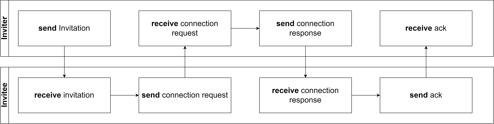
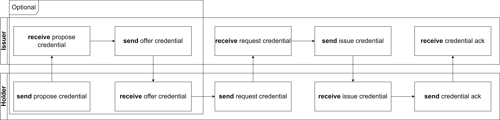
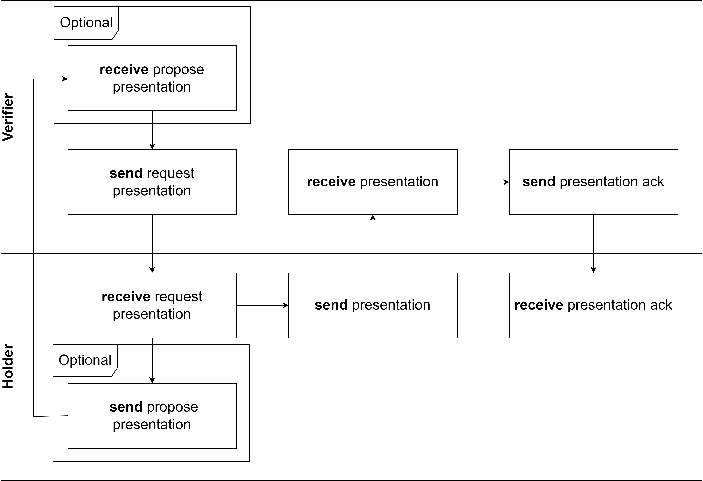

# Hyperledger Aries 분석

Hyperledger Aries는 블록체인 기반 데이터 전송 및 P2P 메시징 기능 지원, 서로 다른 블록체인 및 분산 원장 간의 상호 운용성을 위해 만들어진 도구 및 기술이다.

Hyperledger Aries의 목표는 다음과 같다.

- P2P 상호작용, 분산 시스템을 위한 보안 메시징 코드 제공
- 표준화 작업으로 실용적인 상호 운용성을 촉진하고 단일 비즈니스 솔루션으로 확장

Hyperledger Aries는 다음을 포함한다.

- 블록체인 트랜잭션 생성 및 서명을 위한 인터페이스 계층
- 블록체인 클라이언트를 구현하는데 사용되는 암호화 비밀 및 기타 정보의 안전한 저장을 위한 암호화 지갑
- 여러 전송 프로토콜을 사용하는 클라이언트 간의 상호 작용을 위한 암호화 메시징 시스템
- Hyperledger Ursa의 ZKP 프리미티브를 사용한 ZKP 지원 W3C 검증 가능한 자격 증명(Verifiable Credentials) 구현
- Hyperledger Indy에서 진행 중인 분산형 키 관리 시스템(DKMS) 사양 구현
- 보안 메시지 기능을 기반으로 상위 수준 프로토콜 및 API와 유사한 사용 사례를 구축


Hyperledger Aries는 통신을 위한 프로토콜 표준화를 진행하고 있으며 Hyperledger Aries RFC에 표준을 정리하고 있다. 

Hyperledger Aries RFC : [https://github.com/hyperledger/aries-rfcs/tree/main](https://github.com/hyperledger/aries-rfcs/tree/main)

## Aries Interop Profile

Aries는 Aries Interop Profile을 정의해 버전을 관리한다. 이는 각각의 Aries 구현 코드들이 상호작용을 가지기 위해 정의하며 같은 버전의 AIP를 가진 코드들은 같은 세트의 기능을 구현하여 상호작용성을 확보해야 한다. AIP는 discover_features 프로토콜을 사용해 공개할 수 있다.

- Discover Features Message EX)
    
    ```json
    {
      "@type": "https://didcomm.org/discover-features/2.0/disclosures",
      "disclosures": [
        {
          "feature-type": "aip",
          "id": "AIP2.0",
        },
        {
          "feature-type": "aip",
          "id": "AIP2.0/INDYCRED"
        }
      ]
    }
    ```
    

Aries Interop Profile : [https://github.com/hyperledger/aries-rfcs/blob/main/concepts/0302-aries-interop-profile/README.md](https://github.com/hyperledger/aries-rfcs/blob/main/concepts/0302-aries-interop-profile/README.md)

현재 AIP는 AIP 1.0과 AIP 2.0이 있으며 AIP 2.0은 현재 추가 중에 있다.

- AIP 1.0
    - Connection Protocol
    - Issue Credential Protocol 1.0
    - Present Proof Protocol 1.0

- AIP 2.0
    - DID Exchange Protocol 1.0
    - Issue Credential Protocol 2.0
    - Present Proof Protocol 2.0

Aries 저장소 : [https://github.com/hyperledger/aries](https://github.com/hyperledger/aries)

Aries 소개 : [https://www.hyperledger.org/blog/2019/05/14/announcing-hyperledger-aries-infrastructure-supporting-interoperable-identity-solutions](https://www.hyperledger.org/blog/2019/05/14/announcing-hyperledger-aries-infrastructure-supporting-interoperable-identity-solutions)

Aries 제안서 : [https://wiki.hyperledger.org/display/TSC/Hyperledger+Aries+Proposal](https://wiki.hyperledger.org/display/TSC/Hyperledger+Aries+Proposal)

Aries 주요 문서 : [https://github.com/hyperledger/aries-rfcs/tree/main/concepts](https://github.com/hyperledger/aries-rfcs/tree/main/concepts)

DIDComm 표준 사이트 : [https://didcomm.org/search/?page=1&q=](https://didcomm.org/search/?page=1&q=)

## Hyperledger Aries - Connection Protocol

Aries는 에이전트간 연결을 통해 보안 정보를 전달할 수 있는 에이전트를 요구하며 이를 위한 연결 프로토콜이 필요하다.

연결은 다음과 같은 정보를 요구한다.

- 추천 라벨
- 공개적으로 사용 가능한 DID (해당 정보가 있을 시 수신자 키와 서비스 앤드포인트 불필요)
- 수신자 키
- 서비스 앤드포인트
- RoutingKeys (선택 사항)

초대자는 위와 같은 정보를 통해 초대장을 만들며 이를 초대받는 사람에게 전달한다.

초대장 URL 형태로 이메일, SMS, 웹사이트 게시, QR 코드 등 텍스트를 보낼 수 있는 모든 방법을 통해 전송할 수 있다. (Aries에선 Out-of-band Protocol을 추천한다.)

초대 받은 사람은 초대장을 받은 뒤 연결을 위해 본인의 DID 문서를 초대자에게 전달할 필요가 있다. 초대 받은 사람은 연결 요청 메시지를 만들어 이를 초대자에게 전달한다.

Connection은 다른 Aries 사용자와의 통신 채널을 만드는 Protocol이며 안전한 P2P 통신이 가능하다. Connection은 Inviter와 Invitee가 있으며 Inviter의 Invitation 전달로 시작한다. Invitation은 Inviter와 통신을 위한 정보들이 기록되어 있으며 통신을 위한 공개키, 앤드 포인트, DID가 담겨있다. Inviter는 Invitee에게 Invitation을 전달하며 이때 Inviter와 Invitee 사이의 명확한 연결이 없으므로 Inviter는 URL, QR코드와 같은 방법으로 Invitation을 전달한다. Invitee는 초대에 응할 시 ‘connection request’를 만들어 Inviter에게 보낸다. ‘connection request’에는 Inviter의 Invitation처럼 Invitee와 통신을 위한 정보를 가지고 있다. 이후 Inviter가 ‘connection response’으로 응답을 보낸 뒤, ‘ack’ 응답이 오면 Connection이 끝난다. 양쪽 사용자는 Invitation을 통해 서로에게 메시지를 전달할 앤드 포인트와 암호화를 위한 공개키, DID 정보를 알고 있으므로 P2P 통신이 가능하다. 이후 Verifiable Credential(이하 VC) 발급이나 Verifiable Presentation(이하 VP) 전달 등 통신이 필요할 때 기존의 Connection을 사용해 전달한다.

- Connection Protocol 상태머신


- Connection Protocol



1. Invitation
    
    Inviter가 통신을 위한 정보를 기록한 초대장으로 이메일, SMS, 웹사이트 게시, QR 코드 등 다양한 형태로 변형되어 사용될 수 있다.
    
    - Invitation Message Type
        - DID를 사용한 초대장
            
            ```json
            {
                "@type": "https://didcomm.org/connections/1.0/invitation",
                "@id": "12345678900987654321",
                "label": "Alice",
                "did": "did:sov:QmWbsNYhMrjHiqZDTUTEJs"
            }
            ```
            
            - @type : 메시지 정보
            - @id : 메시지 식별 값
            - label : [옵션] 사용자가 메시지에 붙이는 이름표, 해당 이름표를 통해 빠르게 조회할 수 있다.
            - did : 사용자의 공개 DID를 사용하며 DID Doc에 통신을 위한 정보가 있어야 한다.
            
        - 공개키와 URL endpoint를 사용한 초대장
            
            ```json
            {
                "@type": "https://didcomm.org/connections/1.0/invitation",
                "@id": "12345678900987654321",
                "label": "Alice",
                "recipientKeys": ["8HH5gYEeNc3z7PYXmd54d4x6qAfCNrqQqEB3nS7Zfu7K"],
                "serviceEndpoint": "https://example.com/endpoint",
                "routingKeys": ["8HH5gYEeNc3z7PYXmd54d4x6qAfCNrqQqEB3nS7Zfu7K"]
            }
            ```
            
            - serviceEndpoint : 서비스 끝점, 통신을 위해 전달하며 상대방은 해당 정보를 통해 통신을 요청한다.
            - recipientKeys : Inviter의 공개키로 Invitee는 해당 공개키를 통해 암호화하여 메시지를 전달한다.
            - routingKeys : 메시지 처리 방법을 명시적으로 표시하기 위해 사용하는 값이다.
            
        - 공개키와 DID Service Endpoint를 사용한 초대장
            
            ```json
            {
                "@type": "https://didcomm.org/connections/1.0/invitation",
                "label": "Alice",
                "recipientKeys": ["8HH5gYEeNc3z7PYXmd54d4x6qAfCNrqQqEB3nS7Zfu7K"],
                "serviceEndpoint": "did:sov:A2wBhNYhMrjHiqZDTUYH7u;routeid",
                "routingKeys": ["8HH5gYEeNc3z7PYXmd54d4x6qAfCNrqQqEB3nS7Zfu7K"]
            }
            ```
            
        
    - ACA-PY의 Invitation
        
        ```json
        {
            "@type": "did:sov:BzCbsNYhMrjHiqZDTUASHg;spec/connections/1.0/invitation",
            "@id": "1e1bd69d-35d1-43a3-bc37-69c09d49a6c4",
            "recipientKeys": [
              "AuFy5gkhGhapX4MbYLFzsx6hmXmqhY2HWdejgzKVWfWV"
            ],
            "label": "Issuer",
            "serviceEndpoint": "http://220.68.5.139:8000"
        }
        ```
        
    
2. Connection Request
    
    Invitation을 받은 Invitee가 Inviter에게 보내는 연결 요청 메시지로 Invitee와 통신하기 위한 정보를 담고있다.
    
    - Connection Request Message Type
        
        ```json
        {
          "@id": "5678876542345",
          "@type": "https://didcomm.org/connections/1.0/request",
          "label": "Bob",
          "connection": {
            "DID": "B.did@B:A",
            "DIDDoc": {
                "@context": "https://w3id.org/did/v1"
                // DID document contents here.
            }
          }
        }
        ```
        
        - connection : 연결 정보
            - DID : Invitee의 DID
            - DIDDoc : [옵션] 위 DID에 대한 DIDDoc 정보, DID를 통해 원장에서 DIDDoc를 확인할 수 있는 경우 생략할 수 있다.
        - DID Doc 예제 → [https://github.com/hyperledger/aries-rfcs/blob/main/features/0067-didcomm-diddoc-conventions/README.md](https://github.com/hyperledger/aries-rfcs/blob/main/features/0067-didcomm-diddoc-conventions/README.md)
            
            ```json
            {
              "@context": "https://w3id.org/did/v1",
              "id": "did:sov:QUmsj7xwB82QAuuzfmvhAi",
              "publicKey": [
                {
                  "id": "did:sov:QUmsj7xwB82QAuuzfmvhAi#1",
                  "type": "Ed25519VerificationKey2018",
                  "controller": "did:sov:QUmsj7xwB82QAuuzfmvhAi",
                  "publicKeyBase58": "DoDMNYwMrSN8ygGKabgz5fLA9aWV4Vi8SLX6CiyN2H4a"
                }
              ],
              "authentication": [
                {
                  "type": "Ed25519SignatureAuthentication2018",
                  "publicKey": "did:sov:QUmsj7xwB82QAuuzfmvhAi#1"
                }
              ],
              "service": [
                {
                  "id": "did:sov:QUmsj7xwB82QAuuzfmvhAi;indy",
                  "type": "IndyAgent",
                  "priority": 0,
                  "recipientKeys": [
                    "DoDMNYwMrSN8ygGKabgz5fLA9aWV4Vi8SLX6CiyN2H4a"
                  ],
                  "serviceEndpoint": "http://192.168.65.3:8030"
                }
              ]
            }
            ```
            
        
    - ACA-PY의 Connection Request
        
        ```json
        {
          "@type": "did:sov:BzCbsNYhMrjHiqZDTUASHg;spec/connections/1.0/request",
          "@id": "6ac2c4db-b363-482f-afb6-1bfb81ab7bb6",
          "~thread": {
            "thid": "6ac2c4db-b363-482f-afb6-1bfb81ab7bb6",
            "pthid": "1e1bd69d-35d1-43a3-bc37-69c09d49a6c4"
          },
          "label": "Holder",
          "connection": {
            "DID": "R2FHoWQuc8td1scxdE8ML3",
            "DIDDoc": {
              "@context": "https://w3id.org/did/v1",
              "id": "did:sov:R2FHoWQuc8td1scxdE8ML3",
              "publicKey": [
                {
                  "id": "did:sov:R2FHoWQuc8td1scxdE8ML3#1",
                  "type": "Ed25519VerificationKey2018",
                  "controller": "did:sov:R2FHoWQuc8td1scxdE8ML3",
                  "publicKeyBase58": "E6NGLoREMVDVsbEWVzNsQBtZg4BqtmX4wtZM1aWTdJSP"
                }
              ],
              "authentication": [
                {
                  "type": "Ed25519SignatureAuthentication2018",
                  "publicKey": "did:sov:R2FHoWQuc8td1scxdE8ML3#1"
                }
              ],
              "service": [
                {
                  "id": "did:sov:R2FHoWQuc8td1scxdE8ML3;indy",
                  "type": "IndyAgent",
                  "priority": 0,
                  "recipientKeys": [
                    "E6NGLoREMVDVsbEWVzNsQBtZg4BqtmX4wtZM1aWTdJSP"
                  ],
                  "serviceEndpoint": "http://220.68.5.139:8002"
                }
              ]
            }
          }
        }
        ```
        
    
3. Connection Response
    
    Connection Request를 받은 Inviter가 Invitee에게 보내는 응답 메시지로 Inviter와 통신을 위한 정보를 담고있다. 
    
    - Connection Response Message Type
        
        ```json
        {
          "@type": "https://didcomm.org/connections/1.0/response",
          "@id": "12345678900987654321",
          "~thread": {
            "thid": "<@id of request message>"
          },
          "connection": {
            "DID": "A.did@B:A",
            "DIDDoc": {
              "@context": "https://w3id.org/did/v1"
              // DID document contents here.
            }
          }
        }
        ```
        
        - ~thread : [옵션] 요청 메시지에 대한 참조, 추가 형식에서 확인
        - connection : 연결 정보
            - DID : Invitee의 DID
            - DIDDoc : [옵션] 위 DID에 대한 DIDDoc 정보, DID를 통해 원장에서 DIDDoc를 확인할 수 있는 경우 생략할 수 있다.
        
        - 위 메시지는 서명이 필요하며 서명은 아래와 같다. → [https://github.com/hyperledger/aries-rfcs/blob/main/features/0234-signature-decorator/README.md](https://github.com/hyperledger/aries-rfcs/blob/main/features/0234-signature-decorator/README.md)
            
            ```json
            {
              "@type": "https://didcomm.org/connections/1.0/response",
              "@id": "12345678900987654321",
              "~thread": {
                "thid": "<@id of request message>"
              },
              "connection~sig": {
                "@type": "https://didcomm.org/signature/1.0/ed25519Sha512_single",
                "signature": "<digital signature function output>",
                "sig_data": "<base64URL(64bit_integer_from_unix_epoch||connection_attribute)>",
                "signer": "<signing_verkey>"
              }
            }
            ```
            
    - ACA-PY의 Connection Response
        
        ```json
        {
          "@type": "did:sov:BzCbsNYhMrjHiqZDTUASHg;spec/connections/1.0/response",
          "@id": "d1259aed-cdae-437d-a224-398b69c1113c",
          "~thread": {
            "thid": "6ac2c4db-b363-482f-afb6-1bfb81ab7bb6",
            "pthid": "1e1bd69d-35d1-43a3-bc37-69c09d49a6c4"
          },
          "connection~sig": {
            "@type": "did:sov:BzCbsNYhMrjHiqZDTUASHg;spec/signature/1.0/ed25519Sha512_single",
            "signature": "qcJQ6Yynw9DFuEiaoh8CuXZjVJdF5Wo0SOVcAbkhyjxgd4YaYm0Y4twhKCsehLTfEhJmd_8BdsDXS5Ll1__QAA==",
            "sig_data": "AAAAAGRjSIJ7IkRJRCI6ICIxNGhNNGc3Q2l6aFFCY1A5VXVqRDJ4IiwgIkRJRERvYyI6IHsiQGNvbnRleHQiOiAiaHR0cHM6Ly93M2lkLm9yZy9kaWQvdjEiLCAiaWQiOiAiZGlkOnNvdjoxNGhNNGc3Q2l6aFFCY1A5VXVqRDJ4IiwgInB1YmxpY0tleSI6IFt7ImlkIjogImRpZDpzb3Y6MTRoTTRnN0NpemhRQmNQOVV1akQyeCMxIiwgInR5cGUiOiAiRWQyNTUxOVZlcmlmaWNhdGlvbktleTIwMTgiLCAiY29udHJvbGxlciI6ICJkaWQ6c292OjE0aE00ZzdDaXpoUUJjUDlVdWpEMngiLCAicHVibGljS2V5QmFzZTU4IjogIjEzMXB1Mm5yamZmM2ZTY1VvV1Jxc1pyWVBUVXkxUTREVjg2S1hHVHhmcXZ6In1dLCAiYXV0aGVudGljYXRpb24iOiBbeyJ0eXBlIjogIkVkMjU1MTlTaWduYXR1cmVBdXRoZW50aWNhdGlvbjIwMTgiLCAicHVibGljS2V5IjogImRpZDpzb3Y6MTRoTTRnN0NpemhRQmNQOVV1akQyeCMxIn1dLCAic2VydmljZSI6IFt7ImlkIjogImRpZDpzb3Y6MTRoTTRnN0NpemhRQmNQOVV1akQyeDtpbmR5IiwgInR5cGUiOiAiSW5keUFnZW50IiwgInByaW9yaXR5IjogMCwgInJlY2lwaWVudEtleXMiOiBbIjEzMXB1Mm5yamZmM2ZTY1VvV1Jxc1pyWVBUVXkxUTREVjg2S1hHVHhmcXZ6Il0sICJzZXJ2aWNlRW5kcG9pbnQiOiAiaHR0cDovLzIyMC42OC41LjEzOTo4MDAwIn1dfX0=",
            "signer": "AuFy5gkhGhapX4MbYLFzsx6hmXmqhY2HWdejgzKVWfWV"
          }
        }
        ```
        
    
- 추가 형식
    - Threaded Messages
        
        ```json
        {
            "@type": "did:example:12345...;spec/example_family/1.0/example_type",
            "@id": "98fd8d72-80f6-4419-abc2-c65ea39d0f38",
            "~thread": {
                "thid": "98fd8d72-80f6-4419-abc2-c65ea39d0f38",
                "pthid": "1e513ad4-48c9-444e-9e7e-5b8b45c5e325",
                "sender_order": 3,
                "received_orders": {"did:sov:abcxyz":1},
                "goal_code": "aries.vc.issue"
            },
            "example_attribute": "example_value"
        }
        ```
        
        - thid : 메시지의 ID
        - pthid : [옵션] 기존 메시지에 이어 보내거나 중첩이 필요할 때 사용
        - ~thread : 스레드 정보
            - sender_order : 현재 메시지의 순서를 알려주며 해당 스레드에 기여한 모든 메시지 중 맞는 위치를 알려준다.
            - received_orders : 보낸 사람이 스래드의 다른 보낸 사람에게서 가장 높은 sender_order 값을 전달한다.
        
        thread 정보 : [https://github.com/hyperledger/aries-rfcs/blob/main/concepts/0008-message-id-and-threading/README.md#thread-object](https://github.com/hyperledger/aries-rfcs/blob/main/concepts/0008-message-id-and-threading/README.md#thread-object)


Hyperledger Aries Connection Protocol :
[https://github.com/hyperledger/aries-rfcs/tree/main/features/0160-connection-protocol](https://github.com/hyperledger/aries-rfcs/tree/main/features/0160-connection-protocol)
        
## Hyperledger Aries - Issue Credential Protocol 2.0

Issue Credential Protocol은 자격 증명 발급을 위해 사용하며 일정한 인터페이스 제공을 위해 Protocol을 정의한다. Issue Credential Protocol은 자격 증명 종류에 영향을 받지 않으며 일정한 프로토콜을 제공한다.  

### Verifiable Credential 이란?

Verifiable Credential 이란 검증 가능한 자격 증명으로 인터넷 상에서 본인을 증명할 때 사용하는 JSON 형식의 문서이다. 

VC는 크게 3가지의 정보를 가지고 있다. 발급 기관 및 자격 증명에 대한 정보가 담긴 ‘Credential Metadata’, VC의 주체에 대한 정보가 담긴 ‘Claim’, VC의 증명에 대한 정보가 담긴 ‘Proof’가 있다. VC는 ‘Proof’에 있는 서명을 통해 발급 기관의 증명과 데이터의 무결성을 검증한다. ‘Claim’은 발급자를 식별할 수 있는 정보를 가지고 있으며 ‘Property’와 ‘Value’로 나눈다. ‘Property’는 ‘Value’가 가진 의미를 설명하며 ‘Value’는 ‘Property’와 매칭되는 발급자의 정보를 담고 있다.

- W3C에서 제시한 Verifiable Credential 예시
    
    ```json
    {
      "@context": [
        "https://www.w3.org/2018/credentials/v1",
        "https://www.w3.org/2018/credentials/examples/v1"
      ],
      "id": "http://example.edu/credentials/1872",
      "type": ["VerifiableCredential", "AlumniCredential"],
      "issuer": "https://example.edu/issuers/565049",
      "issuanceDate": "2010-01-01T19:23:24Z",
      "credentialSubject": {
        "id": "did:example:ebfeb1f712ebc6f1c276e12ec21",
        "alumniOf": {
          "id": "did:example:c276e12ec21ebfeb1f712ebc6f1",
          "name": [{
            "value": "Example University",
            "lang": "en"
          }, {
            "value": "Exemple d'Université",
            "lang": "fr"
          }]
        }
      },
      "proof": {
        "type": "RsaSignature2018",
        "created": "2017-06-18T21:19:10Z",
        "proofPurpose": "assertionMethod",
        "verificationMethod": "https://example.edu/issuers/565049#key-1",
        "jws": "eyJhbGciOiJSUzI1NiIsImI2NCI6ZmFsc2UsImNyaXQiOlsiYjY0Il19..TCYt5X
          sITJX1CxPCT8yAV-TVkIEq_PbChOMqsLfRoPsnsgw5WEuts01mq-pQy7UJiN5mgRxD-WUc
          X16dUEMGlv50aqzpqh4Qktb3rk-BuQy72IFLOqV0G_zS245-kronKb78cPN25DGlcTwLtj
          PAYuNzVBAh4vGHSrQyHUdBBPM"
      }
    }
    ```
    
    - @context : JSON 문서에 대부분 들어가는 속성으로 현재 JSON이 어떠한 속성 및 규칙들을 가지는지 설명하는 부분이다.
    - id : 식별값
    - type : 해당 Credential이 어떤 Credential 인지 설명한다. VC 생태계에선 VC와 VP를 구별할 때 해당 속성을 사용한다.
    - issuer : Issuer의 정보가 들어가는 곳으로 보통 URL이 들어가며 해당 URL은 Issuer를 설명하는 문서와 연결되어야 한다. 추가 정보를 작성할 수 있다.
    - issuanceDate : 발행 날짜
    - credentialSubject : VC 주체에 대한 정보가 들어간다.
        - id : VC 주체에 대한 정보가 들어가며 DID 정보가 들어간다.
        - 해당 부분의 경우 VC 어떤 VC에 따라 속성 값들이 달라지며 해당 값은 context가 설명한다. 위 예시의 경우 대학 정보를 표시한다.
    - proof : VC 증명을 위한 정보
        - type : proof 형식 정보
        - created : 생성 일자
        - proofPurpose : 증명 방법 제안
        - verificationMethod : 증명에 사용할 방법 (공개 키)
        - jws : 서명 값

- Issue Credential Protocol 2.0 진행도





1. Propose Credential (옵션)
    
    Holder가 Issuer에게 보내는 VC 제안 메시지로 Issuer에게 특정 VC 또는 특정 속성 값이 들어간 VC를 발급받고 싶을 때 사용한다. 
    
    - Propose Credential Message Type
        
        ```json
        {
            "@type": "https://didcomm.org/issue-credential/%VER/propose-credential",
            "@id": "<uuid of propose-message>",
            "goal_code": "<goal-code>",
            "comment": "<some comment>",
            "credential_preview": <json-ld object>,
            "formats" : [
                {
                    "attach_id" : "<attach@id value>",
                    "format" : "<format-and-version>"
                }
            ],
            "filters~attach": [
                {
                    "@id": "<attachment identifier>",
                    "mime-type": "application/json",
                    "data": {
                        "base64": "<bytes for base64>"
                    }
                }
            ],
            "supplements": [
                {
                    "type": "hashlink-data",
                    "ref": "<attachment identifier>",
                    "attrs": [{
                        "key": "field",
                        "value": "<fieldname>"
                    }]
                },
                {
                    "type": "issuer-credential",
                    "ref": "<attachment identifier>",
                }
            ],
            "~attach" : [] //attachments referred to in supplements
        }
        ```
        
        - @type : 메시지 정보
        - @id : 메시지 식별 값
        - goal_coad : [옵션] 메시지 발신자의 목표, 추가 형식의 goal_code 확인
        - comment : [옵션] 추가 메모 또는 메시지
        - credential_preview : [옵션] Holder가 증명하려는 정보가 담긴 JSON-LD 정보, Credential Preview 정보랑 같다. (아래 Preview Credential에 정리)
        - formats : filters~attach 값과 @id, 검증 가능한 자격 증명 형식 및 버전을 제공한다.
        - filters~attach : 제안되는 자격 증명을 추가로 정의하는 첨부 파일 정보
        - supplements : [옵션] 자격 증명에 대한 보충 내용을 위해 작성
        - ~attach : [옵션] 자격 증명과 관련된 선택적 첨부 파일, 해당 내용은 supplements에서 정의되어야 한다.
        
        Aries는 VC 형식에 상관없는 동일한 인터페이스 제공을 위해 데이터 설명("formats")과 전송 데이터("filters~attach")를 통해 처리한다. 아래의 내용은 "filters~attach"에 들어가는 데이터의 정의이며 이는 사용하는 VC 형식에 따라 달라진다.
        
        | Credential Format | Format Value | Link to Attachment Format |
        | --- | --- | --- |
        | DIF Credential Manifest | dif/credential-manifest@v1.0 | https://github.com/hyperledger/aries-rfcs/blob/main/features/0511-dif-cred-manifest-attach/README.md#propose-credential-attachment-formathttps://github.com/hyperledger/aries-rfcs/blob/main/features/0511-dif-cred-manifest-attach/README.md#propose-credential-attachment-format |
        | Linked Data Proof VC Detail | aries/ld-proof-vc-detail@v1.0 | https://github.com/hyperledger/aries-rfcs/blob/main/features/0593-json-ld-cred-attach/README.md#ld-proof-vc-detail-attachment-formathttps://github.com/hyperledger/aries-rfcs/blob/main/features/0593-json-ld-cred-attach/README.md#ld-proof-vc-detail-attachment-format |
        | Hyperledger Indy Credential Filter | hlindy/cred-filter@v2.0 | https://github.com/hyperledger/aries-rfcs/blob/main/features/0592-indy-attachments/README.md#cred-filter-formathttps://github.com/hyperledger/aries-rfcs/blob/main/features/0592-indy-attachments/README.md#cred-filter-format |
        | Hyperledger AnonCreds Credential Filter | anoncreds/credential-filter@v1.0 | https://github.com/hyperledger/aries-rfcs/blob/main/features/0771-anoncreds-attachments/README.md#credential-filter-formathttps://github.com/hyperledger/aries-rfcs/blob/main/features/0771-anoncreds-attachments/README.md#credential-filter-format |

        - DIF Credential Manifest (dif/credential-manifest@v1.0)

            ```json
            {
                "@id": "8639505e-4ec5-41b9-bb31-ac6a7b800fe7",
                "@type": "https://didcomm.org/issue-credential/%VER/propose-credential",
                "comment": "<some comment>",
                "formats" : [{
                    "attach_id": "b45ca1bc-5b3c-4672-a300-84ddf6fbbaea",
                    "format": "dif/credential-manifest@v1.0"
                }],
                "filters~attach": [{
                    "@id": "b45ca1bc-5b3c-4672-a300-84ddf6fbbaea",
                    "mime-type": "application/json",
                    "data": {
                        "json": {
                            "issuer": "did:example:123",
                            "credential": {
                                "name": "Washington State Class A Commercial Driver License",
                                "schema": "ipfs:QmPXME1oRtoT627YKaDPDQ3PwA8tdP9rWuAAweLzqSwAWT"
                            }
                        }
                    }
                }]
            }            
            ```

            - 

        - Hyperledger Indy Credential Filter (hlindy/cred-filter@v2.0)

            data에 해당하는 값이며 base64를 통해 인코딩된 후 처리된다.

            ```json
            {
                "schema_issuer_did": "<schema_issuer_did>",
                "schema_name": "<schema_name>",
                "schema_version": "<schema_version>",
                "schema_id": "<schema_identifier>",
                "issuer_did": "<issuer_did>",
                "cred_def_id": "<credential_definition_identifier>"
            }            
            ```

            - schema_issuer_did : 스키마 주인 did(issuer_did와 동일)
            - schema_name : 스키마 식별 문자열
            - schema_version : 스키마 버전
            - schema_id : 스키마 식별 값
            - issuer_did : issuer의 DID
            - cred_def_id : Credential Definition 식별 값


            - 최종 포멧

                ```json
                {
                    "@id": "<uuid of propose message>",
                    "@type": "https://didcomm.org/issue-credential/%VER/propose-credential",
                    "comment": "<some comment>",
                    "formats" : [{
                        "attach_id": "<attach@id value>",
                        "format": "hlindy/cred-filter@v2.0"
                    }],
                    "filters~attach": [{
                        "@id": "<attach@id value>",
                        "mime-type": "application/json",
                        "data": {
                            "base64": "ewogICAgInNjaGVtYV9pc3N1ZXJfZGlkIjogImRpZDpzb3Y... (clipped)... LMkhaaEh4YTJ0Zzd0MWpxdCIKfQ=="
                        }
                    }]
                }
                ```

        - Hyperledger AnonCreds Credential Filter (anoncreds/credential-filter@v1.0)

            Hyperledger Indy Credential Filter와 동일하나 'format' 값이 다르다.

            ```json
            {
              "schema_issuer_id": "<schema_issuer_id>",
              "schema_name": "<schema_name>",
              "schema_version": "<schema_version>",
              "schema_id": "<schema_identifier>",
              "issuer_id": "<issuer_id>",
              "cred_def_id": "<credential_definition_identifier>"
            }           
            ```

            - 최종 포멧

                ```json
                {
                  "@id": "<uuid of propose message>",
                  "@type": "https://didcomm.org/issue-credential/%VER/propose-credential",
                  "comment": "<some comment>",
                  "formats": [
                    {
                      "attach_id": "<attach@id value>",
                      "format": "anoncreds/credential-filter@v1.0"
                    }
                  ],
                  "filters~attach": [
                    {
                      "@id": "<attach@id value>",
                      "mime-type": "application/json",
                      "data": {
                        "base64": "ewogICAgInNjaGVtYV9pc3N1ZXJfZGlkIjogImRpZDpzb3Y... (clipped)... LMkhaaEh4YTJ0Zzd0MWpxdCIKfQ=="
                      }
                    }
                  ]
                }
                ```


    - ACA-PY의 Propose Credential
        
        ```json
        {
          "@type": "did:sov:BzCbsNYhMrjHiqZDTUASHg;spec/issue-credential/2.0/propose-credential",
          "@id": "2bb571c0-602b-4dd2-97dc-15ab6020a908",
          "~trace": {
            "target": "log",
            "full_thread": true,
            "trace_reports": [
              
            ]
          },
          "filters~attach": [
            {
              "@id": "indy",
              "mime-type": "application/json",
              "data": {
                "base64": "eyJjcmVkX2RlZl9pZCI6ICJWVjlwSzVackxQUndZbW90Z0FDUGtDOjM6Q0w6MTA6ZGVmYXVsdCIsICJpc3N1ZXJfZGlkIjogIlZWOXBLNVpyTFBSd1ltb3RnQUNQa0MiLCAic2NoZW1hX2lkIjogIlZWOXBLNVpyTFBSd1ltb3RnQUNQa0M6MjpwcmVmczoxLjAiLCAic2NoZW1hX2lzc3Vlcl9kaWQiOiAiVlY5cEs1WnJMUFJ3WW1vdGdBQ1BrQyIsICJzY2hlbWFfbmFtZSI6ICJwcmVmcyIsICJzY2hlbWFfdmVyc2lvbiI6ICIxLjAifQ=="
              }
            }
          ],
          "comment": "string",
          "credential_preview": {
            "@type": "did:sov:BzCbsNYhMrjHiqZDTUASHg;spec/issue-credential/2.0/credential-preview",
            "attributes": [
              {
                "name": "name",
                "value": "Alice Smith"
              },
              {
                "name": "timestamp",
                "value": "1234567890"
              },
              {
                "name": "date",
                "value": "2018-05-28"
              },
              {
                "name": "degree",
                "value": "Maths"
              },
              {
                "name": "birthdate_dateint",
                "value": "19640101"
              }
            ]
          },
          "formats": [
            {
              "attach_id": "indy",
              "format": "hlindy/cred-filter@v2.0"
            }
          ]
        }
        ```
        
    - ACA-PY의 Propose Credential base64 디코딩
        
        ```json
        {
          "cred_def_id": "VV9pK5ZrLPRwYmotgACPkC:3:CL:10:default",
          "issuer_did": "VV9pK5ZrLPRwYmotgACPkC",
          "schema_id": "VV9pK5ZrLPRwYmotgACPkC:2:prefs:1.0",
          "schema_issuer_did": "VV9pK5ZrLPRwYmotgACPkC",
          "schema_name": "prefs",
          "schema_version": "1.0"
        }
        ```
        
    
2. Offer Credential (옵션)
    
    Issuer가 Holder에게 보내는 VC 제안 메시지로 VC에 들어가는 속성 정보, VC 발급 비용 등을 미연에 전달하기 위해 사용한다. Hyperledger Indy의 경우 Offer 교환을 필수로 실시한다.
    
    - Offer Credential Message Type
        
        ```json
        {
            "@type": "https://didcomm.org/issue-credential/%VER/offer-credential",
            "@id": "<uuid of offer message>",
            "goal_code": "<goal-code>",
            "replacement_id": "<issuer unique id>",
            "comment": "<some comment>",
            "multiple_available": "<count>",
            "credential_preview": <json-ld object>,
            "formats" : [
                {
                    "attach_id" : "<attach@id value>",
                    "format" : "<format-and-version>",
                }
            ],
            "offers~attach": [
                {
                    "@id": "<attach@id value>",
                    "mime-type": "application/json",
                    "data": {
                        "base64": "<bytes for base64>"
                    }
                }
            ],
            "supplements": [
                {
                    "type": "hashlink-data",
                    "ref": "<attachment identifier>",
                    "attrs": [{
                        "key": "field",
                        "value": "<fieldname>"
                    }]
                },
                {
                    "type": "issuer-credential",
                    "ref": "<attachment identifier>",
                }
            ],
            "~attach" : [] //attachments referred to in supplements
        }
        ```
        
        - replacement_id : [옵션] 자격 증명 교체를 위한 정보, 이전에 발급한 자격 증명과 겹칠 경우 이전의 자격 증명을 대체함을 알리기 위해 사용된다.
        - multiple-available : [옵션] Holder가 Issuer에게 발급 받은 자격 증명의 개수를 나타내는 값
        - credential_preview : Holder가 증명하려는 정보가 담긴 JSON-LD 정보, Credential Preview 정보랑 같다. (아래 Preview Credential에 정리)
        - formats : offer~attach 값과 @id, 검증 가능한 자격 증명 형식 및 버전을 제공한다.
        - offer~attach : 제공되는 자격 증명을 추가로 정의하는 첨부 파일 정보
        
        Offer의 첨부 파일 형식은 아래 표를 따른다.
        
        | Credential Format | Format Value | Link to Attachment Format |
        | --- | --- | --- |
        | DIF Credential Manifest | dif/credential-manifest@v1.0 | https://github.com/hyperledger/aries-rfcs/blob/main/features/0511-dif-cred-manifest-attach/README.md#propose-credential-attachment-formathttps://github.com/hyperledger/aries-rfcs/blob/main/features/0511-dif-cred-manifest-attach/README.md#propose-credential-attachment-format |
        | Linked Data Proof VC Detail | aries/ld-proof-vc-detail@v1.0 | https://github.com/hyperledger/aries-rfcs/blob/main/features/0593-json-ld-cred-attach/README.md#ld-proof-vc-detail-attachment-formathttps://github.com/hyperledger/aries-rfcs/blob/main/features/0593-json-ld-cred-attach/README.md#ld-proof-vc-detail-attachment-format |
        | Hyperledger Indy Credential Filter | hlindy/cred-filter@v2.0 | https://github.com/hyperledger/aries-rfcs/blob/main/features/0592-indy-attachments/README.md#cred-filter-formathttps://github.com/hyperledger/aries-rfcs/blob/main/features/0592-indy-attachments/README.md#cred-filter-format |
        | Hyperledger AnonCreds Credential Filter | anoncreds/credential-filter@v1.0 | https://github.com/hyperledger/aries-rfcs/blob/main/features/0771-anoncreds-attachments/README.md#credential-filter-formathttps://github.com/hyperledger/aries-rfcs/blob/main/features/0771-anoncreds-attachments/README.md#credential-filter-format |
    
        - DIF Credential Manifest (dif/credential-manifest@v1.0)

            ```json
            {
                "@id": "dfedaad3-bd7a-4c33-8337-fa94a547c0e2",
                "@type": "https://didcomm.org/issue-credential/%VER/offer-credential",
                "comment": "<some comment>",
                "formats" : [{
                    "attach_id" : "76cd0d94-8eb6-4ef3-a094-af45d81e9528",
                    "format" : "dif/credential-manifest@v1.0"
                }],
                "offers~attach": [{
                    "@id": "76cd0d94-8eb6-4ef3-a094-af45d81e9528",
                    "mime-type": "application/json",
                    "data": {
                        "json": {
                            "challenge": "1f44d55f-f161-4938-a659-f8026467f126",
                            "domain": "us.gov/DriverLicense",
                            "credential_manifest": {
                                // credential manifest object
                            }
                        }
                    }
                }]
            }          
            ```

            - 

        - Hyperledger Indy Credential Filter (hlindy/cred-abstract@v2.0)

            data에 해당하는 값이며 base64를 통해 인코딩된 후 처리된다.

            자격 증명 요청 생성을 위해 Prover에서 사용할 자격 증명 제안을 생성합니다. 제안에는 프로토콜 단계와 무결성 검사 사이의 인증을 위한 nonce 및 키 정확성 증명이 포함됩니다.

            ```json
            {
                "schema_id": "4RW6QK2HZhHxa2tg7t1jqt:2:bcgov-mines-act-permit.bcgov-mines-permitting:0.2.0",
                "cred_def_id": "4RW6QK2HZhHxa2tg7t1jqt:3:CL:58160:default",
                "nonce": "57a62300-fbe2-4f08-ace0-6c329c5210e1",
                "key_correctness_proof" : <key_correctness_proof>
            }          
            ```

            - schema_id : 스키마 식별 값
            - cred_def_id : Credential Definition 식별 값


            - 최종 포멧

                ```json
                {
                    "@type": "https://didcomm.org/issue-credential/%VER/offer-credential",
                    "@id": "<uuid of offer message>",
                    "replacement_id": "<issuer unique id>",
                    "comment": "<some comment>",
                    "credential_preview": <json-ld object>,
                    "formats" : [
                        {
                            "attach_id" : "<attach@id value>",
                            "format": "hlindy/cred-abstract@v2.0"
                        }
                    ],
                    "offers~attach": [
                        {
                            "@id": "<attach@id value>",
                            "mime-type": "application/json",
                            "data": {
                                "base64": "ewogICAgInNjaGVtYV9pZCI6ICI0Ulc2UUsySFpoS... (clipped)... jb3JyZWN0bmVzc19wcm9vZj4KfQ=="
                            }
                        }
                    ]
                }
                ```

        - Hyperledger AnonCreds Credential Filter (anoncreds/credential-offer@v1.0)

            Hyperledger Indy Credential Filter와 동일하나 'format' 값이 다르다.

            ```json
            {
                "schema_id": "4RW6QK2HZhHxa2tg7t1jqt:2:bcgov-mines-act-permit.bcgov-mines-permitting:0.2.0",
                "cred_def_id": "4RW6QK2HZhHxa2tg7t1jqt:3:CL:58160:default",
                "nonce": "57a62300-fbe2-4f08-ace0-6c329c5210e1",
                "key_correctness_proof" : <key_correctness_proof>
            }         
            ```

            - 최종 포멧

                ```json
                {
                    "@type": "https://didcomm.org/issue-credential/%VER/offer-credential",
                    "@id": "<uuid of offer message>",
                    "replacement_id": "<issuer unique id>",
                    "comment": "<some comment>",
                    "credential_preview": <json-ld object>,
                    "formats" : [
                        {
                            "attach_id" : "<attach@id value>",
                            "format": "anoncreds/credential-offer@v1.0"
                        }
                    ],
                    "offers~attach": [
                        {
                            "@id": "<attach@id value>",
                            "mime-type": "application/json",
                            "data": {
                                "base64": "ewogICAgInNjaGVtYV9pZCI6ICI0Ulc2UUsySFpoS... (clipped)... jb3JyZWN0bmVzc19wcm9vZj4KfQ=="
                            }
                        }
                    ]
                }
                ```    
    
    - ACA-PY의 Offer Credential
        
        ```json
        {
          "@type": "did:sov:BzCbsNYhMrjHiqZDTUASHg;spec/issue-credential/2.0/offer-credential",
          "@id": "0b5873cc-581d-4956-b1d7-4483aad15701",
          "~thread": {
            "thid": "05f2a18b-87c4-4348-84b3-59258d0d0065"
          },
          "~trace": {
            "target": "log",
            "full_thread": true,
            "trace_reports": [
              
            ]
          },
          "formats": [
            {
              "attach_id": "indy",
              "format": "hlindy/cred-abstract@v2.0"
            }
          ],
          "comment": "string",
          "credential_preview": {
            "@type": "did:sov:BzCbsNYhMrjHiqZDTUASHg;spec/issue-credential/2.0/credential-preview",
            "attributes": [
              {
                "name": "name",
                "value": "Alice Smith"
              },
              {
                "name": "timestamp",
                "value": "1234567890"
              },
              {
                "name": "date",
                "value": "2018-05-28"
              },
              {
                "name": "degree",
                "value": "Maths"
              },
              {
                "name": "birthdate_dateint",
                "value": "19640101"
              }
            ]
          },
          "offers~attach": [
            {
              "@id": "indy",
              "mime-type": "application/json",
              "data": {
                "base64": "..."
              }
            }
          ]
        }
        ```
        
    - ACA-PY의 Offer Credential base64 디코딩
        
        ```json
        {
          "schema_id": "VV9pK5ZrLPRwYmotgACPkC:2:prefs:1.0",
          "cred_def_id": "VV9pK5ZrLPRwYmotgACPkC:3:CL:11:default",
          "key_correctness_proof": {
            "c": "52768283872141095737697105529056315458146786685018711117077293384907205762103",
            "xz_cap": "494813253641328256625343359204587329017805653977139325442621089038878036332005499080124843441114483499633244108321799360760648690984801246705218115190094628879069924378088178705982553047732047293867364047687357033617522385084292968902754658563052497096855519217533969727562394415572519497396002556417829255723819917067892182703251855185476728687832129903786047794190347038098191403526183185330404296850789477506441015261596781784257561906213772057628331562100235957012338109376812258487804733558983850761810292251776852066149266016276272235973538803760738128194967705797498513962503123936373024406984624681330039683309141691383032612184761871474444811489972078894557199047325196861143695206174",
            "xr_cap": [
              [
                "name",
                "1410616546945886718411292391159458796179869620202271279273461216401870822689284438601356024502612962642090654795944266561303848206230237347823290640913726527366573030239808734681294020816678016404179597580665099636055190855956410025218930360064332955407606813553754433244751309281506706092756253729585840382053338807214246496488261607459555824841033592482828296625525813348766838122322316988820518327464464539983646968553097015698384765101512666553400414409647327121872951824669107334521483854439708503151307869442799608513736724863089090288165421471251380143783206506415056865510000684530207833886779119602922192677116437626121252824664578498134952907929059214612559767092865748726192057718296"
              ],
              [
                "date",
                "375401648845713632401225870132671507243473831135423481926971284241062880945807671644295110882075278940633737723295300577668253063917150738250474726126112405651328868903423996843400356255510475319134071083115193651194767293342174107865960187949327390792286771035826022771987406778832248851644631651527851084460477297182400562566566406180611445226757513324717790560692982197614909361624212081840776409156546203814602158129634956434219971663739365394802420335209956460339854291806939076604553035811731309687725826231368630842992901750788022520823057290948053272076836079017621308232464006298422259618647908945143909977968662052660527613365240926879020083481452787960157855843548495717433113880180"
              ],
              [
                "degree",
                "765528343887773933701665144381583083058716191176110308872989589784993758788531569838645589239041446331383728960014340495384826607361329843883866002564924459165832050802747284176645744197579333386567606375031425000193782555252610947167442807432604210042553010031184259539903822392934893243925553665604612864524351410957618454406592930085968019396175365098951298542614802897514205084227273138701113341342681929752680865066562522889395152090985725396413045087568162851239120748084930442808197098558468023486317099542018407451332615790735342317200982567395513309881335178882666896323763009858641878768554751281954960004170024653604903876150096479783202319571055543514856370891521271289721440825855"
              ],
              [
                "timestamp",
                "239945407541255391495450670932526392295842900285658917637828686546961284926947588432566292299450501340997680725778874833820265312664644818233449692569809000351259003037241794969094576470643267927412390430225220687754998399517076638358058743722551520070656566786467175502564079831503905031067267166791161713208327375743698356570106707997791852625469103077497667359189263382486690950000022498868787794326553223547106825369182227986448047818924996402017765761600704322608936421345473663631878996070484237023701300106934269488110402194777518433272663934243190259672314273547034451080026429318751862059613169092407077109680500251691959520098266911281232964448429800924454918941082177492885783465294"
              ],
              [
                "master_secret",
                "248981834351477287368484697592665265664726685690153249295222999462263664549100206388839077120606550050554002700165245711077741635538759937924896300333709256676904352187160903207426716328878435175690642536234602793220979687414428221333905272126209021031575918634760454180001249681437277461891085838020822503569148284935085866629114416388446931307746362257323582407847501769576472370149788643770186100195724770426893334510198999324003364195293763171826052661516264468463814340933557379857083241580125079534237190223615510565712738651566469268248958740223354284626148999297732957004674793118174502191998172614372247381709003046357190582013046027440962404518411929574314978917245822561266919529148"
              ],
              [
                "birthdate_dateint",
                "1267277484316044393395627730784059120091339448233488718720430627698811692346579674864155060171121704472918103519192028169559287377847076834860951856420558915128859430335376813460577616543195711259834264321007343220828720627257415905908128044866338147625283956764475809970059101077680645643735512383714119555951872099700464912956125093325238571298833116209111043074405065783277074188524485417543477683738409116760742921179078169222969637238328686804109970857747796714124855331359324115360786771868818807102478027670680241809517880459738436676257798459439519280078688356586783451260222922572329911099205993260476903714201365907021972458001234072657268987638557255833440458694581395670522289799542"
              ]
            ]
          },
          "nonce": "648857467986408716364793"
        }
        ```
        
    
3. Request Credential
    
    Holder가 Issuer에게 VC 발급을 요청하는 메시지이다.
    
    - Request Credential Message Type
        
        ```json
        {
            "@type": "https://didcomm.org/issue-credential/%VER/request-credential",
            "@id": "<uuid of request message>",
            "goal_code": "<goal-code>",
            "comment": "<some comment>",
            "formats" : [
                {
                    "attach_id" : "<attach@id value>",
                    "format" : "<format-and-version>",
                }
            ],
            "requests~attach": [
                {
                    "@id": "<attachment identifier>",
                    "mime-type": "application/json",
                    "data": {
                        "base64": "<bytes for base64>"
                    }
                },
            ],
            "supplements": [
                {
                    "type": "hashlink-data",
                    "ref": "<attachment identifier>",
                    "attrs": [{
                        "key": "field",
                        "value": "<fieldname>"
                    }]
                },
                {
                    "type": "issuer-credential",
                    "ref": "<attachment identifier>",
                }
            ],
            "~attach" : [] //attachments referred to in supplements
        }
        ```
        
        - formats : request~attach 값과 @id, 검증 가능한 자격 증명 형식 및 버전을 제공한다.
        - requests~attach : 자격 증명에 요청된 형식을 정의하는 첨부 파일의 배열
        
        Request의 첨부 파일 형식은 아래 표를 따른다.
        
        | Credential Format | Format Value | Link to Attachment Format |
        | --- | --- | --- |
        | DIF Credential Manifest | dif/credential-manifest@v1.0 | https://github.com/hyperledger/aries-rfcs/blob/main/features/0511-dif-cred-manifest-attach/README.md#offer-credential-attachment-formathttps://github.com/hyperledger/aries-rfcs/blob/main/features/0511-dif-cred-manifest-attach/README.md#offer-credential-attachment-format |
        | Hyperledger Indy Credential Abstract | hlindy/cred-abstract@v2.0 | https://github.com/hyperledger/aries-rfcs/blob/main/features/0592-indy-attachments/README.md#cred-abstract-formathttps://github.com/hyperledger/aries-rfcs/blob/main/features/0592-indy-attachments/README.md#cred-abstract-format |
        | Linked Data Proof VC Detail | aries/ld-proof-vc-detail@v1.0 | https://github.com/hyperledger/aries-rfcs/blob/main/features/0593-json-ld-cred-attach/README.md#ld-proof-vc-detail-attachment-formathttps://github.com/hyperledger/aries-rfcs/blob/main/features/0593-json-ld-cred-attach/README.md#ld-proof-vc-detail-attachment-format |
        | Hyperledger AnonCreds Credential Offer | anoncreds/credential-offer@v1.0 | https://github.com/hyperledger/aries-rfcs/blob/main/features/0771-anoncreds-attachments/README.md#credential-offer-formathttps://github.com/hyperledger/aries-rfcs/blob/main/features/0771-anoncreds-attachments/README.md#credential-offer-format |

        - DIF Credential Manifest (dif/credential-manifest@v1.0)

            ```json
            {
                "@id": "dfedaad3-bd7a-4c33-8337-fa94a547c0e2",
                "@type": "https://didcomm.org/issue-credential/%VER/offer-credential",
                "comment": "<some comment>",
                "formats" : [{
                    "attach_id" : "76cd0d94-8eb6-4ef3-a094-af45d81e9528",
                    "format" : "dif/credential-manifest@v1.0"
                }],
                "offers~attach": [{
                    "@id": "76cd0d94-8eb6-4ef3-a094-af45d81e9528",
                    "mime-type": "application/json",
                    "data": {
                        "json": {
                            "challenge": "1f44d55f-f161-4938-a659-f8026467f126",
                            "domain": "us.gov/DriverLicense",
                            "credential_manifest": {
                                // credential manifest object
                            }
                        }
                    }
                }]
            }          
            ```

            - 

        - Hyperledger Indy Credential Filter (hlindy/cred-req@v2.0)

            data에 해당하는 값이며 base64를 통해 인코딩된 후 처리된다.

            ```json
            {
                "entropy" : "e7bc23ad-1ac8-4dbc-92dd-292ec80c7b77",
                "cred_def_id" : "4RW6QK2HZhHxa2tg7t1jqt:3:CL:58160:default",
                // Fields below can depend on Cred Def type
                "blinded_ms" : <blinded_master_secret>,
                "blinded_ms_correctness_proof" : <blinded_ms_correctness_proof>,
                "nonce": "fbe22300-57a6-4f08-ace0-9c5210e16c32"
            }        
            ```

            - cred_def_id : Credential Definition 식별 값


            - 최종 포멧

                ```json
                {
                    "@id": "cf3a9301-6d4a-430f-ae02-b4a79ddc9706",
                    "@type": "https://didcomm.org/issue-credential/%VER/request-credential",
                    "comment": "<some comment>",
                    "formats": [{
                        "attach_id": "7cd11894-838a-45c0-a9ec-13e2d9d125a1",
                        "format": "hlindy/cred-req@v2.0"
                    }],
                    "requests~attach": [{
                        "@id": "7cd11894-838a-45c0-a9ec-13e2d9d125a1",
                        "mime-type": "application/json",
                        "data": {
                            "base64": "ewogICAgInByb3Zlcl9kaWQiIDogImRpZDpzb3Y6YWJjeHl.. (clipped)... DAtNTdhNi00ZjA4LWFjZTAtOWM1MjEwZTE2YzMyIgp9"
                        }
                    }]
                }
                ```

        - Hyperledger AnonCreds Credential Filter (anoncreds/credential-request@v1.0)

            Hyperledger Indy Credential Filter와 동일하나 'format' 값이 다르다.

            ```json
            {
                "entropy" : "e7bc23ad-1ac8-4dbc-92dd-292ec80c7b77",
                "cred_def_id" : "4RW6QK2HZhHxa2tg7t1jqt:3:CL:58160:default",
                // Fields below can depend on Cred Def type
                "blinded_ms" : <blinded_master_secret>,
                "blinded_ms_correctness_proof" : <blinded_ms_correctness_proof>,
                "nonce": "fbe22300-57a6-4f08-ace0-9c5210e16c32"
            }       
            ```

            - 최종 포멧

                ```json
                {
                  "@id": "cf3a9301-6d4a-430f-ae02-b4a79ddc9706",
                  "@type": "https://didcomm.org/issue-credential/%VER/request-credential",
                  "comment": "<some comment>",
                  "formats": [
                    {
                      "attach_id": "7cd11894-838a-45c0-a9ec-13e2d9d125a1",
                      "format": "anoncreds/credential-request@v1.0"
                    }
                  ],
                  "requests~attach": [
                    {
                      "@id": "7cd11894-838a-45c0-a9ec-13e2d9d125a1",
                      "mime-type": "application/json",
                      "data": {
                        "base64": "ewogICAgInByb3Zlcl9kaWQiIDogImRpZDpzb3Y6YWJjeHl.. (clipped)... DAtNTdhNi00ZjA4LWFjZTAtOWM1MjEwZTE2YzMyIgp9"
                      }
                    }
                  ]
                }
                ```    

    - ACA-PY의 Request Credential
        
        ```json
        {
          "@type": "did:sov:BzCbsNYhMrjHiqZDTUASHg;spec/issue-credential/2.0/request-credential",
          "@id": "164c5778-3714-491d-a3a6-fdacd77ce7b2",
          "~thread": {
            "thid": "05f2a18b-87c4-4348-84b3-59258d0d0065"
          },
          "~trace": {
            "target": "log",
            "full_thread": true,
            "trace_reports": [
              
            ]
          },
          "formats": [
            {
              "attach_id": "indy",
              "format": "hlindy/cred-req@v2.0"
            }
          ],
          "requests~attach": [
            {
              "@id": "indy",
              "mime-type": "application/json",
              "data": {
                "base64": "..."
              }
            }
          ]
        }
        ```
        
    - ACA-PY의 Request Credential base64 디코딩
        
        ```json
        {
          "prover_did": "R2FHoWQuc8td1scxdE8ML3",
          "cred_def_id": "VV9pK5ZrLPRwYmotgACPkC:3:CL:11:default",
          "blinded_ms": {
            "u": "12532893228926019289902382296992246841105071047171267056444028506791204307257735407678819700562364378669947101094004388860237073653242464348313143313255772353967712445540479980384576670589176181112090160028157373791788519076971018167407469195868086878495488386875463569750784095797511185966064648218419912484482655063353999351096510335049843203056931529080692680318338488812296983370475172989293204829191484779079880219816614599364257204111899689299328056280122671805990297344183486822085575421671893563078753060161203972634838241921847271296511550243924301493624884532019357377708695313527738432425869413859529886559",
            "ur": null,
            "hidden_attributes": [
              "master_secret"
            ],
            "committed_attributes": {
              
            }
          },
          "blinded_ms_correctness_proof": {
            "c": "37638007691044212975929222812675089232831109479245553675973024469650943986880",
            "v_dash_cap": "144691925747782144134094265037222593425212391502926203345119503525832940428196435670681414736498383665014225158177375481975148707162695742680340345789961309719023324295548936590498802004828166211947940343428788072009709025680608929510812514371713939187055805976407707342894619267051304397127766318119394110544803193037882332571203426966478654643949256775228247744113270786285239244156996672689313170760775975510306847948069007253086911538955745289100478443384221297889118745111243695618106545511895403924432457300419104344633122165074922769672711689680105110055872248118035060896363453032514350717065324908044175600375428116200629305882329567738435482356165013935015423070502371660533400682939738144044239932731505132",
            "m_caps": {
              "master_secret": "28591709287557002121160821037402228963371689867636037514747890734751687604077010698695057415371384697161430133948178293611847280763324229992251556570083660122481666698299369025260"
            },
            "r_caps": {
              
            }
          },
          "nonce": "75995550088172445773449"
        }
        ```
        
    
4. Issue Credential
    
    Issuer가 Holder에게 VC 전달을 위해 사용하는 메시지로 VC가 담겨있다. 
    
    - Issue Credential Message Type
        
        ```json
        {
            "@type": "https://didcomm.org/issue-credential/%VER/issue-credential",
            "@id": "<uuid of issue message>",
            "goal_code": "<goal-code>",
            "replacement_id": "<issuer unique id>",
            "comment": "<some comment>",
            "more_available": "<count>",
            "formats" : [
                {
                    "attach_id" : "<attachment identifier>",
                    "format" : "<format-and-version>",
                }
            ],
            "credentials~attach": [
                {
                    "@id": "<attachment identifier>",
                    "mime-type": "application/json",
                    "data": {
                        "base64": "<bytes for base64>"
                    }
                }
            ],
            "supplements": [
                {
                    "type": "hashlink-data",
                    "ref": "<attachment identifier>",
                    "attrs": [{
                        "key": "field",
                        "value": "<fieldname>"
                    }]
                },
                {
                    "type": "issuer-credential",
                    "ref": "<attachment identifier>",
                }
            ],
            "~attach" : [] //attachments referred to in supplements       
        }
        ```
        
        - more_available : [옵션]
        - formats : request~attach 값과 @id, 검증 가능한 자격 증명 형식 및 버전을 제공한다.
        - requests~attach : 자격 증명에 요청된 형식을 정의하는 첨부 파일의 배열
        
        Request의 첨부 파일 형식은 아래 표를 따른다.
        
        | Credential Format | Format Value | Link to Attachment Format |
        | --- | --- | --- |
        | DIF Credential Manifest | dif/credential-manifest@v1.0 | https://github.com/hyperledger/aries-rfcs/blob/main/features/0511-dif-cred-manifest-attach/README.md#offer-credential-attachment-formathttps://github.com/hyperledger/aries-rfcs/blob/main/features/0511-dif-cred-manifest-attach/README.md#offer-credential-attachment-format |
        | Hyperledger Indy Credential Abstract | hlindy/cred-abstract@v2.0 | https://github.com/hyperledger/aries-rfcs/blob/main/features/0592-indy-attachments/README.md#cred-abstract-formathttps://github.com/hyperledger/aries-rfcs/blob/main/features/0592-indy-attachments/README.md#cred-abstract-format |
        | Linked Data Proof VC Detail | aries/ld-proof-vc-detail@v1.0 | https://github.com/hyperledger/aries-rfcs/blob/main/features/0593-json-ld-cred-attach/README.md#ld-proof-vc-detail-attachment-formathttps://github.com/hyperledger/aries-rfcs/blob/main/features/0593-json-ld-cred-attach/README.md#ld-proof-vc-detail-attachment-format |
        | Hyperledger AnonCreds Credential Offer | anoncreds/credential-offer@v1.0 | https://github.com/hyperledger/aries-rfcs/blob/main/features/0771-anoncreds-attachments/README.md#credential-offer-formathttps://github.com/hyperledger/aries-rfcs/blob/main/features/0771-anoncreds-attachments/README.md#credential-offer-format |

        - DIF Credential Manifest (dif/credential-manifest@v1.0)

            ```json
            {
                "@id": "dfedaad3-bd7a-4c33-8337-fa94a547c0e2",
                "@type": "https://didcomm.org/issue-credential/%VER/offer-credential",
                "comment": "<some comment>",
                "formats" : [{
                    "attach_id" : "76cd0d94-8eb6-4ef3-a094-af45d81e9528",
                    "format" : "dif/credential-manifest@v1.0"
                }],
                "offers~attach": [{
                    "@id": "76cd0d94-8eb6-4ef3-a094-af45d81e9528",
                    "mime-type": "application/json",
                    "data": {
                        "json": {
                            "challenge": "1f44d55f-f161-4938-a659-f8026467f126",
                            "domain": "us.gov/DriverLicense",
                            "credential_manifest": {
                                // credential manifest object
                            }
                        }
                    }
                }]
            }          
            ```

            - 

        - Hyperledger Indy Credential Filter (hlindy/cred@v2.0)

            data에 해당하는 값이며 base64를 통해 인코딩된 후 처리된다.

            ```json
            {
                "schema_id": "4RW6QK2HZhHxa2tg7t1jqt:2:bcgov-mines-act-permit.bcgov-mines-permitting:0.2.0",
                "cred_def_id": "4RW6QK2HZhHxa2tg7t1jqt:3:CL:58160:default",
                "rev_reg_id", "EyN78DDGHyok8qw6W96UBY:4:EyN78DDGHyok8qw6W96UBY:3:CL:56389:CardossierOrgPerson:CL_ACCUM:1-1000",
                "values": {
                    "attr1" : {"raw": "value1", "encoded": "value1_as_int" },
                    "attr2" : {"raw": "value2", "encoded": "value2_as_int" }
                },
                // Fields below can depend on Cred Def type
                "signature": <signature>,
                "signature_correctness_proof": <signature_correctness_proof>
                "rev_reg": <revocation registry state>
                "witness": <witness>
            }
            ```

        - Hyperledger AnonCreds Credential Filter (anoncreds/credential@v1.0)

            Hyperledger Indy Credential Filter와 동일하나 'format' 값이 다르다.

            ```json
            {
                "schema_id": "4RW6QK2HZhHxa2tg7t1jqt:2:bcgov-mines-act-permit.bcgov-mines-permitting:0.2.0",
                "cred_def_id": "4RW6QK2HZhHxa2tg7t1jqt:3:CL:58160:default",
                "rev_reg_id", "EyN78DDGHyok8qw6W96UBY:4:EyN78DDGHyok8qw6W96UBY:3:CL:56389:CardossierOrgPerson:CL_ACCUM:1-1000",
                "values": {
                    "attr1" : {"raw": "value1", "encoded": "value1_as_int" },
                    "attr2" : {"raw": "value2", "encoded": "value2_as_int" }
                },
                // Fields below can depend on Cred Def type
                "signature": <signature>,
                "signature_correctness_proof": <signature_correctness_proof>
                "rev_reg": <revocation registry state>
                "witness": <witness>
            }
            ```


        - ACA-PY
            
            ```json
            {
              "auto_issue": true,
              "auto_remove": true,
              "comment": "string",
              "connection_id": "dda5bdbc-7111-4634-aeda-c632a3671fd3",
              "credential_preview": {
                "@type": "issue-credential/2.0/credential-preview",
                "attributes": [
                  {"name": "name","value": "Alice Smith"},
                  {"name": "timestamp","value": "1234567890"},
                  {"name": "date","value": "2018-05-28"},
                  {"name": "degree","value": "Maths"},
                  {"name": "birthdate_dateint","value": "19640101"}
                ]
              },
              "filter": {
                "indy": {
                  "cred_def_id": "VV9pK5ZrLPRwYmotgACPkC:3:CL:10:default",
                  "issuer_did": "VV9pK5ZrLPRwYmotgACPkC",
                  "schema_id": "VV9pK5ZrLPRwYmotgACPkC:2:prefs:1.0",
                  "schema_issuer_did": "VV9pK5ZrLPRwYmotgACPkC",
                  "schema_name": "prefs",
                  "schema_version": "1.0"
                }
              },
              "trace": true
            }
            ```
            
    - ACA-PY의 Issue Credential
        
        ```json
        {
          "@type": "did:sov:BzCbsNYhMrjHiqZDTUASHg;spec/issue-credential/2.0/issue-credential",
          "@id": "a4e83a5e-186f-4872-9cb5-efdaebbe5c43",
          "~thread": {
            "thid": "05f2a18b-87c4-4348-84b3-59258d0d0065"
          },
          "~trace": {
            "target": "log",
            "full_thread": true,
            "trace_reports": [
              
            ]
          },
          "formats": [
            {
              "attach_id": "indy",
              "format": "hlindy/cred@v2.0"
            }
          ],
          "credentials~attach": [
            {
              "@id": "indy",
              "mime-type": "application/json",
              "data": {
                "base64": "..."
              }
            }
          ]
        }
        ```
        
    - ACA-PY의 Issue Credential base64 디코딩
        
        ```json
        {
          "schema_id": "VV9pK5ZrLPRwYmotgACPkC:2:prefs:1.0",
          "cred_def_id": "VV9pK5ZrLPRwYmotgACPkC:3:CL:11:default",
          "rev_reg_id": null,
          "values": {
            "name": {
              "raw": "Alice Smith",
              "encoded": "62816810226936654797779705000772968058283780124309077049681734835796332704413"
            },
            "birthdate_dateint": {
              "raw": "19640101",
              "encoded": "19640101"
            },
            "date": {
              "raw": "2018-05-28",
              "encoded": "23402637423876324098256519317695433196813217785795317220680415812348801086586"
            },
            "timestamp": {
              "raw": "1234567890",
              "encoded": "1234567890"
            },
            "degree": {
              "raw": "Maths",
              "encoded": "460273229220408542178729328948548235132905393400001582342944147813984660772"
            }
          },
          "signature": {
            "p_credential": {
              "m_2": "107177945667982708129503847221765281721837417507783497582500295546011143294165",
              "a": "880385101186732793566745990372308923861837683552013101629442689965116801271451405840781300675498978646517161113743393237043514736321978198835566269201362580735469873128518041644297716991372851076477158416251310182585914709982524533603275790556988914413954467231896427630476476677776949829490582609226087693248627117187123936594128120724495027120041037312138246234800571223911497904642791592446260846115690279668976516341853521378764312865698955445568607933684932373439554025306762743805306364255157796568910150259000989159297503553958010895770160170849736754085931156757287706883281708140107654706226600916403124544",
              "e": "259344723055062059907025491480697571938277889515152306249728583105665800713306759149981690559193987143012367913206299323899696942213235956742930296714111885262238414274535344772269",
              "v": "7125553685025648260452648661375518695218588053568273678817301577873936075152941881882490712396593924155908640704578690630501846555248988008225656800925774169477883332279284031281351510212996485663738900351749826494079954572922529278527331090017997352773231970491304011959446209382213278511305940957037250332744088481897356670382357024697887657038925678964179433900195623808718474263981604127447544734144484295812840069472831608435539465321103004796112140145154305955410870374885320948164926875213280942803668877337236239099868993584956955240008693078057750522293813762631459279591241448992009315660687262029212021047685728258256045281095219062311570025515325104685021711223165582063722799641019911356305957003323657023037011241285029503005469583191820134987291910991615537224286567383752863574636464081337882692611013992"
            },
            "r_credential": null
          },
          "signature_correctness_proof": {
            "se": "15515769451981966549549164958636284741793952767753496967246494342391925087155325089512094831109223655405553744665865243103990624078759319567001235137799991413758085703722352826850655498856080712579154226804172402701582753476370962427136454260460757649195283393860599337044369963725591124949495014480920651254278109652296924532960982322074968928657136827933110886228966670457978910778671843383669847168106855042721687487051664805854478667414309802054765440831030291782741414077248581407702819215838274916823915304363200975968538195877434225647499134733646758902837189408406495068657861055209646252773549436336132878732",
            "c": "51862548300747863867692650200628858777406450326430744322085215393341210988175"
          },
          "rev_reg": null,
          "witness": null
        }
        ```
        

- 추가 형식
    - Preview Credential
        
        ```json
        {
            "@type": "https://didcomm.org/issue-credential/%VER/credential-preview",
            "attributes": [
                {
                    "name": "<attribute name>",
                    "mime-type": "<type>",
                    "value": "<value>"
                },
                // more attributes
            ]
        }
        ```
        
        Preview Credential : [https://github.com/hyperledger/aries-rfcs/blob/main/features/0453-issue-credential-v2/README.md#preview-credential](https://github.com/hyperledger/aries-rfcs/blob/main/features/0453-issue-credential-v2/README.md#preview-credential)
        
    - Supplements
        
        ```json
        {
            "type": "<supplement_type>",
            "ref": "<attachment_id>",
            "attrs": [
                {
                    "key": "<attr_key>",
                    "value": "<attr_value>"
                }
            ]
        }
        ```
        
        Supplements : [https://github.com/hyperledger/aries-rfcs/blob/main/features/0453-issue-credential-v2/README.md#supplements](https://github.com/hyperledger/aries-rfcs/blob/main/features/0453-issue-credential-v2/README.md#supplements)
        
    - goal_code
        
        
        Goal Codes : [https://github.com/hyperledger/aries-rfcs/blob/main/concepts/0519-goal-codes/README.md](https://github.com/hyperledger/aries-rfcs/blob/main/concepts/0519-goal-codes/README.md)
        

Hyperledger Aries issuer-credential-v2 : [https://github.com/hyperledger/aries-rfcs/blob/main/features/0453-issue-credential-v2/README.md](https://github.com/hyperledger/aries-rfcs/blob/main/features/0453-issue-credential-v2/README.md)

W3C Verifiable Credential Data Model v1.1 : [https://www.w3.org/TR/vc-data-model/#core-data-model](https://www.w3.org/TR/vc-data-model/#core-data-model)

## Hyperledger Aries - Present Proof Protocol 2.0

Present Proof Protocol은 검증 가능한 프레젠테이션 전달을 위해 사용하며 일정한 인터페이스 제공을 위해 Protocol을 정의한다. Present Proof Protocol은 프레젠테이션 종류에 영향을 받지 않으며 일정한 프로토콜을 제공한다. 

### Verifiable Presentation 이란?

VC에는 Holder의 개인정보가 담겨있어 이를 그대로 사용하면 필요 이상의 개인정보가 노출된다. Holder는 이를 방지하기 위해 검증 가능한 프레젠테이션인 Verifiable Presentation(이하 VP)을 사용한다. VP는 Holder를 검증할 Verifier의 요구에 맞춰 VC에 필요한 정보만을 조합해 만든다. VP는 크게 3가지의 정보로 나뉘며 VP 형식 및 추가 정보가 담긴 ‘Presentation Metadata’, 기존의 VC에서 검증자가 요구하는 정보를 담은 ‘Verifiable Credential’, VP 증명에 대한 정보가 담긴 ‘Proof’가 있다. VP는 ‘Proof’에 있는 서명을 통해 Holder와 Issuer에 대한 증명과 데이터의 무결성을 검증한다. ‘Verifiable Credential’은 VP의 요구사항에 맞춰 VC에서 가져와 만든다.

- W3C에서 제시한 Verifiable Presentation 예시
    
    ```json
    {
      "@context": [
        "https://www.w3.org/2018/credentials/v1",
        "https://www.w3.org/2018/credentials/examples/v1"
      ],
      "type": "VerifiablePresentation",
      "verifiableCredential": [{
        "@context": [
          "https://www.w3.org/2018/credentials/v1",
          "https://www.w3.org/2018/credentials/examples/v1"
        ],
        "id": "http://example.edu/credentials/1872",
        "type": ["VerifiableCredential", "AlumniCredential"],
        "issuer": "https://example.edu/issuers/565049",
        "issuanceDate": "2010-01-01T19:73:24Z",
        "credentialSubject": {
          "id": "did:example:ebfeb1f712ebc6f1c276e12ec21",
          "alumniOf": {
            "id": "did:example:c276e12ec21ebfeb1f712ebc6f1",
            "name": [{
              "value": "Example University",
              "lang": "en"
            }, {
              "value": "Exemple d'Université",
              "lang": "fr"
            }]
          }
        },
        "proof": {
          "type": "RsaSignature2018",
          "created": "2017-06-18T21:19:10Z",
          "proofPurpose": "assertionMethod",
          "verificationMethod": "https://example.edu/issuers/keys/1",
          "jws": "eyJhbGciOiJSUzI1NiIsImI2NCI6ZmFsc2UsImNyaXQiOlsiYjY0Il19..TCYt5X
            sITJX1CxPCT8yAV-TVkIEq_PbChOMqsLfRoPsnsgw5WEuts01mq-pQy7UJiN5mgRxD-WUc
            X16dUEMGlv50aqzpqh4Qktb3rk-BuQy72IFLOqV0G_zS245-kronKb78cPN25DGlcTwLtj
            PAYuNzVBAh4vGHSrQyHUdBBPM"
        }
      }],
      "proof": {
        "type": "RsaSignature2018",
        "created": "2018-09-14T21:19:10Z",
        "proofPurpose": "authentication",
        "verificationMethod": "did:example:ebfeb1f712ebc6f1c276e12ec21#keys-1",
        "challenge": "1f44d55f-f161-4938-a659-f8026467f126",
        "domain": "4jt78h47fh47",
        "jws": "eyJhbGciOiJSUzI1NiIsImI2NCI6ZmFsc2UsImNyaXQiOlsiYjY0Il19..kTCYt5
          XsITJX1CxPCT8yAV-TVIw5WEuts01mq-pQy7UJiN5mgREEMGlv50aqzpqh4Qq_PbChOMqs
          LfRoPsnsgxD-WUcX16dUOqV0G_zS245-kronKb78cPktb3rk-BuQy72IFLN25DYuNzVBAh
          4vGHSrQyHUGlcTwLtjPAnKb78"
       }
    }
    ```
    
    - type : 해당 Credential이 어떤 Credential 인지 설명한다. VP의 경우 “VerifiablePresentation”이 들어간다.
    - verifiableCredential : 증명을 위한 VC 정보가 들어간다. 검증자가 요구하는 정보에 따라 달라질 수 있다.
    - proof : VP 증명을 위한 정보
        - type : 증명 정보 값
        - created : 생성 일자
        - proofPurpose : 증명 방법
        - verificationMethod : 증명에 사용할 방법 (공개 키)
        - challenge : 중복 검증을 방지하기 위해 쓰이는 값으로 한 번 사용하면 폐기된다.
        - domain : 중복 검증을 방지하기 위해 쓰이는 값으로
        - jws : 서명 값
    
    W3C VP : [https://www.w3.org/TR/vc-data-model/#concrete-lifecycle-example](https://www.w3.org/TR/vc-data-model/#concrete-lifecycle-example)
    

- Present Proof Protocol 2.0 상태머신
    
    
    

- Present Proof Protocol 2.0 동작
    
    
    
    
    

1. Propose Presentation (옵션)
    
    Holder가 Verifier에게 보내는 프레젠테이션 제안 메시지로 Credential 정보, 증명을 위한 속성 정보 등을 작성한다. 
    
    - Propose Presentation Message
        
        ```json
        {
            "@type": "https://didcomm.org/present-proof/%VER/propose-presentation",
            "@id": "<uuid-propose-presentation>",
            "goal_code": "<goal-code>",
            "comment": "some comment",
            "formats" : [
                {
                    "attach_id" : "<attach@id value>",
                    "format" : "<format-and-version>",
                }
            ],
            "proposals~attach": [
                {
                    "@id": "<attachment identifier>",
                    "mime-type": "application/json",
                    "data": {
                        "json": "<json>"
                    }
                }
            ]
        }
        ```
        
        - formats : proposals~attach 값과 @id, 검증 가능한 자격 증명 형식 및 버전을 제공한다.
        - proposals~attach : 제안되는 프레젠테이션 요청을 추가로 정의하는 첨부 파일 정보
        
        Propose의 첨부 파일 형식은 아래 표를 따른다.
        
        | Presentation Format | Format Value | Link to Attachment Format | Comment |
        | --- | --- | --- | --- |
        | Hyperledger Indy Proof Req | hlindy/proof-req@v2.0 | https://github.com/hyperledger/aries-rfcs/blob/main/features/0592-indy-attachments/README.md#proof-request-format | Used to propose as well as request proofs. |
        | DIF Presentation Exchange | dif/presentation-exchange/definitions@v1.0 | https://github.com/hyperledger/aries-rfcs/blob/main/features/0510-dif-pres-exch-attach/README.md#propose-presentation-attachment-formathttps://github.com/hyperledger/aries-rfcs/blob/main/features/0510-dif-pres-exch-attach/README.md#propose-presentation-attachment-format |  |
        | Hyperledger AnonCreds Proof Request | anoncreds/proof-request@v1.0 | https://github.com/hyperledger/aries-rfcs/blob/main/features/0771-anoncreds-attachments/README.md#proof-request-formathttps://github.com/hyperledger/aries-rfcs/blob/main/features/0771-anoncreds-attachments/README.md#proof-request-format | Used to propose as well as request proofs. |
    - ACA-PY의 Request Presentation
        
        ```json
        {
          "@type": "did:sov:BzCbsNYhMrjHiqZDTUASHg;spec/present-proof/2.0/propose-presentation",
          "@id": "f33b43bc-5c42-406c-bdbf-cf305199c2b4",
          "formats": [
            {
              "attach_id": "indy",
              "format": "hlindy/proof-req@v2.0"
            }
          ],
          "comment": "This is a comment about the reason for the proof",
          "proposals~attach": [
            {
              "@id": "indy",
              "mime-type": "application/json",
              "data": {
                "base64": "..."
              }
            }
          ]
        }
        ```
        
    - ACA-PY의 Request Presentation base64 디코딩
        
        ```json
        {
          "name": "Proof of Education",
          "version": "1.0",
          "requested_attributes": {
            "0_name_uuid": {
              "name": "name",
              "restrictions": [
                {
                  "cred_def_id": "VV9pK5ZrLPRwYmotgACPkC:3:CL:10:default"
                }
              ]
            },
            "0_date_uuid": {
              "name": "date",
              "restrictions": [
                {
                  "cred_def_id": "VV9pK5ZrLPRwYmotgACPkC:3:CL:10:default"
                }
              ]
            },
            "0_degree_uuid": {
              "name": "degree",
              "restrictions": [
                {
                  "cred_def_id": "VV9pK5ZrLPRwYmotgACPkC:3:CL:10:default"
                }
              ]
            }
          },
          "requested_predicates": {
            
          }
        }
        ```
        
        - name : 제안하는 Presentation의 이름
        - version : Request Presentation의 버전 관리를 위해 사용
        - requested_attributes : Request Presentation에 작성하는 부분으로 제안을 위한 속성 정보를 작성한다.
          - restrictions : 제안하는 속성 정보
        - requested_predicates : 영지식 증명을 위해 사용


    
2. Request Presentation
    
    Verifier가 Holder에게 프레젠테이션을 요청하는 메시지로 프레젠테이션에서 요구하는 속성 값에 대한 정보가 담겨있다.
    
    - Request Presentation Message
        
        ```json
        {
            "@type": "https://didcomm.org/present-proof/%VER/request-presentation",
            "@id": "<uuid-request>",
            "goal_code": "<goal-code>",
            "comment": "some comment",
            "will_confirm": true,
            "present_multiple": false,
            "formats" : [
                {
                    "attach_id" : "<attach@id value>",
                    "format" : "<format-and-version>",
                }
            ],
            "request_presentations~attach": [
                {
                    "@id": "<attachment identifier>",
                    "mime-type": "application/json",
                    "data":  {
                        "base64": "<base64 data>"
                    }
                }
            ]
        }
        ```
        
        - will_confirm : Verifier가 프레젠테이션을 받은 후 확인 메시지를 보낼 것인지 나타내는 정보
        - present_multiple : Verifier가 여러 개의 프레젠테이션을 요청할 것인지 나타내는 정보
        - formats : request_presentations~attach 값과 @id, 검증 가능한 자격 증명 형식 및 버전을 제공한다.
        - request_presentations~attach : 제안되는 프레젠테이션 요청을 추가로 정의하는 첨부 파일 정보
        
        Presentation Request의 첨부 파일 형식은 아래 표를 따른다.
        
        | Presentation Format | Format Value | Link to Attachment Format | Comment |
        | --- | --- | --- | --- |
        | Hyperledger Indy Proof Req | hlindy/proof-req@v2.0 | https://github.com/hyperledger/aries-rfcs/blob/main/features/0592-indy-attachments/README.md#proof-request-format | Used to propose as well as request proofs. |
        | DIF Presentation Exchange | dif/presentation-exchange/definitions@v1.0 | https://github.com/hyperledger/aries-rfcs/blob/main/features/0510-dif-pres-exch-attach/README.md#request-presentation-attachment-formathttps://github.com/hyperledger/aries-rfcs/blob/main/features/0510-dif-pres-exch-attach/README.md#request-presentation-attachment-format |  |
        | Hyperledger AnonCreds Proof Request | anoncreds/proof-request@v1.0 | https://github.com/hyperledger/aries-rfcs/blob/main/features/0771-anoncreds-attachments/README.md#proof-request-formathttps://github.com/hyperledger/aries-rfcs/blob/main/features/0771-anoncreds-attachments/README.md#proof-request-format | Used to propose as well as request proofs. |
        - ACA-PY
            
            ```json
            {
              "comment": "This is a comment about the reason for the proof",
              "connection_id": "69fd8c81-3bdd-4881-8a4d-3719ee11a466",
              "presentation_request": {
                "indy": {
                  "name": "Proof of Education",
                  "version": "1.0",
                  "requested_attributes": {
                    "0_name_uuid": {
                      "name": "name",
                      "restrictions": [
                        {
                          "cred_def_id": "VV9pK5ZrLPRwYmotgACPkC:3:CL:10:default"
                        }
                      ]
                    },
                    "0_date_uuid": {
                      "name": "date",
                      "restrictions": [
                        {
                          "cred_def_id": "VV9pK5ZrLPRwYmotgACPkC:3:CL:10:default"
                        }
                      ]
                    },
                    "0_degree_uuid": {
                      "name": "degree",
                      "restrictions": [
                        {
                          "cred_def_id": "VV9pK5ZrLPRwYmotgACPkC:3:CL:10:default"
                        }
                      ]
                    }
                  },
                  "requested_predicates": {       
                  }
                }
              }
            }
            ```
            
    - ACA-PY의 Request Presentation
        
        ```json
        {
          "@type": "did:sov:BzCbsNYhMrjHiqZDTUASHg;spec/present-proof/2.0/request-presentation",
          "@id": "a30722f0-478f-490e-a823-9fd97b6376cd",
          "formats": [
            {
              "attach_id": "indy",
              "format": "hlindy/proof-req@v2.0"
            }
          ],
          "comment": "This is a comment about the reason for the proof",
          "will_confirm": true,
          "request_presentations~attach": [
            {
              "@id": "indy",
              "mime-type": "application/json",
              "data": {
                "base64": "..."
              }
            }
          ]
        }
        ```
        
    - ACA-PY의 Request Presentation base64 디코딩
        
        ```json
        {
          "name": "Proof of Education",
          "version": "1.0",
          "requested_attributes": {
            "0_name_uuid": {
              "name": "name",
              "restrictions": [
                {
                  "cred_def_id": "VV9pK5ZrLPRwYmotgACPkC:3:CL:11:default"
                }
              ]
            },
            "0_date_uuid": {
              "name": "date",
              "restrictions": [
                {
                  "cred_def_id": "VV9pK5ZrLPRwYmotgACPkC:3:CL:11:default"
                }
              ]
            },
            "0_degree_uuid": {
              "name": "degree",
              "restrictions": [
                {
                  "cred_def_id": "VV9pK5ZrLPRwYmotgACPkC:3:CL:11:default"
                }
              ]
            }
          },
          "requested_predicates": {
            
          },
          "nonce": "598764002857305756812746"
        }
        ```
        
    
3. Presentation
    
    Holder가 Verifier에게 프레젠테이션을 전달하는 메시지로 Request Presentation에서 요구한 속성에 대한 값들을 VC에서 가져와 작성한다. 
    
    - Presentation Message
        
        ```json
        {
            "@type": "https://didcomm.org/present-proof/%VER/presentation",
            "@id": "<uuid-presentation>",
            "goal_code": "<goal-code>",
            "comment": "some comment",
            "last_presentation": true,
            "formats" : [
                {
                    "attach_id" : "<attach@id value>",
                    "format" : "<format-and-version>",
                }
            ],
            "presentations~attach": [
                {
                    "@id": "<attachment identifier>",
                    "mime-type": "application/json",
                    "data": {
                        "sha256": "f8dca1d901d18c802e6a8ce1956d4b0d17f03d9dc5e4e1f618b6a022153ef373",
                        "links": ["https://ibb.co/TtgKkZY"]
                    }
                }
            ],
            "supplements": [
                {
                    "type": "hashlink-data",
                    "ref": "<attachment identifier>",
                    "attrs": [{
                        "key": "field",
                        "value": "<fieldname>"
                    }]
                },
                {
                    "type": "issuer-credential",
                    "ref": "<attachment identifier>",
                }
            ],
            "~attach" : [] //attachments referred to in supplements   
        }
        ```
        
        - last_presentation : 프레젠테이션 요청을 위한 마지막 메시지인지 확인, false인 경우 추가 프레젠테이션을 전달한다.
        - formats : presentations~attach 값과 @id, 검증 가능한 자격 증명 형식 및 버전을 제공한다.
        - presentations~attach : 제안되는 프레젠테이션 요청을 추가로 정의하는 첨부 파일 정보
        
        Presentation의 첨부 파일 형식은 아래 표를 따른다.
        
        | Presentation Format | Format Value | Link to Attachment Format |
        | --- | --- | --- |
        | Hyperledger Indy Proof | hlindy/proof@v2.0 | https://github.com/hyperledger/aries-rfcs/blob/main/features/0592-indy-attachments/README.md#proof-format |
        | DIF Presentation Exchange | dif/presentation-exchange/submission@v1.0 | https://github.com/hyperledger/aries-rfcs/blob/main/features/0510-dif-pres-exch-attach/README.md#presentation-attachment-formathttps://github.com/hyperledger/aries-rfcs/blob/main/features/0510-dif-pres-exch-attach/README.md#presentation-attachment-format |
        | Hyperledger AnonCreds Proof | anoncreds/proof@v1.0 | https://github.com/hyperledger/aries-rfcs/blob/main/features/0771-anoncreds-attachments/README.md#proof-formathttps://github.com/hyperledger/aries-rfcs/blob/main/features/0771-anoncreds-attachments/README.md#proof-format |
        - ACA-PY
            
            ```json
            {
              "indy": {
                "requested_predicates": {      
                },
                "requested_attributes": {
                  "0_name_uuid": {
                    "cred_id": "d33f5508-60cc-4e19-9d59-0fd412e2ba04",
                    "revealed": false
                  },
                  "0_date_uuid": {
                    "cred_id": "d33f5508-60cc-4e19-9d59-0fd412e2ba04",
                    "revealed": true
                  },
                  "0_degree_uuid": {
                    "cred_id": "d33f5508-60cc-4e19-9d59-0fd412e2ba04",
                    "revealed": true
                  }
                },
                "self_attested_attributes": { 
                }
              }
            }
            ```
            
        
    - ACA-PY의 Presentation
        
        ```json
        {
          "@type": "did:sov:BzCbsNYhMrjHiqZDTUASHg;spec/present-proof/2.0/presentation",
          "@id": "ec10d1df-3d3b-489d-9617-548b66cd31c4",
          "~thread": {
            "thid": "a30722f0-478f-490e-a823-9fd97b6376cd"
          },
          "formats": [
            {
              "attach_id": "indy",
              "format": "hlindy/proof@v2.0"
            }
          ],
          "comment": "auto-presented for proof requests, pres_ex_record: 7cef6ef1-3442-4304-9372-d36450a503b5",
          "presentations~attach": [
            {
              "@id": "indy",
              "mime-type": "application/json",
              "data": {
                "base64": "..."
              }
            }
          ]
        }
        ```
        
    - ACA-PY의 Presentation base64 디코딩
        
        ```json
        {
          "proof": {
            "proofs": [
              {
                "primary_proof": {
                  "eq_proof": {
                    "revealed_attrs": {
                      "date": "23402637423876324098256519317695433196813217785795317220680415812348801086586",
                      "degree": "460273229220408542178729328948548235132905393400001582342944147813984660772",
                      "name": "62816810226936654797779705000772968058283780124309077049681734835796332704413"
                    },
                    "a_prime": "40989562386163754636408932618992178513298836227855308767820631664869310282337780637306678737531865004525706410744296679199250396737277652196812412218673335444730753037377080068638520491503507698496445170545352492332437865309984863269873856168567317972407851219316463891905335384266518225263098964093855301149735298726991889910657594614053850186134110564562737208529433373557229444531180157042954068432434842331808779846417130934492403013900526301068098621035352255071934091034000795185585436374557009628384927049737500786282604942902609588602563575062930612540803132694668946559970457741499951870213204688210091754627",
                    "e": "45059917615175393704170948834371870174675156036421818679038489755546244172692317704399731939123051403592932573778591457192978207383018495",
                    "v": "1412760581604797364759435064581028864508796578776035373327822543481961946200743614443909341973043808492180736338842373218919380574047944987496533148680514966427275034586858411512252306929613227913202402709988702123967899919201078918179883723121225898736475898841387745216471075667997026313271901915340188232383506029005266056372448760237844462474170386204935520161805925431092804685163669651943649102538984908165027292806397152043462068393485301334130480848991952492289837348244967125674124583649311300536506522278007881287730948299831639291776167527586126286821059103390701109666913887544017084713462168416701960955472071219590142657109933218287362362979940016787134316495183121258363349513652999894915588586559953839448596784707239813097384170072298140606587802517833769213769475020171198389298826184263604141267316418613723034917946239495421080784012657655962136394864231397398782059198973287029144760548456530358093368",
                    "m": {
                      "timestamp": "662150620684951170301646226625048877267794041228973803609673790582707568456880178038684124226761742669955862315901867162213706771508661277249702735446145621606429291865225094180",
                      "birthdate_dateint": "6835038068657731758980677979008307576253377703468578992826309692058270541227752388022109345141491449567611606717164675665178927660042330863048403346175578726982924776573778212298",
                      "master_secret": "11103863335718937803187356283275720483651254334983842364389615307871083442241313807636571351498008827485671535160830648423415974869839952045129413408786349145051431097091005690133"
                    },
                    "m2": "6927606359112118662934168693481156552898444048953301666549356295074836125034039067595298379908560756598496632661794957575057775541576731100875696967892600475690249725718857435677"
                  },
                  "ge_proofs": [
                    
                  ]
                },
                "non_revoc_proof": null
              }
            ],
            "aggregated_proof": {
              "c_hash": "99191089924287589957195573358954533848195495980850811558075004126665228030779",
              "c_list": [
                [
        1,68,179,43,74,70,177,17,182,119,55,244,162,112,160,203,63,28,134,204,57,121,194,80,38,240,18,21,243,157,130,225,150,53,174,7,94,109,65,99,177,123,170,5,177,148,93,106,165,197,224,204,225,171,241,218,225,251,182,73,51,244,94,92,243,38,193,32,121,100,99,36,115,31,216,147,32,82,249,130,18,130,245,100,227,167,158,197,42,103,99,133,31,21,154,250,182,131,74,205,208,124,49,194,197,187,160,70,203,171,64,9,131,84,68,80,165,78,135,19,251,5,145,191,233,36,171,84,162,179,175,229,190,162,93,234,20,92,210,49,53,122,33,131,6,170,77,209,55,2,205,50,224,18,221,24,221,55,62,92,146,20,15,156,64,125,89,115,82,239,237,99,11,85,220,24,214,54,145,195,166,162,122,183,90,121,18,228,129,64,183,0,79,184,241,49,76,17,171,212,19,8,72,227,178,212,229,188,47,179,253,65,108,147,101,134,136,70,220,79,91,132,94,241,65,67,156,96,45,106,43,60,135,168,56,1,237,152,87,76,76,106,131,254,143,246,32,5,230,253,101,202,67,29,46,196,131
                ]
              ]
            }
          },
          "requested_proof": {
            "revealed_attrs": {
              "0_date_uuid": {
                "sub_proof_index": 0,
                "raw": "2018-05-28",
                "encoded": "23402637423876324098256519317695433196813217785795317220680415812348801086586"
              },
              "0_name_uuid": {
                "sub_proof_index": 0,
                "raw": "Alice Smith",
                "encoded": "62816810226936654797779705000772968058283780124309077049681734835796332704413"
              },
              "0_degree_uuid": {
                "sub_proof_index": 0,
                "raw": "Maths",
                "encoded": "460273229220408542178729328948548235132905393400001582342944147813984660772"
              }
            },
            "self_attested_attrs": {
              
            },
            "unrevealed_attrs": {
              
            },
            "predicates": {
              
            }
          },
          "identifiers": [
            {
              "schema_id": "VV9pK5ZrLPRwYmotgACPkC:2:prefs:1.0",
              "cred_def_id": "VV9pK5ZrLPRwYmotgACPkC:3:CL:11:default",
              "rev_reg_id": null,
              "timestamp": null
            }
          ]
        }
        ```
        

Hyperledger Aries present-proof-v2 : [0454-present-proof-v2](https://github.com/hyperledger/aries-rfcs/tree/main/features/0454-present-proof-v2)

W3C Verifiable Credential Data Model v1.1 : [https://www.w3.org/TR/vc-data-model/#core-data-model](https://www.w3.org/TR/vc-data-model/#core-data-model)

## Hyperledger Aries - Out of Band Protocol 1.1

특정 에이전트와의 연결을 모를 때 사용한다. 새 연결을 설정하거나 연결되어 있지만 상대방이 누군지 모르거나, 연결 없는 상호작용을 원할 때 사용된다. 해당 연결은 DIDComm 연결이 없기 때문에 일반 메시지를 사용하며 QR코드, 이메일 또는 기타 사용 가능한 채널과 같이 ‘Out of Band’로 전송된다.

- 발신자의 상태머신


- 수신자의 상태머신


1. Out-of-band Message
    
    발신자가 DIDComm이 외의 방법을 위한 통신이나 DID를 사용한 통신 채널 생성 이전에 통신을 할 경우 사용하는 메시지
    
    - Out-of-band Message
        
        ```json
        {
          "@type": "https://didcomm.org/out-of-band/%VER/invitation",
          "@id": "<id used for context as pthid>",
          "label": "Faber College",
          "goal_code": "issue-vc",
          "goal": "To issue a Faber College Graduate credential",
          "handshake_protocols": [
              "https://didcomm.org/didexchange/1.0",
              "https://didcomm.org/connections/1.0"
              ],
          "request~attach": [
            {
                "@id": "request-0",
                "mime-type": "application/json",
                "data": {
                    "json": "<json of protocol message>"
                }
            }
          ],
          "service": ["did:sov:LjgpST2rjsoxYegQDRm7EL"]
        }
        ```
        
        - @type : DIDComm 메시지 유형
        - @id : 메시지 고유 id
        - handshake_protocols : [옵션] 메시지 재사용을 위한 값, 통신 채널을 생성하기 위한 방법을 명시한다.
        - request~attach : [옵션] 메시지 응답을 위한 값, 수신자는 해당 값을 통해 메시지 응답을 전달한다.
        - service : 수신자가 메시지 응답에 사용할 DIDDoc 내용이 담긴 곳

Hyperledger Aries outofband : [0434-outofband](https://github.com/hyperledger/aries-rfcs/tree/main/features/0434-outofband)

## Hyperledger Aries - DID Exchange Protocol 1.0

DID를 사용한 통신을 위해선 기반 데이터가 필요하며 이를 가져올 수 있는 DID를 교환하는 명확한 프로토콜을 정의할 필요가 있다. 요청자는 메시지 수신 이후 초대(Out of Band) 또는 공개 DID의 묵시적 초대를 사용해 프로토콜을 시작하는 당사자이다.

- DID Exchange 상태 머신
    
    
    

1. Exchange Request
    
    DID 교환을 원하는 요청자가 DID 문서를 응답자에게 전달하기 위해 사용하는 메시지
    
    - Exchange Request Message Type
        
        ```json
        {
          "@id": "5678876542345",
          "@type": "https://didcomm.org/didexchange/1.0/request",
          "~thread": { 
              "thid": "5678876542345",
              "pthid": "<id of invitation>"
          },
          "label": "Bob",
          "goal_code": "aries.rel.build",
          "goal": "To create a relationship",
          "did": "B.did@B:A",
          "did_doc~attach": {
              "@id": "d2ab6f2b-5646-4de3-8c02-762f553ab804",
              "mime-type": "application/json",
              "data": {
                 "base64": "eyJ0eXAiOiJKV1Qi... (bytes omitted)",
                 "jws": {
                    "header": {
                       "kid": "did:key:z6MkmjY8GnV5i9YTDtPETC2uUAW6ejw3nk5mXF5yci5ab7th"
                    },
                    "protected": "eyJhbGciOiJFZERTQSIsImlhdCI6MTU4Mzg4... (bytes omitted)",
                    "signature": "3dZWsuru7QAVFUCtTd0s7uc1peYEijx4eyt5... (bytes omitted)"
                    }
              }
           }
        }
        ```
        
        - ~thread : 요청 메시지에 대한 참조
            - thread message 정보 : [https://www.notion.so/Hyperledger-Aries-10dfa3de368e43b2aff2001cf5cef71e?pvs=4#63d24a517d2349329a519b930b56556a](https://www.notion.so/Hyperledger-Aries-10dfa3de368e43b2aff2001cf5cef71e)
        - goal : [옵션]
        - did : Invitee의 DID
        - did_doc~attach : [옵션] 위 DID에 대한 DIDDoc 정보, DID를 통해 원장에서 DIDDoc를 확인할 수 있는 경우 생략할 수 있다.
        
        초대장은 두 가지 형식으로 나뉘며 ‘out-of-band’를 사용한 명시적 초대와 DIDComm 규칙을 지키는 DIDDoc를 사용한 암묵적 초대로 나뉜다. 
        
        - 명시적 초대
            
            ```json
            {
              "@id": "a46cdd0f-a2ca-4d12-afbf-2e78a6f1f3ef",
              "@type": "https://didcomm.org/didexchange/1.0/request",
              "~thread": { 
                  "thid": "a46cdd0f-a2ca-4d12-afbf-2e78a6f1f3ef",
                  "pthid": "032fbd19-f6fd-48c5-9197-ba9a47040470" 
              },
              "label": "Bob",
              "goal_code": "aries.rel.build",
              "goal": "To create a relationship",
              "did": "B.did@B:A",
              "did_doc~attach": {
                  "@id": "d2ab6f2b-5646-4de3-8c02-762f553ab804",
                  "mime-type": "application/json",
                  "data": {
                     "base64": "eyJ0eXAiOiJKV1Qi... (bytes omitted)",
                     "jws": {
                        "header": {
                           "kid": "did:key:z6MkmjY8GnV5i9YTDtPETC2uUAW6ejw3nk5mXF5yci5ab7th"
                        },
                        "protected": "eyJhbGciOiJFZERTQSIsImlhdCI6MTU4Mzg4... (bytes omitted)",
                        "signature": "3dZWsuru7QAVFUCtTd0s7uc1peYEijx4eyt5... (bytes omitted)"
                        }
                  }
               }
            }
            ```
            
        - 암묵적 초대
            
            ```json
            {
              "@id": "a46cdd0f-a2ca-4d12-afbf-2e78a6f1f3ef",
              "@type": "https://didcomm.org/didexchange/1.0/request",
              "~thread": { 
                  "thid": "a46cdd0f-a2ca-4d12-afbf-2e78a6f1f3ef",
                  "pthid": "did:example:21tDAKCERh95uGgKbJNHYp#didcomm" 
              },
              "label": "Bob",
              "goal_code": "aries.rel.build",
              "goal": "To create a relationship",
              "did": "B.did@B:A",
              "did_doc~attach": {
                  "@id": "d2ab6f2b-5646-4de3-8c02-762f553ab804",
                  "mime-type": "application/json",
                  "data": {
                     "base64": "eyJ0eXAiOiJKV1Qi... (bytes omitted)",
                     "jws": {
                        "header": {
                           "kid": "did:key:z6MkmjY8GnV5i9YTDtPETC2uUAW6ejw3nk5mXF5yci5ab7th"
                        },
                        "protected": "eyJhbGciOiJFZERTQSIsImlhdCI6MTU4Mzg4... (bytes omitted)",
                        "signature": "3dZWsuru7QAVFUCtTd0s7uc1peYEijx4eyt5... (bytes omitted)"
                        }
                  }
               }
            }
            ```
            
    
2. Exchange Response
    
    Exchange Request에 대한 응답을 위해 전달하는 메시지
    
    - Exchange Response Message Type
        
        ```json
        {
          "@type": "https://didcomm.org/didexchange/1.0/response",
          "@id": "12345678900987654321",
          "~thread": {
            "thid": "<The Thread ID is the Message ID (@id) of the first message in the thread>"
          },
          "did": "B.did@B:A",
          "did_doc~attach": {
              "@id": "d2ab6f2b-5646-4de3-8c02-762f553ab804",
              "mime-type": "application/json",
              "data": {
                 "base64": "eyJ0eXAiOiJKV1Qi... (bytes omitted)",
                 "jws": {
                    "header": {
                       "kid": "did:key:z6MkmjY8GnV5i9YTDtPETC2uUAW6ejw3nk5mXF5yci5ab7th"
                    },
                    "protected": "eyJhbGciOiJFZERTQSIsImlhdCI6MTU4Mzg4... (bytes omitted)",
                    "signature": "3dZWsuru7QAVFUCtTd0s7uc1peYEijx4eyt5... (bytes omitted)"
                    }
              }
           }
        }
        ```
        
        - ~thread : 요청 메시지에 대한 참조
        - did : Invitee의 DID
        - did_doc~attach : [옵션] 위 DID에 대한 DIDDoc 정보, DID를 통해 원장에서 DIDDoc를 확인할 수 있는 경우 생략할 수 있다.
    
3. Exchange Complete
    
    연결 확인을 위해 요청자가 보내는 완료 메시지
    
    - Exchange Complete Message Type
        
        ```json
        {
          "@type": "https://didcomm.org/didexchange/1.0/complete",
          "@id": "12345678900987654321",
          "~thread": {
            "thid": "<The Thread ID is the Message ID (@id) of the first message in the thread>",
            "pthid": "<pthid used in request message>"
          }
        }
        ```
        
        - ~thread : 요청 메시지에 대한 참조

Hyperledger Aries did-exchange : [Aries RFC 0023: DID Exchange Protocol 1.0](https://github.com/hyperledger/aries-rfcs/blob/main/features/0023-did-exchange/README.md)

## Hyperledger Aries - Revocation Notification 2.0

Issuer가 Holder에게 VC가 취소되었음을 알리기 위해 사용하는 Protocol이다. 해당 프로토콜은 간단한 단일 메시지로 끝나며 Issuer가 Holder에게 전달한다.

예를 들어, 여권 대행사(Issuer)가 Alice(Holder)의 여권(VC)을 취소할 때 여권이 취소되어 사용할 수 없음을 알릴 수 있다. 

<aside>
💡 현재 해당 프로토콜은 아직 제안 중에 있으며 정식 채택된 프로토콜이 아니다. ( 2022-02-15)

</aside>

- Revocation Notification Message
    
    Issuer가 Holder에게 보내는 자격 증명 해지 메시지로 Holder는 보낸 Issuer에게서 발행한 자격 증명이 있는지를 확인해야한다.
    
    - Revocation Notification Message Type
        
        ```json
        {
          "@type": "https://didcomm.org/revocation_notification/2.0/revoke",
          "@id": "<uuid-revocation-notification>",
          "~please_ack": ["RECEIPT","OUTCOME"],
          "revocation_format": "<revocation_format>",
          "credential_id": "<credential_id>",
          "comment": "Some comment"
        }
        ```
        
        - ~please_ack : [옵션] 임의의 ack를 보내기 위해 사용
        - revocation_format : 자격 증명 해지 형식
        - credential_ai : Issuer Credential v2 Protocol을 통해 발급 받은 자격 증명 개별 식별자
        - comment : [옵션] 전달하고자 하는 특정 문자열을 작성하며 일반적으로 해지 이유를 작성한다.
        
        Revocation의 첨부 파일 형식은 아래 표를 따른다.
        
        | 해지 형식 | 자격 증명 식별자 형식 | 예 |
        | --- | --- | --- |
        | indy-anoncreds | <revocation-registry-id>::<credential-revocation-id> | AsB27X6KRrJFsqZ3unNAH6:4:AsB27X6KRrJFsqZ3unNAH6:3:cl:48187:default:CL_ACCUM:3b24a9b0-a979-41e0-9964-2292f2b1b7e9::1 |
    

Hyperledger Aries Revocation Notification 2.0 : [https://github.com/hyperledger/aries-rfcs/tree/main/features/0721-revocation-notification-v2](https://github.com/hyperledger/aries-rfcs/tree/main/features/0721-revocation-notification-v2)

## Hyperledger Aries - Basic Message Protocol 1.0

메시지를 전달하는 기본적인 기능이다. 메시지 통신의 가장 기본적인 형태이며 구현을 쉽게하기 위해 고급 기능이 제외되어있다. 보통 테스트를 위해 사용한다.

- Basic Message
    
    기본적인 메시지 형식이다.
    
    - Basic Message
        
        ```json
        {
            "@id": "123456780",
            "@type": "https://didcomm.org/basicmessage/1.0/message",
            "~l10n": { "locale": "en" },
            "sent_time": "2019-01-15 18:42:01Z",
            "content": "Your hovercraft is full of eels."
        }
        ```
        
        - ~l10n : 해당 블록을 사용해야 하지만 locale 값만 표기한다.
        - sent_time : ISO 8601 UTC 형식에 맞는 타임 스탬프
        - content : 메시지 내용

Hyperledger Aries basic message : [https://github.com/hyperledger/aries-rfcs/tree/main/features/0095-basic-message](https://github.com/hyperledger/aries-rfcs/tree/main/features/0095-basic-message)

## Hyperledger Aries - Trust Ping Protocol 1.0

각각의 에이전트가 동일하게 동작한다는 보장이 없으며 이로인해 두 에이전트가 기능적인 쌍방향 채널을 가지고 있다는 증명이 어려울 수 있다. Trust Ping은 전송과 응답을 통해 채널이 제대로 동작하는지, 안전한지 등을 테스트할 수 있다. 

Hyperledger Aries trust ping : [https://github.com/hyperledger/aries-rfcs/tree/main/features/0048-trust-ping](https://github.com/hyperledger/aries-rfcs/tree/main/features/0048-trust-ping)

## Hyperledger Aries - Action Menu Protocol

상대 에이전트가 가진 기능을 확인하기 위해 요청하는 메시지

Hyperledger Aries action menu : [https://github.com/hyperledger/aries-rfcs/tree/main/features/0509-action-menu](https://github.com/hyperledger/aries-rfcs/tree/main/features/0509-action-menu)

## Hyperledger Aries - **Discover Features Protocol v2.x**

서로 다른 Agent의 통신을 위해 다양한 Protocol이 Hyperledger Aries에서 표준화되고 있다. 그러나 Agent에는 다양한 기능들이 추가될 수 있으며 이는 다른 Agent들이 확인하기 어렵다. Discover Features Protocol은 Agent가 가진 기능을 

- Queries Message
    
    ```json
    {
      "@type": "https://didcomm.org/discover-features/2.0/queries",
      "@id": "yWd8wfYzhmuXX3hmLNaV5bVbAjbWaU",
      "queries": [
        { "feature-type": "protocol", "match": "https://didcomm.org/tictactoe/1.*" },
        { "feature-type": "goal-code", "match": "aries.*" }
      ]
    }
    ```
    

- ACA-PY 실행물
    
    ```json
    {
      "disclose": {
        "@type": "did:sov:BzCbsNYhMrjHiqZDTUASHg;spec/discover-features/1.0/disclose",
        "@id": "f0341f5c-c2ea-45e3-a7a3-457927a0770d",
        "protocols": [
          {
            "pid": "https://didcomm.org/present-proof/2.0"
          },
          {
            "pid": "did:sov:BzCbsNYhMrjHiqZDTUASHg;spec/basicmessage/1.0"
          },
          {
            "pid": "did:sov:BzCbsNYhMrjHiqZDTUASHg;spec/transactions/1.0"
          },
          {
            "pid": "did:sov:BzCbsNYhMrjHiqZDTUASHg;spec/revocation_notification/2.0"
          },
          {
            "roles": [
              "provider"
            ],
            "pid": "did:sov:BzCbsNYhMrjHiqZDTUASHg;spec/action-menu/1.0"
          },
          {
            "pid": "did:sov:BzCbsNYhMrjHiqZDTUASHg;spec/present-proof/1.0"
          },
          {
            "pid": "did:sov:BzCbsNYhMrjHiqZDTUASHg;spec/notification/1.0"
          },
          {
            "pid": "did:sov:BzCbsNYhMrjHiqZDTUASHg;spec/out-of-band/1.0"
          },
          {
            "pid": "did:sov:BzCbsNYhMrjHiqZDTUASHg;spec/discover-features/1.0"
          },
          {
            "pid": "https://didcomm.org/didexchange/1.0"
          },
          {
            "pid": "https://didcomm.org/issue-credential/1.0"
          },
          {
            "pid": "did:sov:BzCbsNYhMrjHiqZDTUASHg;spec/revocation_notification/1.0"
          },
          {
            "pid": "did:sov:BzCbsNYhMrjHiqZDTUASHg;spec/trust_ping/1.0"
          },
          {
            "pid": "https://didcomm.org/basicmessage/1.0"
          },
          {
            "pid": "https://didcomm.org/discover-features/2.0"
          },
          {
            "pid": "https://didcomm.org/out-of-band/1.1"
          },
          {
            "pid": "https://didcomm.org/discover-features/1.0"
          },
          {
            "pid": "did:sov:BzCbsNYhMrjHiqZDTUASHg;spec/present-proof/2.0"
          },
          {
            "pid": "https://didcomm.org/notification/1.0"
          },
          {
            "pid": "did:sov:BzCbsNYhMrjHiqZDTUASHg;spec/discover-features/2.0"
          },
          {
            "pid": "https://didcomm.org/trust_ping/1.0"
          },
          {
            "pid": "https://didcomm.org/out-of-band/1.0"
          },
          {
            "roles": [
              "provider"
            ],
            "pid": "https://didcomm.org/action-menu/1.0"
          },
          {
            "pid": "did:sov:BzCbsNYhMrjHiqZDTUASHg;spec/issue-credential/1.0"
          },
          {
            "pid": "https://didcomm.org/routing/1.0"
          },
          {
            "pid": "https://didcomm.org/issue-credential/2.0"
          },
          {
            "pid": "https://didcomm.org/revocation_notification/2.0"
          },
          {
            "pid": "did:sov:BzCbsNYhMrjHiqZDTUASHg;spec/connections/1.0"
          },
          {
            "pid": "https://didcomm.org/transactions/1.0"
          },
          {
            "pid": "did:sov:BzCbsNYhMrjHiqZDTUASHg;spec/out-of-band/1.1"
          },
          {
            "pid": "https://didcomm.org/present-proof/1.0"
          },
          {
            "pid": "did:sov:BzCbsNYhMrjHiqZDTUASHg;spec/routing/1.0"
          },
          {
            "pid": "did:sov:BzCbsNYhMrjHiqZDTUASHg;spec/issue-credential/2.0"
          },
          {
            "pid": "https://didcomm.org/introduction-service/0.1"
          },
          {
            "pid": "did:sov:BzCbsNYhMrjHiqZDTUASHg;spec/introduction-service/0.1"
          },
          {
            "pid": "https://didcomm.org/coordinate-mediation/1.0"
          },
          {
            "pid": "did:sov:BzCbsNYhMrjHiqZDTUASHg;spec/didexchange/1.0"
          },
          {
            "pid": "https://didcomm.org/connections/1.0"
          },
          {
            "pid": "did:sov:BzCbsNYhMrjHiqZDTUASHg;spec/coordinate-mediation/1.0"
          },
          {
            "pid": "https://didcomm.org/revocation_notification/1.0"
          }
        ]
      },
      "trace": false,
      "query_msg": {
        "@type": "did:sov:BzCbsNYhMrjHiqZDTUASHg;spec/discover-features/1.0/query",
        "@id": "1bc16aa9-92f1-401e-86b4-a557b1e550a0",
        "comment": "*",
        "query": "*"
      }
    }
    ```
    

Hyperledger Discover Features Protocol v2.x : [https://github.com/hyperledger/aries-rfcs/tree/main/features/0557-discover-features-v2](https://github.com/hyperledger/aries-rfcs/tree/main/features/0557-discover-features-v2)

## Hyperledger Aries - **Mediator Coordination Protocol**

Agent 사이의 중재자가 필요할 때 사용하는 Protocol으로 전달을 위한 메시지 형식을 정의한다.

Hyperledger Aries Mediator Coordination Protocol : [](https://github.com/hyperledger/aries-rfcs/tree/fa8dc4ea1e667eb07db8f9ffeaf074a4455697c0/features/0211-route-coordination)[https://github.com/hyperledger/aries-rfcs/tree/main/features/0211-route-coordination](https://github.com/hyperledger/aries-rfcs/tree/main/features/0211-route-coordination)

## Hyperledger Aries - Encryption Envelope v2

DIF에서 정의하는 DIDComm Messaging을 지원하기 위해 진행하는 표준화로 암호화 메시지를 정의한다.

Hyperledger Aries Encryption Envelope v2 : [https://github.com/hyperledger/aries-rfcs/tree/main/features/0587-encryption-envelope-v2](https://github.com/hyperledger/aries-rfcs/tree/main/features/0587-encryption-envelope-v2)

DIF - DIDComm Messaging : [https://identity.foundation/didcomm-messaging/spec/](https://identity.foundation/didcomm-messaging/spec/)

[ACA-PY 실행 테스트](https://www.notion.so/ACA-PY-75c3ce873aa641cfbd86f885f01b052d)

[ACA-PY 코드 분석](https://www.notion.so/ACA-PY-b9109d90d79643bcafc28473ff17684f)