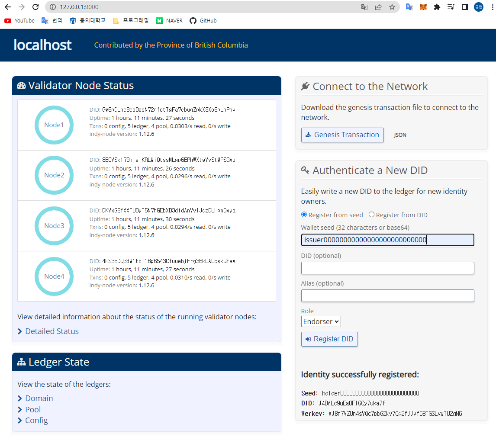
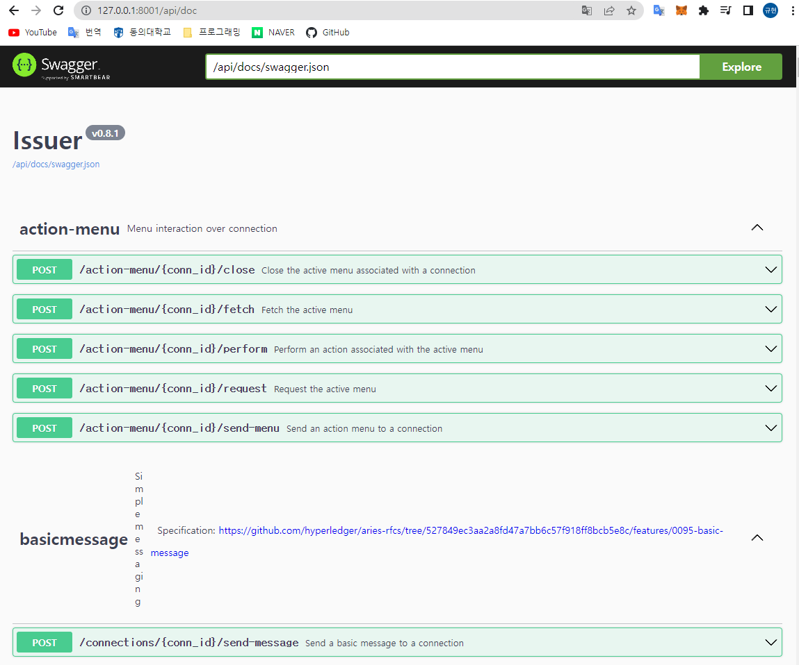
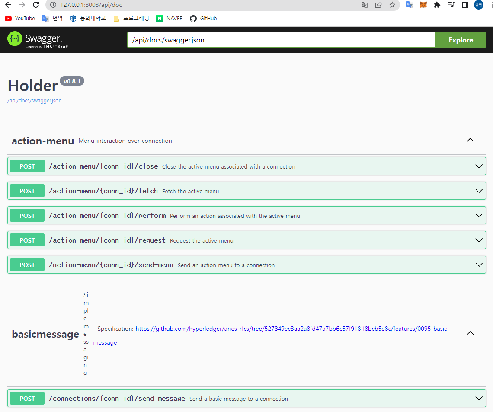

# Start ACA-PY

ACA-PY 코드 분석을 위해 컨테이너를 사용한 Aries 실행 환경 조정

# ACA-PY 설치

docker를 사용해 기반이 되는 이미지를 가져온다. 기반이 되는 이미지 정보는 다음과 같다. → [https://hub.docker.com/r/bcgovimages/von-image](https://hub.docker.com/r/bcgovimages/von-image)

```bash
docker pull bcgovimages/von-image:py36-1.15-1
```

이후 받은 이미지를 사용해 컨테이너를 만들어 실행한다.

```bash
docker run -itd --name aca-py --user root bcgovimages/von-image:py36-1.15-1
docker exec -it aca-py /bin/bash
```

aries 저장소를 git으로 다운 받아 이동한다.

```bash
$ git clone [https://github.com/hyperledger/aries-cloudagent-python.git](https://github.com/hyperledger/aries-cloudagent-python.git)
$ cd aries-cloudagent-python/
```

aries에 필요한 종속성을 pip를 통해 받고 빌드를 시작한다.

```bash
$ pip3 install -r requirements.txt
$ python setup.py install
```

이후 완성된 파일을 실행하여 성공적으로 빌드가 됬는지 확인한다.

```bash
$ cd build/scripts-3.6/
$ ./aca-py --help
$ ./aca-py start --help 
```

<aside>
💡 개발 모드일 경우 aries-cloudagent-python 디렉토리에서 ‘python -m pip install -e .’ 또는 ‘python [setup.py](http://setup.py/) develop’ 명령어 사용

</aside>

해당 컨테이너를 계속해서 사용하기 위해선 컨테이너를 이미지로 바꾸는 편이 좋다. 컨테이너를 이미지로 만들면 이후 해당 컨테이너를 사용할 때 위의 과정을 반복할 필요없이 이미지를 컨테이너화 하는 것으로 빠르게 환경을 구축할 수 있다.

본인은 코드 수정을 용이하게 하기 위해 파일 편집 프로그램인 ‘vim’을 설치하고 이미지화 했다.

```bash
$ apt update
$ apt install vim
$ exit
```

컨테이너 밖으로 나간 뒤 commit 명령어를 통해 컨테이너를 이미지화 한다. 

```bash
docker commit aca-py giry0612/aries-test:latest // commit 컨테이너이름 이미지이름:태그
docker imgaes // 이미지 확인
```

추가로 해당 이미지를 docker hub에 올릴 경우 로그인하는 것으로 어디서든 이미지를 받을 수 있기 때문에 편리하다. 이미지를 docker hub에 올리기 위해선 docker hub에 로그인하여 이미지를 담을 repository를 만든다. 이후 docker login 명령어 또는 Docker Desktop을 통해 로그인을 한 뒤 docker push 명령어를 통해 이미지를 docker hub repository에 올린다.

```bash
docker push giry0612/aries-test:latest
```

<aside>
💡 docker hub에 이미지를 올리기 위해선 이미지 이름 앞에 추가 이름을 입력해 다른 이미지와의 중복을 방지해야한다. 위 예시 처럼 이미지 이름 앞에 ‘/’로 추가 이름을 입력하면 된다.

</aside>

이후 docker hub repository에 이미지가 올라갔는지 확인하면 되며 이후 해당 이미지가 필요할 때 docekr hub에 로그인 한 뒤 docker pull 명령어를 사용해 다운받으면 된다. 

```bash
docker pull giry0612/aries-test:latest
docker imgaes
docker run -itd --name aca-py --user root giry0612/aries-test:latest
```

# ACA-PY 코드 수정

위 과정을 통해 aca-py 실행파일이 완성되어 실행이 가능하다면 이후 코드를 수정해 작업할 수 있는 환경이 완성된다. 코드의 경우 ‘aries-cloudagent-python/aries_cloudagent’ 폴더에 있으며 내부 파이썬 파일을 수정하여 빌드를 진행하면 수정된 내용으로 실행된다.

만약 처음 실행 시 ‘Hello World’ 출력을 하고 싶다면 코드가 있는 폴더로 이동해 처음 실행되는 함수인 ‘__main__.py’를 수정하면 된다. 

```bash
$ cd aries_cloudagent
$ vim __main__.py
```

<aside>
💡 vim의 경우 ‘vim 폴더이름’을 통해 수정이 가능하며 이후 a키를 입력해 입력 모드로 들어갈 수 있다. 문서를 수정한 이후 Esc를 눌러 명령모드로 들어간 뒤 wq를 입력하여 엔터를 치면 저장이 된다. vim의 자세한 사용법은 해당 링크에 있다. → [https://zeddios.tistory.com/122](https://zeddios.tistory.com/122)

</aside>

’__main__.py’의 main 함수에 print 함수를 추가해 원하는 문자열을 입력하고 저장한다. 이후 프로젝트 최상위 폴더로 나간 뒤 ‘python setup.py develop’ 명령어를 통해 빌드한다. 이후 빌드된 파일을 실행해 변경된 코드가 작동하는지 확인한다. 

```bash
$ cd ..
$ python setup.py develop
$ cd build/scripts-3.6/
$ ./aca-py start --help
```

# ACA-PY 실행

<aside>

💡 해당 실행 내용은 ‘ACA-PY 동작’ 부분과 내용이 조금 겹칠 수 있습니다.

</aside>

Hyperledger Aries 코드를 빌드할 경우 ‘aca-py’라는 실행파일이 나오며 이를 사용해 ‘aries_cloudagent’ 코드를 실행할 수 있다. ‘aca-py’를 사용한 실행은 다음 링크에 나와있다. → [https://github.com/hyperledger/aries-cloudagent-python/blob/main/DevReadMe.md](https://github.com/hyperledger/aries-cloudagent-python/blob/main/DevReadMe.md)

aca-py의 동작을 위해선 블록체인이 필요하며 본 실행의 경우 von-network를 사용하였다.

```bash
git clone [https://github.com/bcgov/von-network.git](https://github.com/bcgov/von-network.git)
cd von-network
./manage build
./manage start
```

위 과정을 통해 Hyperledger Indy 기반의 Pool이 동작하며 웹 브라우저를 통해 확인할 수 있다. → [http://127.0.0.1:9000/](http://127.0.0.1:9000/)

또한 indy를 사용한 서비스 이용을 위해선 DID 정보기 미연에 블록체인에 저장되어 있어야하며 von-network의 ‘Authenticate a New DID' 기능을 사용해 추가할 수 있다. ‘Authenticate a New DID'의 ‘Register from seed’를 체크한 뒤 ‘Wallet seed’ 항목에 ‘issuer00000000000000000000000000’를 작성, 이후 ‘Register DID’ 버튼을 클릭하면 Pool에 새로운 DID가 추가된 것을 확인할 수 있다. 본 실행에는 Issuer 이외에 Holder가 추가로 있기 때문에 ‘holder00000000000000000000000000’ 값을 추가로 실행한다.



aca-py는 P2P 통신을 위한 에이전트로서 서버 및 클라이언트가 작동하며 웹 사이트 형식의 API를 제공한다. 사용자는 이를 사용하기 위해 데이터가 들어오는 inbound 값과 outbound 값을 지정할 필요가 있으며 컨테이너 생성 시 ip 및 port를 지정해주는 것이 좋다.

```bash
docker run -itd --name aca-py-issuer --user root -p 8000-8001:8000-8001 giry0612/aries-test:latest
docker exec -it aca-py-issuer /bin/bash
```

아래와 같이 작성하여 Agent를 가동한다.

```bash
$ cd aries-cloudagent-python/build/scripts-3.6/
$ PORTS="8000 8001" ./aca-py start -l Issuer -it http 0.0.0.0 8000 -ot http --admin 0.0.0.0 8001 --admin-insecure-mode -e http://127.0.0.1:8000 --genesis-url http://220.68.5.139:9000/genesis --log-level info --wallet-type indy --wallet-name issuerwallet --wallet-key issuerkey --auto-provision --auto-accept-invites --auto-accept-requests --auto-ping-connection --auto-respond-credential-proposal --auto-respond-credential-offer --auto-respond-credential-request --auto-store-credential --seed issuer00000000000000000000000000
```

가동 이후 다음 사이트로 이동 시 Agent의 API를 사용할 수 있다. → [http://127.0.0.1:8001/api/doc](http://127.0.0.1:8001/api/doc)



Issuer와 통신하기 위한 추가 에이전트 작동 시 컨테이너를 새로 만들어 시행해야하며 Port 값 및 aca-py 옵션 값들을 바꿔야 한다. 

```bash
docker run -itd --name aca-py-holder --user root -p 8002-8003:8002-8003 giry0612/aries-test:latest
docker exec -it aca-py-holder /bin/bash
$ cd aries-cloudagent-python/build/scripts-3.6/
$ PORTS="8002 8003" ./aca-py start -l Holder -it http 0.0.0.0 8002 -ot http --admin 0.0.0.0 8003 --admin-insecure-mode -e http://127.0.0.1:8003 --genesis-url http://220.68.5.139:9000/genesis --log-level info --wallet-type indy --wallet-name holderwallet --wallet-key holderkey --auto-provision --auto-accept-invites --auto-accept-requests --auto-ping-connection --auto-respond-credential-proposal --auto-respond-credential-offer --auto-respond-credential-request --auto-store-credential --seed holder00000000000000000000000000
```

이후 Issuer와 같이 해당 사이트로 이동 시 API를 이용할 수 있다. → [http://127.0.0.1:8003/api/doc](http://127.0.0.1:8003/api/doc)



# ACA-PY VC VP 코드 수정 테스트

Hyperledger Aries의 VC, VP 동작 이해를 위해 코드를 수정해 동작에 필요한 값들을 조회한다. 수정이 필요한 부분은 다음 링크를 통해 확인할 수 있다.

- VC 동작 부분 : [https://github.com/hyperledger/aries-cloudagent-python/tree/main/aries_cloudagent/protocols/issue_credential/v2_0](https://github.com/hyperledger/aries-cloudagent-python/tree/main/aries_cloudagent/protocols/issue_credential/v2_0)
- VP 동작 부분 : [https://github.com/hyperledger/aries-cloudagent-python/tree/main/aries_cloudagent/protocols/present_proof/v2_0](https://github.com/hyperledger/aries-cloudagent-python/tree/main/aries_cloudagent/protocols/present_proof/v2_0)

실행은 docker를 사용해 컨테이너를 만든 이후 진행한다. 컨테이너 생성 이후 코드 수정을 위해 코드 폴더 내부로 들어간다. 현재 VP 발급 및 VP 발급 부분의 확인이 필요하므로 해당 함수 실행 부분에 ‘print’ 문을 넣어 해당 코드가 실행되는 것을 확인할 것이다. 코드 수정의 경우 위의 ‘VC 동작 부분’과 ‘VP 동작 부분’을 수정할 것이다.

```bash
$ cd aries-cloudagent-python
$ cd aries_cloudagent/protocols/issue_credential/v2_0/
$ vim manager.py
$ cd /home/indy/aries-cloudagent-python/aries_cloudagent/protocols/present_proof/v2_0
$ vim manager.py
$ cd /home/indy/aries-cloudagent-python/
$ python setup.py develop
$ cd /home/indy/aries-cloudagent-python/build/scripts-3.6/
$ PORTS="8000 8001" ./aca-py start -l Issuer -it http 0.0.0.0 8000 -ot http --admin 0.0.0.0 8001 --admin-insecure-mode -e http://127.0.0.1:8000 --genesis-url http://220.68.5.139:9000/genesis --log-level info --wallet-type indy --wallet-name issuerwallet --wallet-key issuerkey --auto-provision --auto-accept-invites --auto-accept-requests --auto-ping-connection --auto-respond-credential-proposal --auto-respond-credential-offer --auto-respond-credential-request --auto-store-credential --seed issuer00000000000000000000000000
```