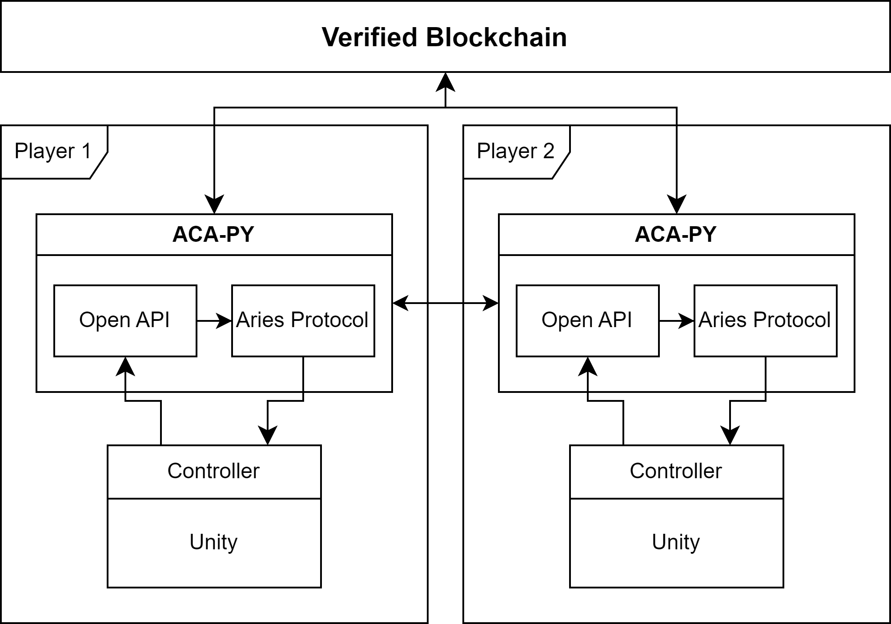

# aries-python-test

Hyperledger Aries Cloud Agent Python 코드 테스트를 위해 작성된 저장소

## 실행방법

윈도우 환경에서 실행하였으며 python 3.11.3 버전 사용

    $python --version
    Python 3.11.3

pip를 사용해 패키지 다운

    $pip --version
    pip 23.1

패키지의 경우 aries-python-test 폴더로 이동 후 pip로 패키지 다운

    $cd aries-python-test
    $pip install -r requirements.txt --user

python을 사용해 코드 실행

    $python main.py

## 코드 목적

1. 메타버스 상에서 DID를 사용한 메시지 통신 (Unity와 ACA-PY 연계)
    - Unity에 ACA-PY 연동을 위한 클라이언트 코드(Controller) 작성
    - ACA-PY는 서버처럼 동작하여 Unity 클라이언트의 요청을 받아 통신
    - Unity는 ACA-PY에서 응답을 받아 Event 형태로 처리

최종 결과물 : Unity 상의 두 사용자가 DID를 사용해 통신, Unity 상의 시민증(VC) 발급 및 증명

- 코드 작성 참고 사이트
    - [ACA-PY 그림](https://github.com/hyperledger/aries-cloudagent-python/blob/main/aca-py_architecture.png)
    - [Connection Test Code](https://github.com/hyperledger/aries-cloudagent-python/blob/main/aries_cloudagent/protocols/connections/v1_0/tests/test_manager.py)
    - [InMemoryProfile](https://github.com/hyperledger/aries-cloudagent-python/blob/main/aries_cloudagent/core/in_memory/profile.py)
    - [genesis url load function : fetch](https://github.com/hyperledger/aries-cloudagent-python/blob/main/aries_cloudagent/utils/http.py)
    - [Webhook-Call back URL](https://leffept.tistory.com/329)
    - [Welcome to initial DID Platform Developer Site](https://initial-v2-platform.readthedocs.io/ko/master/home/)
    - [ACA-PY Controller Demo](https://github.com/hyperledger/aries-cloudagent-python/tree/main/demo)
        - [agent_container.py](https://github.com/hyperledger/aries-cloudagent-python/blob/main/demo/runners/agent_container.py)
        - [agent.py](https://github.com/hyperledger/aries-cloudagent-python/blob/main/demo/runners/support/agent.py)
            - [admin_POST](https://github.com/hyperledger/aries-cloudagent-python/blob/main/demo/runners/support/agent.py#L971)
            - [admin_request](https://github.com/hyperledger/aries-cloudagent-python/blob/main/demo/runners/support/agent.py#L877)

## 시스템 설계

### 전재 조건

- 사용자들은 모두 DID를 가지고 있다.

### Controller 기능

- 

### 통신 연결 시 

1. 사용자는 상대방의 DID를 확인한다.
2. 사용자는 연결 기록을 확인하여 이미 연결한 기록이 있는 DID인지 확인한다.

- 처음 연결일 경우
    1. 사용자는 상대방의 DID를 통해 DID Doc를 조회
    2. 조회한 DID Doc에서 'publickey', 'endpoint'를 확인하여 이를 Controller에 전달한다.
    3. Controller는 받은 정보를 통해 ACA-PY의 Connection Request API 사용
    4. ACA-PY는 받은 정보를 토대로 상대방의 ACA-PY에게 Connection Request 메시지를 전달
    5. 상대방의 ACA-PY는 Connection Request 메시지를 저장한 뒤, Unity의 Controller에게 연결 요청이 온것을 알린다.
    6. Controller는 연결 요청을 받고 이를 Unity의 사용자에게 알려 연결을 받을 것인지 확인한다.
    7. 연결을 받을 경우 이를 Controller에게 전달한다.
    8. Controller는 받은 Connection Request에 대한 응답을 위해 ACA-PY의 Connection Respone을 실행하여 응답을 전달한다.

- 연결 기록이 있을 경우
    1. 사용자는 상대방의 DID를 

## aries Protocol 정리

        protocols
        |   didcomm_prefix.py
        |
        +---actionmenu
        |   |   definition.py
        |   |
        |   \---v1_0
        |       |   base_service.py
        |       |   controller.py
        |       |   driver_service.py
        |       |   message_types.py
        |       |   routes.py
        |       |   util.py
        |       |
        |       +---handlers
        |       |       menu_handler.py
        |       |       menu_request_handler.py
        |       |       perform_handler.py
        |       |   
        |       |
        |       +---messages
        |       |       menu.py
        |       |       menu_request.py
        |       |       perform.py
        |       |   
        |       |
        |       \---models
        |               menu_form.py
        |               menu_form_param.py
        |               menu_option.py
        |       
        |
        +---basicmessage
        |   |
        |   \---v1_0
        |       |   message_types.py
        |       |   routes.py
        |       |
        |       +---handlers
        |       |       basicmessage_handler.py
        |       |   
        |       \---messages
        |               basicmessage.py
        |          
        +---connections
        |   |
        |   \---v1_0
        |       |   manager.py
        |       |   message_types.py
        |       |   routes.py
        |       |
        |       +---handlers
        |       |       connection_invitation_handler.py
        |       |       connection_request_handler.py
        |       |       connection_response_handler.py
        |       |    
        |       |
        |       +---messages
        |       |       connection_invitation.py
        |       |       connection_request.py
        |       |       connection_response.py
        |       |       problem_report.py
        |       |   
        |       |
        |       \---models
        |               connection_detail.py
        |
        +---coordinate_mediation
        |   |   mediation_invite_store.py
        |   |
        |   \---v1_0
        |       |   controller.py
        |       |   manager.py
        |       |   message_types.py
        |       |   normalization.py
        |       |   routes.py
        |       |   route_manager.py
        |       |   route_manager_provider.py
        |       |
        |       +---handlers
        |       |       keylist_handler.py
        |       |       keylist_query_handler.py
        |       |       keylist_update_handler.py
        |       |       keylist_update_response_handler.py
        |       |       mediation_deny_handler.py
        |       |       mediation_grant_handler.py
        |       |       mediation_request_handler.py
        |       |       problem_report_handler.py
        |       |   
        |       |
        |       +---messages
        |       |   |   keylist.py
        |       |   |   keylist_query.py
        |       |   |   keylist_update.py
        |       |   |   keylist_update_response.py
        |       |   |   mediate_deny.py
        |       |   |   mediate_grant.py
        |       |   |   mediate_request.py
        |       |   |   problem_report.py
        |       |   |
        |       |   \---inner
        |       |           keylist_key.py
        |       |           keylist_query_paginate.py
        |       |           keylist_updated.py
        |       |           keylist_update_rule.py
        |       |   
        |       \---models
        |               mediation_record.py
        |
        +---didexchange
        |   |
        |   \---v1_0
        |       |   manager.py
        |       |   message_types.py
        |       |   routes.py
        |       |
        |       +---handlers
        |       |       complete_handler.py
        |       |       invitation_handler.py
        |       |       request_handler.py
        |       |       response_handler.py
        |       |
        |       \---messages
        |               complete.py
        |               problem_report_reason.py
        |               request.py
        |               response.py
        |
        +---discovery
        |   |
        |   +---v1_0
        |   |   |   manager.py
        |   |   |   message_types.py
        |   |   |   routes.py
        |   |   |
        |   |   +---handlers
        |   |   |       disclose_handler.py
        |   |   |       query_handler.py
        |   |   |
        |   |   +---messages
        |   |   |       disclose.py
        |   |   |       query.py
        |   |   |
        |   |   \---models
        |   |           discovery_record.py
        |   |
        |   \---v2_0
        |       |   manager.py
        |       |   message_types.py
        |       |   routes.py
        |       |
        |       +---handlers
        |       |       disclosures_handler.py
        |       |       queries_handler.py
        |       |
        |       +---messages
        |       |       disclosures.py
        |       |       queries.py
        |       |
        |       \---models
        |               discovery_record.py
        |
        +---endorse_transaction
        |   |
        |   \---v1_0
        |       |   controller.py
        |       |   manager.py
        |       |   message_types.py
        |       |   routes.py
        |       |   transaction_jobs.py
        |       |   util.py
        |       |
        |       +---handlers
        |       |       endorsed_transaction_response_handler.py
        |       |       refused_transaction_response_handler.py
        |       |       transaction_acknowledgement_handler.py
        |       |       transaction_cancel_handler.py
        |       |       transaction_job_to_send_handler.py
        |       |       transaction_request_handler.py
        |       |       transaction_resend_handler.py
        |       |
        |       +---messages
        |       |       cancel_transaction.py
        |       |       endorsed_transaction_response.py
        |       |       messages_attach.py
        |       |       refused_transaction_response.py
        |       |       transaction_acknowledgement.py
        |       |       transaction_job_to_send.py
        |       |       transaction_request.py
        |       |       transaction_resend.py
        |       |
        |       \---models
        |               transaction_record.py
        |
        +---introduction
        |   |
        |   \---v0_1
        |       |   base_service.py
        |       |   demo_service.py
        |       |   message_types.py
        |       |   routes.py
        |       |
        |       +---handlers
        |       |       forward_invitation_handler.py
        |       |       invitation_handler.py
        |       |       invitation_request_handler.py
        |       |
        |       \---messages
        |               forward_invitation.py
        |               invitation.py
        |               invitation_request.py
        |
        +---issue_credential
        |   |
        |   +---v1_0
        |   |   |   controller.py
        |   |   |   manager.py
        |   |   |   message_types.py
        |   |   |   routes.py
        |   |   |
        |   |   +---handlers
        |   |   |       credential_ack_handler.py
        |   |   |       credential_issue_handler.py
        |   |   |       credential_offer_handler.py
        |   |   |       credential_problem_report_handler.py
        |   |   |       credential_proposal_handler.py
        |   |   |       credential_request_handler.py
        |   |   |
        |   |   +---messages
        |   |   |   |   credential_ack.py
        |   |   |   |   credential_exchange_webhook.py
        |   |   |   |   credential_issue.py
        |   |   |   |   credential_offer.py
        |   |   |   |   credential_problem_report.py
        |   |   |   |   credential_proposal.py
        |   |   |   |   credential_request.py
        |   |   |   |
        |   |   |   \---inner
        |   |   |           credential_preview.py
        |   |   |
        |   |   \---models
        |   |           credential_exchange.py
        |   |
        |   \---v2_0
        |       |   controller.py
        |       |   manager.py
        |       |   message_types.py
        |       |   routes.py
        |       |
        |       +---formats
        |       |   |   handler.py
        |       |   |
        |       |   +---indy
        |       |   |       handler.py
        |       |   |
        |       |   \---ld_proof
        |       |       |   handler.py
        |       |       |
        |       |       \---models
        |       |               cred_detail.py
        |       |               cred_detail_options.py
        |       |
        |       +---handlers
        |       |       cred_ack_handler.py
        |       |       cred_issue_handler.py
        |       |       cred_offer_handler.py
        |       |       cred_problem_report_handler.py
        |       |       cred_proposal_handler.py
        |       |       cred_request_handler.py
        |       |
        |       +---messages
        |       |   |   cred_ack.py
        |       |   |   cred_ex_record_webhook.py
        |       |   |   cred_format.py
        |       |   |   cred_issue.py
        |       |   |   cred_offer.py
        |       |   |   cred_problem_report.py
        |       |   |   cred_proposal.py
        |       |   |   cred_request.py
        |       |   |
        |       |   \---inner
        |       |           cred_preview.py
        |       |
        |       \---models
        |           |   cred_ex_record.py
        |           |
        |           \---detail
        |                   indy.py
        |                   ld_proof.py
        |
        +---notification
        |   |
        |   \---v1_0
        |       |   message_types.py
        |       |
        |       +---handlers
        |       |       ack_handler.py
        |       |
        |       \---messages
        |               ack.py
        |
        +---out_of_band
        |   |
        |   \---v1_0
        |       |   controller.py
        |       |   manager.py
        |       |   message_types.py
        |       |   routes.py
        |       |
        |       +---handlers
        |       |       problem_report_handler.py
        |       |       reuse_accept_handler.py
        |       |       reuse_handler.py
        |       |
        |       +---messages
        |       |       invitation.py
        |       |       problem_report.py
        |       |       reuse.py
        |       |       reuse_accept.py
        |       |       service.py
        |       |
        |       \---models
        |               invitation.py
        |               oob_record.py
        |
        +---present_proof
        |   |
        |   +---dif
        |   |       pres_exch.py
        |   |       pres_exch_handler.py
        |   |       pres_proposal_schema.py
        |   |       pres_request_schema.py
        |   |       pres_schema.py
        |   |
        |   +---indy
        |   |       pres_exch_handler.py
        |   |
        |   +---v1_0
        |   |   |   controller.py
        |   |   |   manager.py
        |   |   |   message_types.py
        |   |   |   routes.py
        |   |   |
        |   |   +---handlers
        |   |   |       presentation_ack_handler.py
        |   |   |       presentation_handler.py
        |   |   |       presentation_problem_report_handler.py
        |   |   |       presentation_proposal_handler.py
        |   |   |       presentation_request_handler.py
        |   |   |
        |   |   +---messages
        |   |   |       presentation.py
        |   |   |       presentation_ack.py
        |   |   |       presentation_problem_report.py
        |   |   |       presentation_proposal.py
        |   |   |       presentation_request.py
        |   |   |       presentation_webhook.py
        |   |   |
        |   |   \---models
        |   |           presentation_exchange.py
        |   |
        |   \---v2_0
        |       |   controller.py
        |       |   manager.py
        |       |   message_types.py
        |       |   routes.py
        |       |
        |       +---formats
        |       |   |   handler.py
        |       |   |
        |       |   +---dif
        |       |   |       handler.py
        |       |   |
        |       |   \---indy
        |       |           handler.py
        |       |
        |       +---handlers
        |       |       pres_ack_handler.py
        |       |       pres_handler.py
        |       |       pres_problem_report_handler.py
        |       |       pres_proposal_handler.py
        |       |       pres_request_handler.py
        |       |
        |       +---messages
        |       |       pres.py
        |       |       pres_ack.py
        |       |       pres_format.py
        |       |       pres_problem_report.py
        |       |       pres_proposal.py
        |       |       pres_request.py
        |       |       pres_webhook.py
        |       |
        |       \---models
        |               pres_exchange.py
        |
        +---problem_report
        |   |
        |   \---v1_0
        |           handler.py
        |           message.py
        |           message_types.py
        |
        +---revocation_notification
        |   |
        |   +---v1_0
        |   |   |   message_types.py
        |   |   |   routes.py
        |   |   |
        |   |   +---handlers
        |   |   |       revoke_handler.py
        |   |   |
        |   |   +---messages
        |   |   |       revoke.py
        |   |   |
        |   |   \---models
        |   |           rev_notification_record.py
        |   |
        |   \---v2_0
        |       |   message_types.py
        |       |   routes.py
        |       |
        |       +---handlers
        |       |       revoke_handler.py
        |       |
        |       +---messages
        |       |       revoke.py
        |       |
        |       \---models
        |               rev_notification_record.py
        |
        +---routing
        |   |
        |   \---v1_0
        |       |   manager.py
        |       |   message_types.py
        |       |
        |       +---handlers
        |       |       forward_handler.py
        |       |       route_query_request_handler.py
        |       |       route_query_response_handler.py
        |       |       route_update_request_handler.py
        |       |       route_update_response_handler.py
        |       |
        |       +---messages
        |       |       forward.py
        |       |       route_query_request.py
        |       |       route_query_response.py
        |       |       route_update_request.py
        |       |       route_update_response.py
        |       |
        |       \---models
        |               paginate.py
        |               paginated.py
        |               route_query_result.py
        |               route_record.py
        |               route_update.py
        |               route_updated.py
        |
        \---trustping
            |
            \---v1_0
                |   message_types.py
                |   routes.py
                |
                +---handlers
                |       ping_handler.py
                |       ping_response_handler.py
                |
                \---messages
                        ping.py
                        ping_response.py