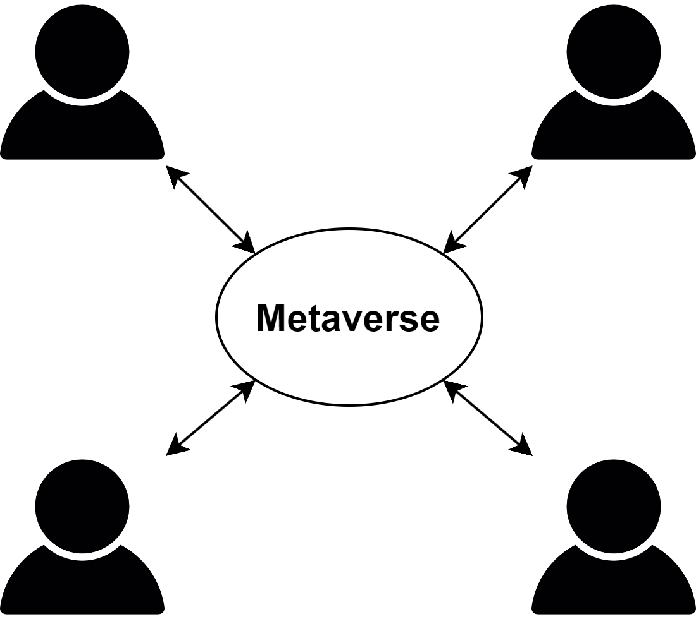

# Metaverse

## DID와 Metaverse

### Metaverse란?

가상 현실으로 현실과 비슷한 상호작용이 가능한 디지털 세계를 말한다.

### Metaverse의 특징

메타버스의 특징은 다음과 같다.

현재 대부분의 메타버스는 월드 기반으로 동작한다. 사용자는 메타버스 플랫폼에 접속하여 본인의 아바타를 생성 및 선택한 뒤 

현재 블록체인을 활용한 메타버스는 이더리움의 스마트 컨트렉트와 자체적인 암호화폐를 주로 사용한다. 이떄 컨텐츠엔 NFT를 화폐에는 암호화폐를 사용해 컨텐츠 생산과 거래에 주목하는 느낌이 강하다. 또한 LAND라고 하는 땅을 사고 해당 땅에 본인 만의 컨텐츠를 만들어 공유하며 메타버스를 소비하는 경향이 크다. 

- 블록체인을 사용하는 메타버스
  - [이더리움 기반의 메타버스 Cryptovoxels](https://www.voxels.com/)
  - [블록체인 기반 메타버스 Somnium Space](https://somniumspace.com/#owhership)

#### 중앙화 Metaverse

현재 대부분의 메타버스는 중앙화 서비스를 제공한다. 메타버스 서비스 제공자는 사용자들에게 메타버스 이용을 위한 클라이언트를 제공하며 사용자는 이를 통해 메타버스 서비스 제공자가 만든 메타버스 서버에 접속하여 서비스를 이용한다. 사용자는 메타버스 서버 접속에 사용자 인증을 거치며 사용자의 개인 정보를 제공한다. 

위와 같은 중앙화 메타버스는 다음과 같은 특징을 지닌다.

- 중앙화 메타버스의 장점 
  - 어디든 접속 가능 : 메타버스 접속을 위한 클라이언트를 제공할 수 있다면 다양한 환경에서 메타버스를 이용할 수 있다.
  - 사용자 정보 관리 : 서버 측에서 사용자 정보를 관리하기 때문에 사용자는 본인의 정보 보호를 위한 비용이 발생하지 않는다.
  - 범죄 사용자 제한 : 서버 측에서 사용자를 필터링 하는 것으로 일부 범죄 이력이 있거나 범죄를 저지른 사용자의 차단이 가능하다.

- 중앙화 메타버스의 단점
  - 단일 서버 의존성 : 특정 서버에 의존하기 때문에 서버의 영향을 크게 받으며 서버 상태에 따라 사용의 제한이 발생할 수 있다.
  - 프라이버시 문제 : 하나의 서버가 많은 사용자의 정보를 관리할 경우 해킹을 통해 큰 피해가 발생할 수 있으며 사용자는 이를 제어할 수 없다.
  - 컨텐츠의 의존성 : 사용자가 만든 정보 및 컨텐츠가 서버에 올라가 사용자 본인이 관리하기 힘드며 최악의 경우 서비스 종료로 인한 사용자 정보 및 컨텐츠가 분실될 수 있다.
  - 확장성의 제한 : 

- 중앙화 메타버스 예시
  - 로블록스
  - 마인크래프트 

#### 탈중앙 Metaverse

탈중앙 메타버스의 경우 오픈 소스 플랫폼을 통해 관리되며 커뮤니티가 형성되어 제어된다.

위와 같은 탈중앙 메타버스는 다음과 같은 특징을 지닌다.

- 탈중앙 메타버스의 장점 
  - 높은 확장성 : 
  - 서버 비용 절감 : 

- 탈중앙 메타버스의 단점
  - 보안 문제 : 
  - 대역폭 부하 : 
  - 사용자 특정 : 

- 탈중앙 메타버스 예시
  - [탈중앙화된 메타버스 Decentraland](https://decentraland.org/)
    - Decentraland 투표 DApp인 Agora를 사용해 커뮤니티에 영향을 끼치는 문제에 대한 투표가 가능하다. - [디센트럴랜드(MANA)란?](https://blockchain-media.org/chto-takoe-decentraland-mana)
    - 디센트럴랜드 클라이언트는 이더리움 네트워크에 연결하여 랜드의 스마트 계약에 대한 업데이트를 가져온다. - [해시넷 디센트럴랜드](http://wiki.hash.kr/index.php/%EB%94%94%EC%84%BC%ED%8A%B8%EB%9F%B4%EB%9E%9C%EB%93%9C)
  - [블록체인 기반 메타버스 Somnium Space](https://somniumspace.com/#owhership)
    - 사용자는 NFT 형태의 디지털 토지를 구매하면 이를 자유롭게 사용이 가능하며 Somnium Space는 이를 간섭하지 않는다.

- 메타버스 정보
  - [여러분을 위한 메타버스 가이드](https://www.ledger.com/ko/academy/topics-ko/nfts/%EC%97%AC%EB%9F%AC%EB%B6%84%EC%9D%84-%EC%9C%84%ED%95%9C-%EB%A9%94%ED%83%80%EB%B2%84%EC%8A%A4-%EA%B0%80%EC%9D%B4%EB%93%9C)

오픈 메타버스는 오픈 소스 소프트웨어와 개방형 사향을 통해 누구나 쉽게 사용이 가능하고 연결이 가능한 메타버스를 말한다. 오픈 메타버스 재단은 이러한 오픈 메타버스를 위해 여러 다양한 기업들과의 연계와 일관된 규칙 재정을 통해 개방되고 확장가능한 메타버스 개발을 지향한다.

- 오픈메타버스 정보
  - [“메타버스도 공개 표준 필요” 리눅스재단, 오픈 메타버스 재단 설립](https://www.itworld.co.kr/news/274273#csidx1445b9397a06cf78077ef3f7f398384)
  - [Open Metaverse Foundation – Linux Foundation Project](https://www.openmv.org/)
  - [The Open Metaverse OS](https://outlierventures.io/research/the-open-metaverse-os/)
  - [메타버스와 오픈소스](https://www.oss.kr/oss_guide/show/c203c6fb-c9cc-4e67-bb65-ea177244ecdd)

#### Metaverse 비교

|| 로블록스 | 샌드박스 | Decentraland |
| --- | --- | --- | --- |
| NFT 사용여부 | 사용안함 | 사용 | 사용 |
| 클라이언트 관리 (오픈 소스화 여부) | 서버가 관리 | 서버가 관리 | 커뮤니티가 관리 |
| 분산 파일 시스템 사용 | 사용 안함 | 사용안함 | 사용안함 |
| 가상 화폐 | 자체 화폐 사용 (블록체인 아님) | 사용 | 사용 |

### Metaverse의 문제점

- 사용자의 행동 기록의 유출

- 사이버 범죄의 다양성 및 접근성 증가

### DID란?

기존의 시스템은 중앙 집중형으로 사용자의 정보를 서비스 제공자가 관리하는 형태이다. 

### DID의 특징

DID의 정점은 다음과 같다. 

- 검증을 위한 중앙 시스템의 간섭 배제 : Holder가 서비스 이용을 위해 Verifier에게 VP를 제출하고 자격 증명하는 과정이 Issuer에게 노출되지 않는다. VP를 통한 검증은 블록체인에 의해 이루어지기 때문에 이를 Issuer에게 알리지 않아 본인의 개인 정보 노출을 줄일 수 있다.
- 사용자 정보 관리 비용 감소 : Verifier는 Holder가 서비스 이용시 일회성으로 검증하는 것으로 사용자 정보를 관리할 필요가 없어지며 사용자 정보 관리를 위한 데이터 베이스 및 보안 관리 비용을 절감할 수 있다. 
- 자기 주관적 신원 관리 : Holder가 원하는 정보만을 보여주거나 영지식 증명을 통해 검증 결과만을 제출하는 것으로 사용자는 자신의 정보를 선택적으로 증명할 수 있다. 또한 필요에 따라 VC를 폐지하는 것으로 제출한 VP의 효력을 없애는 것 또한 가능하다.
- 개인 정보 분산 방지 : 위 3가지 특징을 통해 개인 정보의 노출을 줄이고 본인 스스로 정보를 관리하는 것으로 개인 정보의 분산을 줄일 수 있다. 

DID를 사용한 시스템은 다음과 같이 동작할 수 있다.

- [메타버스를 위한 블록체인 기반 신원 관리 방법에 관한 예비 연구](https://www.dbpia.co.kr/journal/articleDetail?nodeId=NODE11229705)
  - 사용자를 닮은 Avata를 사용해 비주얼 적인 증명 사용, DID를 만든 뒤 VC를 발급받은 후 VP를 만들어 인증 (DID Avata)
- [DID와 SBT를 활용한 메타버스내에서의 디지털 인증 체계](https://www.dbpia.co.kr/journal/articleDetail?nodeId=NODE11183788)
  - 사용자는 기존의 DID 및 VC를 사용해 메타버스 내에서 인증을 거친 뒤 SBT를 사용한 증명서를 발급받고 이를 사용, 인증서를 배찌처럼 사용해 매번 VP를 제출하는 것이 아닌 한 번의 인증으로 여러 번 사용, NFT와의 연계 가능

DID를 메타버스에 사용 시 고려해야할 점이 생긴다. 

- NFT와의 연계 : 메타버스가 NFT를 사용할 경우 대부분 클라우드 또는 서버 지갑 (핫 지갑)을 사용하며 사용자 한명 당 하나의 지갑을 사용하는데 이는 언제 어디서든 메타버스 서비스를 제공하기 위해 대부분 멀티 플랫폼을 지원하기 때문이다. 즉 DID와 연동할 경우 DID 지갑을 핫 지갑으로 사용하지 않으면 DID 지갑과 NFT용 지갑이 따로 분리되기 때문에 시스템에 대한 고려가 필요하다. 
- 메타버스 내 데이터 처리 : DID의 특징은 사용자 정보를 최소한으로 하여 데이터의 분산 및 사용자 데이터 관리에 의의를 두는 기술이다. 그러나 서버 형식의 메타버스를 사용할 경우 메타버스의 사용자 활동 기록이 남아 DID를 통한 데이터 은폐의 의미가 퇴색될 수 있다. 

아래는 추가 고려 사항이다.

- 맞춤형 서비스와의 단절 : 

- 추가 내용
  - [메타버스에서의 탈중앙화 자율 조직과 Web 3.0 동향 및 미래 가능성에 대한 고찰](https://www.dbpia.co.kr/journal/articleDetail?nodeId=NODE11118497)
    - 컴퓨터 프로그래밍 규칙에 조직의 구성원들이 개방적으로 투명하게 통제를 받고 운영되는 탈중앙화 자율 조직인 DAO(Decentralized Autonomous Organization) 존재
  - [가상세계를 기반으로 한 메타버스의 개념적 이해와 게임형 메타버스 스토리리빙의 구조에 관한 연구](https://www.dbpia.co.kr/journal/articleDetail?nodeId=NODE11443446)
  - [서비스 유형에 따른 메타버스 특성연구: 월드와 아바타를 중심으로](https://www.dbpia.co.kr/journal/articleDetail?nodeId=NODE11443445)
  - [안전한 디지털 학습데이터 처리를 위한 DID 연구](https://www.dbpia.co.kr/journal/articleDetail?nodeId=NODE11213474)
  - [메타버스 내 사용자 신원 증명을 위한 대체 불가능 토큰 기반 가상 아바타: 가상현실 내 사회적 상호작용을 중심으로](https://www.dbpia.co.kr/journal/articleDetail?nodeId=NODE11158132)
  - [메타버스시대에 블록체인 기반의 전자투표 도입과 선거의 신뢰성 확보방안](https://www.dbpia.co.kr/journal/articleDetail?nodeId=NODE11078308)
  - [메타버스 플랫폼을 위한 하이브리드 블록체인 네트워크 설계 및 구현](https://www.dbpia.co.kr/journal/articleDetail?nodeId=NODE11227369)
    - 메타버스 참여자를 프라이빗 블록체인에 등록하여 메타버스 내에 화폐를 사용한 뒤, 이를 외부 사용을 위해 전환활 경우 퍼블릭 블록체인으로 스왑하여 사용
  - [메타버스 플랫폼에서의 DID 인증 방식에 관한 연구 (확인불가)](https://oasis.ssu.ac.kr/#/search/detail/4995143)
  - [블록체인과 스마트 계약(Smart Contract) : 민사법학과 법조실무에 던지는 도전과 응전 - 비가역적·탈중앙화 거래에 관한 민사법적 쟁점과 법률가의 역할](https://www.dbpia.co.kr/journal/articleDetail?nodeId=NODE10667471)
  - [하이브리드 블록체인 기반의분산 아이디(DID) 네트워크를활용한 마이 데이터 서비스](https://m.riss.kr/recommender/click.do?db=1&link_type=sdTogether&p_mat_type=be54d9b8bc7cdb09&control_no=d545742cdc8d7513ffe0bdc3ef48d419)
  - [분산신원증명(DID)과 공개 키 기반(PKI) 간 상호운용가능한 신뢰연결 프레임워크 기본모델 제안](https://www.dbpia.co.kr/journal/articleDetail?nodeId=NODE11147666)
  - [비대면 진료 시 보건의료정보의 무결성 보장을 위한 DID 기반 의료 마이데이터(MyData) 활용 기법](https://www.dbpia.co.kr/journal/articleDetail?nodeId=NODE11227879)
  - [오픈 메타버스(open metaverse, 개방형 메타버스)에 대한 기대](https://www.irsglobal.com/bbs/rwdboard/15093)
  - [메타버스를 위한 블록체인 기반 신원 관리 방법에 관한 예비 연구](https://www.dbpia.co.kr/journal/articleDetail?nodeId=NODE11229705)

## DID를 사용한 메타버스 시스템 설계

### 처음 실행 시 (회원 가입)

1. 외부 지갑과의 연결 또는 내부 지갑 생성
2. 지갑 내 새로운 DID 생성 및 메타버스 내에서 사용할 아바타 생성
3. 아바타와 DID를 매핑하여 서버에 저장

→ 중간에 인증 과정이 필요한가? (기존 메타버스에서 범죄를 저지른 사람을 유추)

→ 로컬에 아바타 저장, 다른 곳에서도 사용 가능

→ 아바타의 범위? → 아바타 관련 표준이 있는가?

<aside>
💡 아바타 표준의 경우 현재 VRM, Ready Player Me, VRC가 있으며 대부분 Unity를 지원한다.  Unity의 경우 엔진 내에서 사용하기 위한 모델의 표준이 작성되어 있다. 또한 Metaverse에서 사용하기 위한 아바타 표준의 경우 Metaverse-standards forum에서 협의 진행 중이다.

</aside>

<aside>
💡 VRM의 경우 파일 포맷이며 VRM 확장자로 만들어진 모델은 VRM 기능을 지원하는 모든 프로그램에 자유롭게 사용할 수 있다.

</aside>

- 관련 링크)
    
    [VRM](https://vrm.dev/en/)
    
    [Ready Player Me](https://docs.readyplayer.me/ready-player-me/)
    
    [VRC](https://docs.vrchat.com/docs/rig-requirements)
    
    [Unity 메뉴얼](https://docs.unity3d.com/Manual/CreatingDCCAssets.html)
    
    [Metaverse-standards forum](https://metaverse-standards.org/)
    
- 그외 아바타 표준 관련 링크)
    
    [애니메이션 관련 표준 glTF](https://github.com/KhronosGroup/glTF)
    
    [Web3D](https://www.web3d.org/)
    

→ 인증 시 아바타를 사용한 인증은 가능한가? → 블록체인에 DID 저장 시 아바타 정보를 같이 저장하며 이후 해당 아바타를 사용해 로그인 → 아바타 하나에 종속적이며 아바타 분실 또는 복제 시 이에 대한 대처 방법이 필요 → 블록체인에 저장할 아바타 정보?

→ 유니티에서 연결할 지갑은? → 외부 지갑을 연결하기 위한 방법? 

- 유니티 지갑 관련 링크)
    
    [moralis - Unity App to a Web3 Wallet](https://moralis.io/how-to-connect-a-unity-app-to-a-web3-wallet/)
    
    [Unity-Solana Wallet](https://github.com/allartprotocol/unity-solana-wallet)
    

### 처음 실행 이후 사용 시 (로그인)

1. 내부 저장소를 읽어 지갑 확인 또는 DID와 공개 키로 로그인

### 메타버스 내부의 인증 상황

- 메타버스 내부에서 VC 발급 시
- 메타버스 내부에서 VP 사용 시
- 외부에서 발급한 VC를 메타버스 내부에서 사용 시
- 

### 아바타의 VC 발급 과정

1. 이전 활동을 통해 발급자와의 인증 완료
2. 아바타의 DID와 VC 발급자의 DID를 사용한 연결
3. DIDComm을 사용한 통신을 통해 VC 전달

### 아바타의 VP 제시 과정

1. 아바타의 서비스 사용 요청
2. 검증자의 VP 제출 요청 (이때 검증에 필요한 정보 전달)
3. VP 제출 요청 기반으로 VP 생성 후 전달
4. 검증자는 받은 VP를 검증
5. 검증 결과에 따라 서비스 제공 또는 거부

### 예시 상황1) 메타버스 집 출입

1. 사용자가 메타버스 내의 집을 구매
    1. 사용자가 직접 집을 만들 경우?
2. 집 제공자는 사용자에게 집의 주인이라는 증명서 제공
    1. NFT를 사용한 증명서 또는 DID를 사용한 VC
    2. 집의 잠금 장치가 사용자의 DID와 공개 키를 저장
3. 사용자는 증명서를 지갑에 저장
4. 집 출입을 위해 사용자가 집에 접근
5. 사용자가 본인의 DID를 제공하여 집 주인임을 인증
    1. 집의 잠금 장치가 사용자의 DID를 통해 신원 인증 진행
    2. 집의 잠금 장치에 사용자의 DID가 등록되어 가벼운 DID Auth를 통해 인증
6. 인증이 완료되면 사용자가 집에 출입

## 추가 내용

- 아래 내용은 ChatGPT를 사용해 나온 결과이다.

        메타버스와 분산형 신원(DID)을 연동하는 것은 다양한 장점과 잠재적인 이점을 제공합니다. 하지만 동시에 고려해야 할 몇 가지 단점과 주의사항도 있습니다. 아래에 장단점을 나열해 보았습니다.

        장점:

        신원의 소유권과 개인정보 보호: DID를 사용하여 메타버스에서 사용자의 신원과 개인정보를 안전하게 보호할 수 있습니다. 사용자는 자신의 DID를 소유하고 관리함으로써 신원과 데이터에 대한 통제력을 가질 수 있습니다.

        신뢰성과 신원 검증: DID는 탈중앙화된 방식으로 운영되므로, 중앙기관의 의존도가 낮고, 신원 검증에 신뢰성을 부여할 수 있습니다. 이를 통해 메타버스에서 사용자들 간에 신뢰할 수 있는 상호작용이 가능해집니다.

        포터빌리티와 상호운용성: DID는 표준화된 형식으로 정의되어 있어 다양한 플랫폼 및 애플리케이션에서 사용할 수 있습니다. 이는 사용자의 신원과 디지털 자산을 메타버스에서 다른 환경으로 이동하거나 연결하는 데 도움이 됩니다.

        단점 및 주의사항:

        보안과 프라이버시의 책임: 메타버스와 DID의 연동은 개인정보와 신원에 대한 중요한 역할을 수행하므로, 적절한 보안 및 프라이버시 대책이 필요합니다. 사용자 및 서비스 제공자는 안전한 보관, 암호화 및 접근 제어를 위한 적절한 조치를 취해야 합니다.

        기술적 복잡성과 구현 난이도: 메타버스와 DID를 통합하기 위해서는 기술적인 이해와 구현 노력이 필요합니다. 표준화된 DID 프로토콜과 플랫폼 간의 호환성 및 상호운용성 문제도 고려해야 합니다.

        사용자 경험과 접근성: 메타버스와 DID의 연동은 사용자에게 새로운 경험을 제공할 수 있지만, 사용자들에게 낯선 개념과 기술을 요구할 수 있습니다. 사용자 교육 및 접근성 개선에 주의가 필요합니다.

- rust와 c# 연동 :
http://lemonheim.blogspot.com/2020/03/unity3d-rust.html

