# Metaverse_inspection

현재 서비스 중에 있는 메타버스를 조사한 내용 정리

## 현재 메타버스 종류

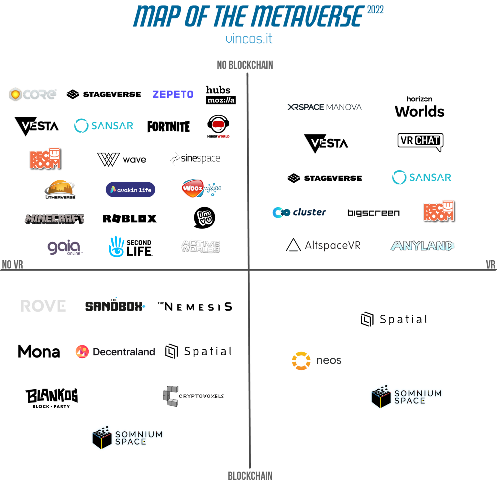

- 메타버스 조사 출처
  - [2023년 최고의 메타버스 TOP 10](https://medium.com/@seobina_/2023%EB%85%84-%EC%B5%9C%EA%B3%A0%EC%9D%98-%EB%A9%94%ED%83%80%EB%B2%84%EC%8A%A4-top-10-4f373461bc1f)
  - [메타버스의 지도](https://vincos.it/2022/04/16/la-mappa-del-metaverso/)

### 로블록스

폐쇠형 메타버스이며 자체 클라이언트 및 에디터를 서버 측에서 관리한다. Robux라는 화폐가 존재하며 로블록스 플랫폼 내에서만 사용할 수 있다. 로블록스는 다양한 월드를 사용자들이 만들어 배포하며 이를 이용하는 것으로 메타버스를 소비한다.

로블록스의 경우 특유의 캐릭터와 접근성 덕에 남녀노소 사용하기 편하며 완성도 높은 로블록스 스튜디오로 인한 높은 퀄리티와 다양한 월드 및 컨텐츠로 인해 월 1억명 이상의 사용자가 이용하는 메타버스이다.

로블록스 스튜디오는 루아 기반 스크립트 언어를 제공하며 사용자에게 무료 서버 및 기능을 지원해주기 때문에 사용자는 멀티 기반의 게임을 쉽게 만들 수 있다.

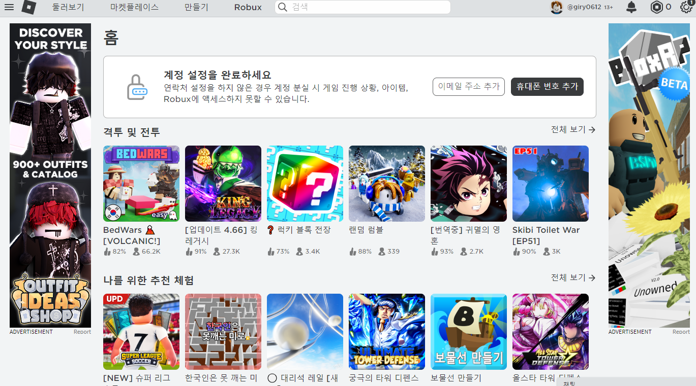

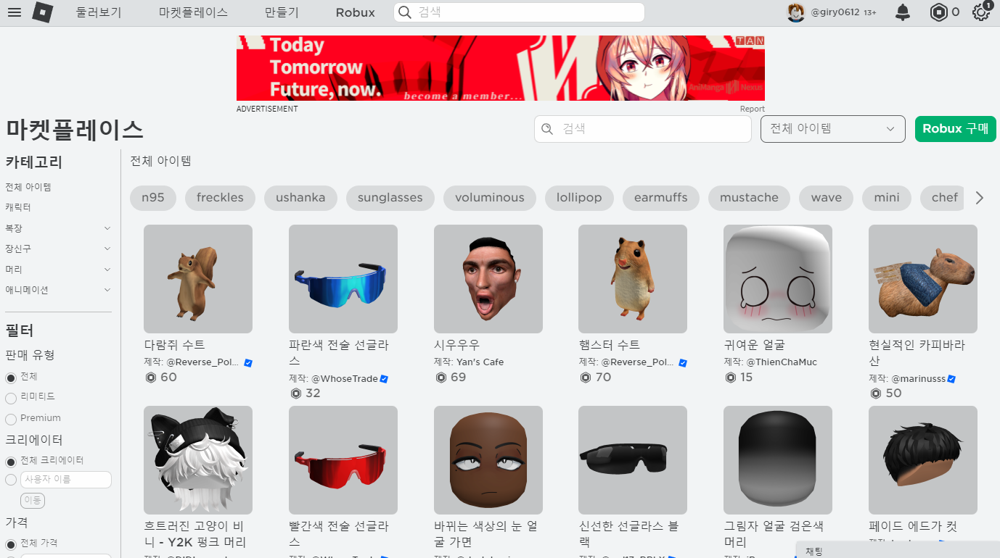

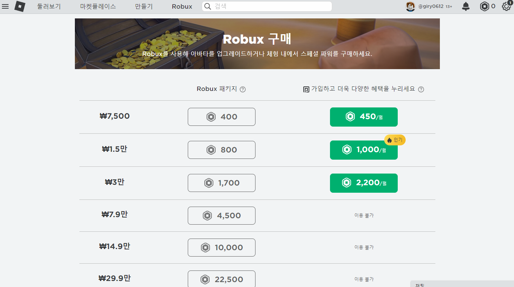

- 링크
  - [로블록스](https://www.roblox.com/home)

### 더 샌드박스

블록체인을 사용한 메타버스로 SAND라는 가상화폐와 LAND라는 NFT 기반의 땅을 구매하여 플레이한다. 또한 사용자는 ASSET을 만들고 NFT화 하여 공유하거나 거래한다. 

LAND 기반이며 사용자는 특정 LAND에 들어가 메타버스를 플레이한다. 

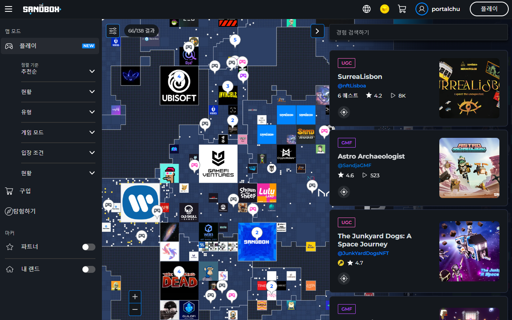

또한 샌드박스에서 만든 ASSET들은 분산형 파일 시스템(IPFS)에 저장되어 관리된다.

- 링크
  - [더샌드박스](https://www.sandbox.game/kr/)
  - [더 샌드박스(The Sandbox)란? ㅣ 블록체인 게임 소개](https://www.btcc.com/ko-KR/academy/crypto-basics/what-is-the-sandbox)

### Decentraland

이더리움 기반의 개방형 메타버스로 분산형 자율 조직(DAO)에 의해 관리된다. 특정 중앙의 제어를 받지 않으며 파일들은 분산 파일 시스템에 의해 관리된다. 

NFT를 사용한 LAND 기반 메타버스이며 사용자는 이를 구매해 메타버스 내의 자신의 땅을 소유할 수 있다.

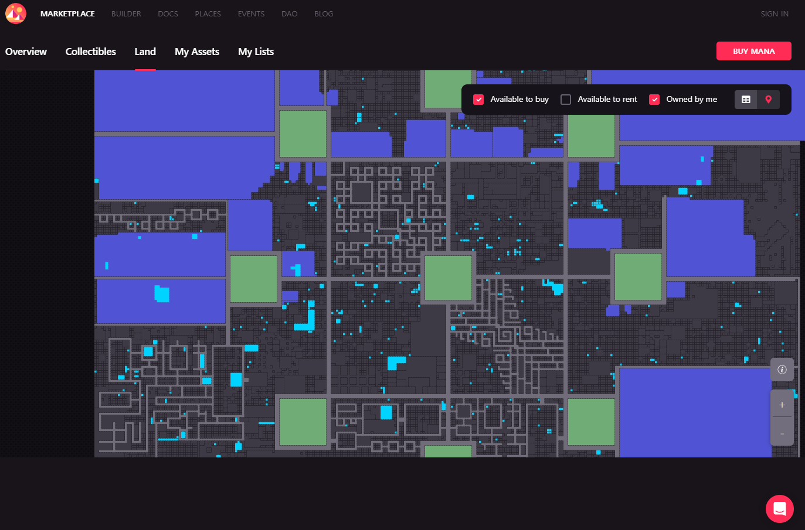

또한 MANA라고 하는 가상 화폐를 통해 거래를 진행한다.

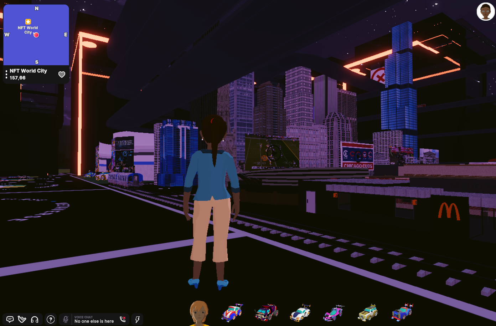

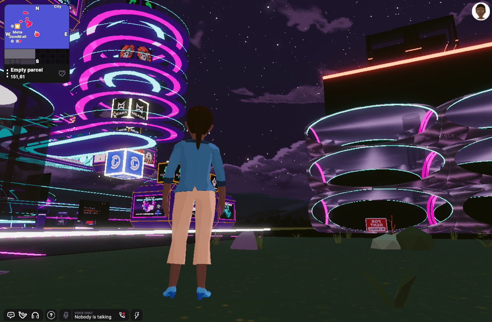

- 링크
  - [Decentraland](https://decentraland.org/)
  - [Decentraland Github](https://github.com/decentraland)
  - [해시넷 디센트럴랜드](http://wiki.hash.kr/index.php/%EB%94%94%EC%84%BC%ED%8A%B8%EB%9F%B4%EB%9E%9C%EB%93%9C)

### Cryptovoxels

웹 기반으로 동작하며 이더리움 기반의 NFT를 사용한 메타버스이다. 사용자 커뮤니티에 의해 관리된다.

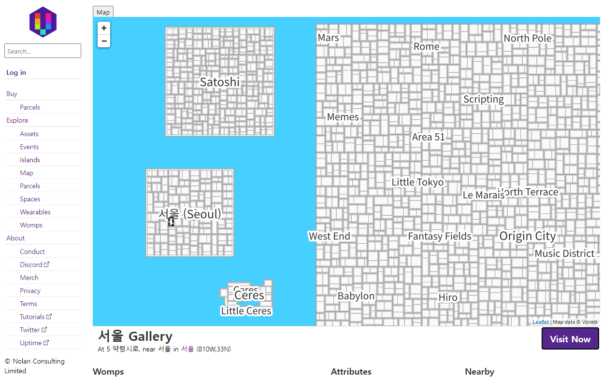

위 사진과 같이 NFT 형식의 LAND가 있으며 사용자는 이를 구매해 사용할 수 있다.

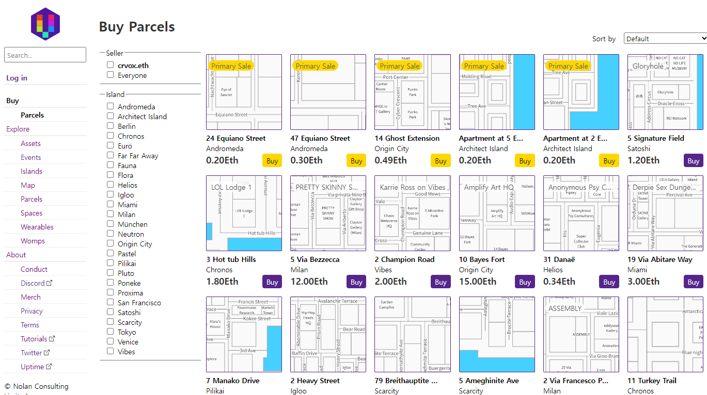

또한 LAND 이외에 다양한 에셋이나 의상 등을 찾아 거래할 수 있다.

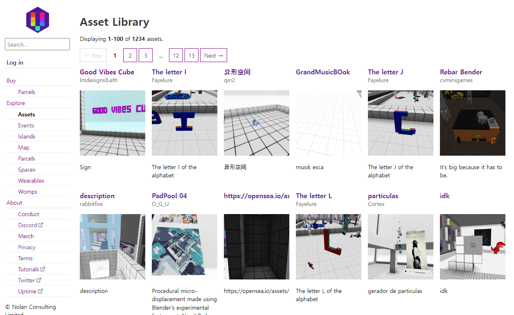

아래 그림들은 실제 메타버스 내부 화면이다.

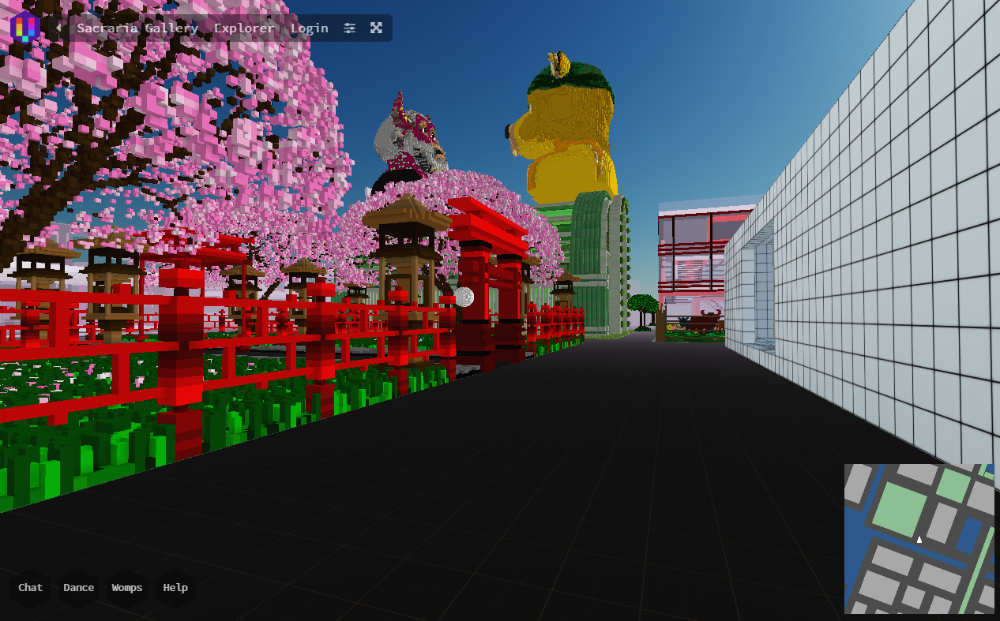

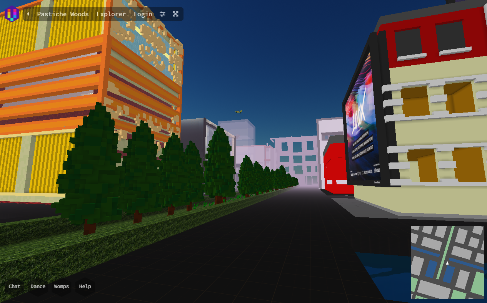

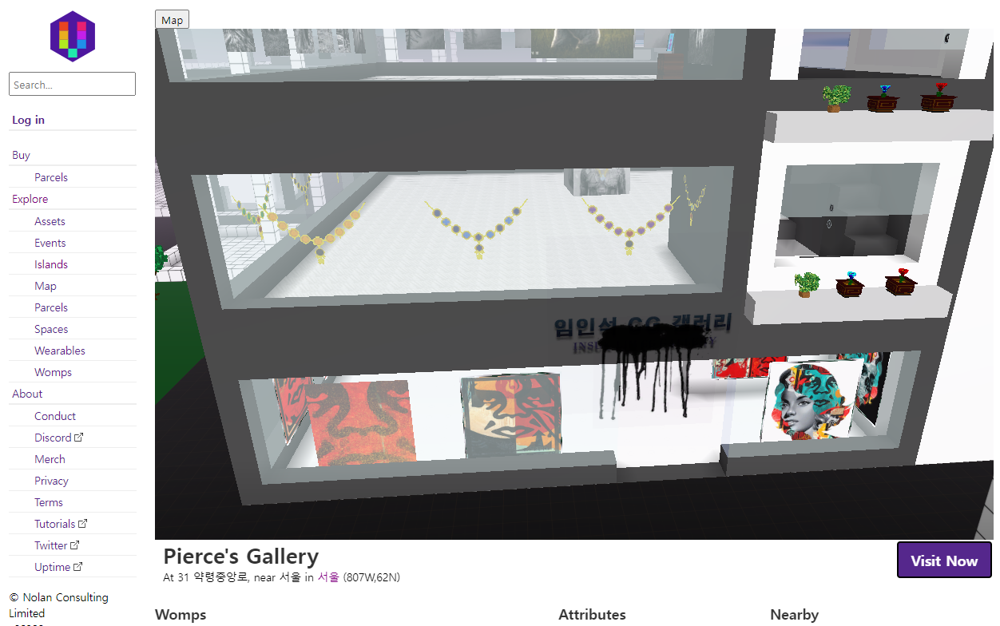

- 링크
  - [Voxels](https://www.voxels.com/)
  - [Cryptovoxels Wiki](https://wiki.cryptovoxels.com/)
  - [Cryptovoxels Github](https://github.com/cryptovoxels)
  - [Voxels Metaverse(이전 Cryptovoxels) 개요](https://nftplazas.com/voxels/)

